<!-- SLIDE 1: COVER PAGE -->
<ImpressiveCover>
<template #subtitle>Investment & Financial Evaluation Dossier</template>
<template #info>
  
Prepared by: Analysis Team

  
Author: Vualidon.FP

  
Date: May 2026 | Version 1.0

</template>
<template #image>
  <!-- Replace with your cover image -->
  
</template>
</ImpressiveCover>

---
transition: slide-left
---

<!-- SLIDE 2: 50-50 SPLIT (Optimized for HEAVY TEXT + 1 Large Chart, No Scroll) -->
<ImpressiveHeader>
<template #title>Tiêu Đề Slide: Bố Cục 50-50 Cho Nhiều Text</template>
<template #subtitle>Thiết kế tinh gọn, cỡ chữ và dòng tối ưu giúp chứa nhiều thông tin không bị tràn trang</template>

  <!-- CỘT TRÁI (col-span-6) - Tối ưu cho NHIỀU TEXT (Cỡ chữ 11px, dòng 1.3, khoảng cách hẹp) -->
  

    

      

        ♦
        <strong class="text-[#003366] text-[11.5px]">Đệm vốn và Thanh khoản (Ý chính 1):</strong> 
        Bằng cách giảm nhẹ cỡ chữ xuống 11px và dòng leading-[1.3], bạn có thể viết được nhiều nội dung hơn mà hoàn toàn không sợ xuất hiện thanh cuộn (scroll).
      

      

        ♦
        <strong class="text-[#E67300] text-[11.5px]">Kiểm định thực nghiệm giả thuyết (Ý chính 2):</strong> 
        Khi trình bày các số liệu phức tạp từ mô hình hồi quy hoặc K-Means, việc trình bày văn bản rõ ràng, súc tích là cực kỳ quan trọng. Hãy sử dụng các màu sắc đồng bộ với biểu đồ để dẫn dắt mắt người đọc.
      

      

        ♦
        <strong class="text-[#0D9488] text-[11.5px]">Khuyến nghị chiến lược (Ý chính 3):</strong> 
        Tóm tắt các hành động cụ thể ở cuối cột văn bản để tạo điểm nhấn kết thúc slide trước khi chuyển tiếp sang nội dung mới.
      

    

  

  <!-- CỘT PHẢI (col-span-6) - 1 Biểu đồ cân đối chiều rộng -->
  

    

      

        [Biểu đồ 1 - Cân đối tỷ lệ 50-50]
      

    

  

<template #footer-left>Phần I: Khái Quát | Slide 1.1 - Mẫu Text Nhiều</template>
</ImpressiveHeader>

---
transition: slide-left
---

<!-- SLIDE 3: 40-60 SPLIT (Text Ít/Trung Bình + Chart To Rõ Nét) -->
<ImpressiveHeader>
<template #title>Tiêu Đề Slide: Bố Cục 40-60 (Ưu Tiên Chart)</template>
<template #subtitle>Tập trung thị giác vào biểu đồ bên trái, text bên phải bổ trợ thông tin</template>

  <!-- CỘT TRÁI (col-span-7) - Chart to chiếm 60% diện tích -->
  

    

      

        [Biểu đồ 2 - Kích thước lớn nổi bật]
      

    

  

  <!-- CỘT PHẢI (col-span-5) - Text ngắn gọn xúc tích (Cỡ 11.5px) -->
  

    

      

        ♦
        <strong class="text-rose-600 text-[12px]">Điểm nóng dữ liệu:</strong> 
        Bố cục này tập trung 60% diện tích cho biểu đồ bên trái để làm nổi bật các biến động lớn. Cột phải chỉ nên chứa 2 ý chính quan trọng nhất.
      

      

        ♦
        <strong class="text-slate-800 text-[12px]">Kết luận then chốt:</strong> 
        Hạn chế nhồi nhét chữ ở cột này để giữ được khoảng thở (whitespace) cho slide thêm phần sang trọng và chuyên nghiệp.
      

    

  

<template #footer-left>Phần I: Khái Quát | Slide 1.2 - Mẫu Ưu Tiên Chart</template>
</ImpressiveHeader>

---
transition: slide-left
---

<!-- SLIDE 4: FULL-WIDTH CHART (Text Ngắn Trên Đầu + Chart Khổng Lồ Phía Dưới) -->
<ImpressiveHeader>
<template #title>Tiêu Đề Slide: Bố Cục Biểu Đồ Toàn Chiều Rộng</template>
<template #subtitle>Phù hợp cho biểu đồ dạng đường (Time-series) hoặc phân cụm (Scatter) cần hiển thị tối đa</template>

  <!-- PHẦN TRÊN: Tóm tắt 2-3 dòng rất ngắn gọn (Không quá 3 dòng để tránh chiếm diện tích chart) -->
  

    <strong class="text-slate-800">Thông điệp cốt lõi:</strong>
    Tóm tắt thật ngắn gọn thông điệp chính tại đây. Bố cục này dành hơn 80% không gian đứng và 100% không gian ngang cho biểu đồ phía dưới, giúp hiển thị các biểu đồ phức tạp mà không bị vỡ hoặc mờ chữ.
  

  <!-- PHẦN DƯỚI: Biểu đồ toàn chiều rộng, chiều cao cực lớn -->
  

    

      [Biểu đồ Full-Width Cực Lớn]
    

  

<template #footer-left>Phần II: Xu hướng | Slide 2.1 - Mẫu Biểu Đồ Toàn Rộng</template>
</ImpressiveHeader>

---
transition: slide-left
---

<!-- SLIDE 1.1: Tổng tài sản toàn ngành & GDP Macro Context -->
<ImpressiveHeader>
<template #title>Chương 1: Quy mô &amp; Tăng trưởng</template>
<template #subtitle>Tổng tài sản toàn hệ thống Ngân hàng Việt Nam &amp; Bối cảnh phục hồi GDP vĩ mô (2020 – 2024)</template>

  <!-- CỘT TRÁI (col-span-6) -->
  

    

      

        ♦
        <strong class="text-[#003366] text-[11.5px]">Tài sản mở rộng mạnh mẽ đồng pha vĩ mô:</strong> 
        Tổng tài sản toàn ngành ghi nhận đà tăng trưởng liên tục, từ 10.87 triệu tỷ VND (2020) lên 19.31 triệu tỷ VND (2024), tương đương mức tăng trưởng tích lũy +77.7% trong 5 năm. Quy mô bảng cân đối kế toán toàn hệ thống được thúc đẩy trực tiếp từ đà phục hồi GDP vĩ mô, vọt từ đáy 2.91% (2020) lên 7.09% (2024).
      

      

        ♦
        <strong class="text-[#E67300] text-[11.5px]">Tốc độ tăng trưởng tài sản duy trì hai chữ số:</strong> 
        Tăng trưởng TTS YoY liên tục duy trì trên 11% mỗi năm, đạt đỉnh 16.33% (2024), phản ánh nhu cầu tín dụng bùng nổ sau đại dịch và sự mở rộng quy mô bảng cân đối toàn hệ thống. Đáng chú ý, tốc độ mở rộng tài sản vượt xa tốc độ tăng trưởng GDP thực, cho thấy vai trò trung gian tài chính của ngành ngân hàng ngày càng được khuếch đại trong nền kinh tế.
      

    

  

  <!-- CỘT PHẢI (col-span-6) - Biểu đồ -->
  

    

      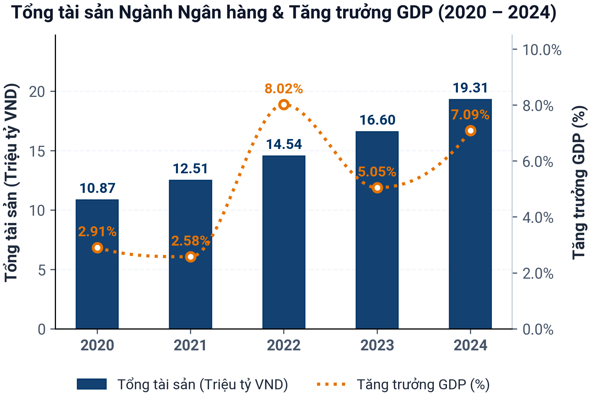
    

  

<template #footer-left>Phần I: Bức tranh toàn cảnh | Slide 1.1 – Quy mô Tài sản &amp; Bối cảnh GDP</template>
</ImpressiveHeader>

---
transition: slide-left
---

<!-- SLIDE 1.2: Tăng trưởng Vốn điều lệ & Vốn CSH + Equity/TTS -->
<ImpressiveHeader>
<template #title>Chương 1: Tăng trưởng Vốn &amp; Đệm An toàn</template>
<template #subtitle>Vốn điều lệ, Vốn chủ sở hữu &amp; Tỷ lệ an toàn vốn Equity/TTS toàn hệ thống (2020 – 2024)</template>

  <!-- CỘT TRÁI (col-span-6) -->
  

    

      

        ♦
        <strong class="text-[#3399FF] text-[11.5px]">Năng lực tài chính cốt lõi liên tục được củng cố:</strong> 
        Quy mô vốn chủ sở hữu (VCSH) và vốn điều lệ (VĐL) toàn hệ thống ghi nhận đà tăng trưởng tích cực, đạt lần lượt 1,612 nghìn tỷ VND và 817 nghìn tỷ VND vào cuối năm 2024, tương ứng mức tăng trưởng +105.3% và +91.9% so với năm 2020. Sự gia tăng này cho thấy nỗ lực của các ngân hàng trong việc gia tăng bộ đệm vốn tự có nhằm đáp ứng tiêu chuẩn Basel II.
      

      

        ♦
        <strong class="text-[#E67300] text-[11.5px]">Đệm vốn suy yếu dưới áp lực đòn bẩy rủi ro:</strong> 
        Mặc dù tăng trưởng mạnh, tốc độ tăng của VCSH và VĐL vẫn không bắt kịp tốc độ phình to của tổng tài sản, khiến tỷ lệ an toàn vốn (được đo lường bằng tỷ lệ Equity/TTS) đạt đỉnh 9.15% (năm 2022) rồi giảm dần xuống còn 8.77% (năm 2024). Mức sụt giảm 0.38 điểm phần trăm (pp) trong 2 năm cho thấy các ngân hàng đang có xu hướng tăng cường sử dụng đòn bẩy tài chính để tối ưu lợi nhuận thay vì củng cố đệm vốn.
      

    

  

  <!-- CỘT PHẢI (col-span-6) - Biểu đồ -->
  

    

      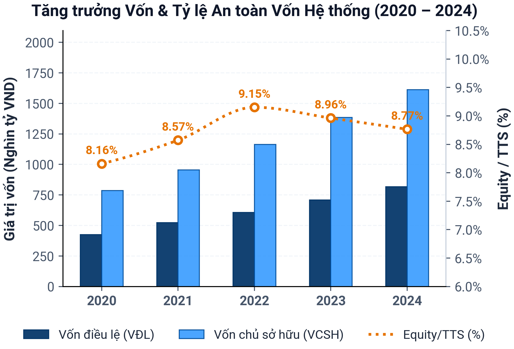
    

  

<template #footer-left>Phần I: Bức tranh toàn cảnh | Slide 1.2 – Tăng trưởng Vốn &amp; Đệm An toàn Hệ thống</template>
</ImpressiveHeader>

---
transition: slide-left
---

<!-- SLIDE 1.3: Phân hóa Đệm vốn toàn hệ thống -->
<ImpressiveHeader>
<template #title>Chương 1: Phân hóa Đệm vốn Hệ thống</template>
<template #subtitle>Khoảng cách Equity/TTS giữa nhóm dẫn đầu &amp; nhóm cuối bảng — Năm 2024</template>

  <!-- CỘT TRÁI (col-span-5) -->
  

    

      

        ♦
        <strong class="text-[#003366] text-[11.5px]">Phân hóa tiềm lực tài chính rõ rệt:</strong> 
        Hệ thống ghi nhận sự phân hóa cao về tiềm lực tài chính khi khoảng cách về tỷ lệ Equity/TTS lên tới 10.80 điểm phần trăm (pp) giữa nhóm ngân hàng dẫn đầu (NH 8: 15.94%) và nhóm cuối bảng (NH 22: 5.14%).
      

      

        ♦
        <strong class="text-[#CC3333] text-[11.5px]">Cảnh báo đệm vốn mỏng:</strong> 
        Đáng chú ý, hệ thống xuất hiện sự phân hóa rủi ro lớn khi có 5 ngân hàng sở hữu đệm vốn mỏng dưới 6% (tiệm cận mức cảnh báo nguy hiểm): NH 22 (5.14%), NH 1 (5.25%), NH 24 (5.34%), NH 3 (5.55%) và NH 21 (5.94%), đặt nhóm này trước rủi ro tổn thương cực lớn khi chất lượng tài sản suy giảm đột ngột.
      

    

  

  <!-- CỘT PHẢI (col-span-7) - Biểu đồ lớn -->
  

    

      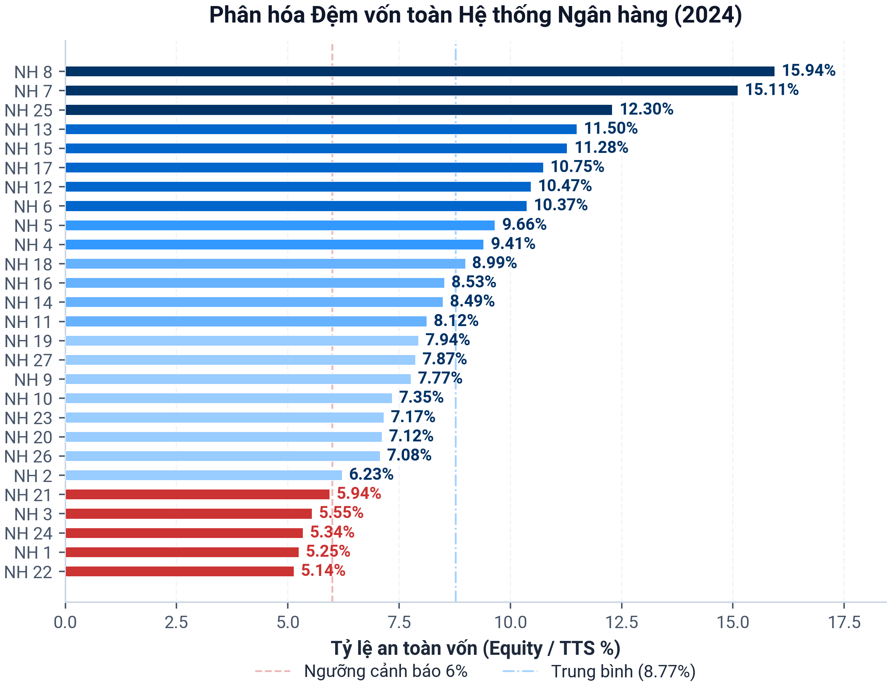
    

  

<template #footer-left>Phần I: Bức tranh toàn cảnh | Slide 1.3 – Phân hóa Đệm vốn Hệ thống</template>
</ImpressiveHeader>

---
transition: slide-left
---

<!-- SLIDE 2.1: ROA & ROE toàn ngành -->
<ImpressiveHeader>
<template #title>Chương 2: Hiệu quả Sinh lời Hệ thống</template>
<template #subtitle>ROA &amp; ROE trung bình toàn ngành ngân hàng (2020 – 2024)</template>

  <!-- CỘT TRÁI (col-span-5) -->
  

    

      

        ♦
        <strong class="text-[#003366] text-[11.5px]">ROA toàn ngành đi theo quỹ đạo hình chữ ∩:</strong> 
        Chỉ số ROA trung bình hệ thống tăng từ 1.04% (2020) lên đỉnh 1.40% (2022), rồi hạ nhiệt trở lại mức 1.04% (2024). Điều này phản ánh khả năng sinh lời trên tổng tài sản đã quay về mức xuất phát sau giai đoạn bùng nổ hậu COVID-19, cho thấy áp lực lên hiệu suất sử dụng tài sản đang gia tăng.
      

      

        ♦
        <strong class="text-[#E67300] text-[11.5px]">ROE suy giảm rõ rệt, phân hóa khốc liệt:</strong> 
        Hiệu quả sử dụng vốn chủ sở hữu (ROE) trung bình giảm mạnh từ đỉnh 15.07% (2022) xuống 10.57% (2024). Đặc biệt, hệ thống ghi nhận sự phân hóa cực đoan với biên độ chênh lệch lên tới 107.56pp giữa NH 11 (23.38%) và NH 22 (−84.18%), chứng minh rằng đòn bẩy tài chính và chất lượng tài sản sinh lời tại mỗi ngân hàng đang được tối ưu hóa theo những kịch bản rất khác nhau.
      

    

  

  <!-- CỘT PHẢI (col-span-7) - Biểu đồ -->
  

    

      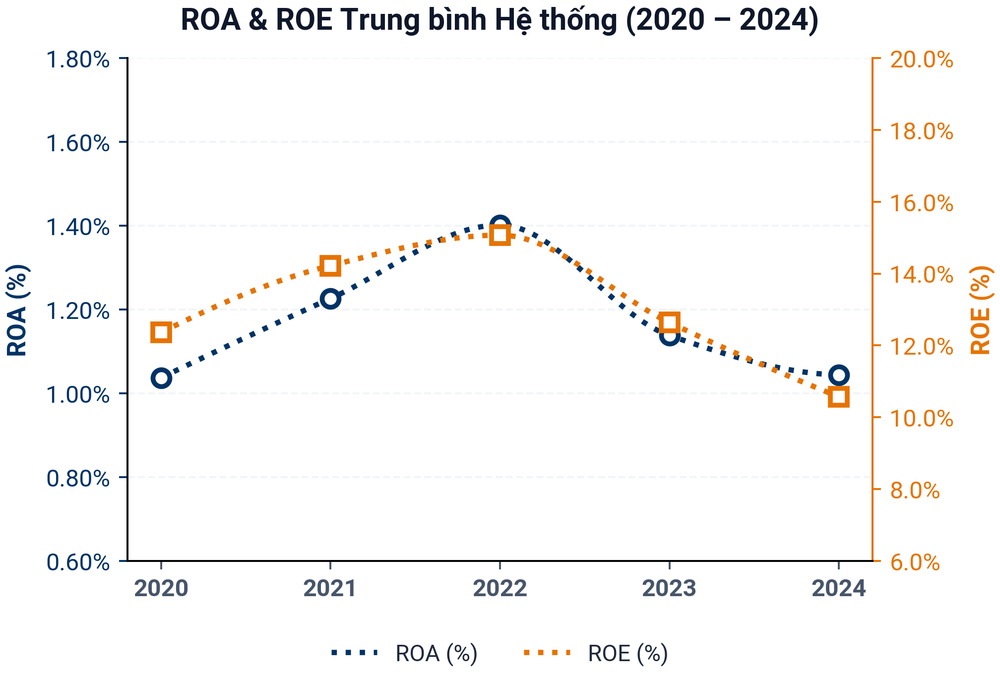
    

  

<template #footer-left>Phần II: Hiệu quả Sinh lời | Slide 2.1 – ROA &amp; ROE Hệ thống</template>
</ImpressiveHeader>

---
transition: slide-left
---

<!-- SLIDE 2.2: Áp lực biên lãi thuần (NIM) -->
<ImpressiveHeader>
<template #title>Chương 2: Áp lực Biên lãi thuần (NIM)</template>
<template #subtitle>NIM đạt đỉnh 2022 rồi co hẹp — 19/27 ngân hàng bị thu hẹp biên lãi trong giai đoạn 2022–2024</template>

  <!-- CỘT TRÁI: Text + NIM system chart (col-span-5) -->
  

    <!-- Text -->
    

      

        ♦
        <strong class="text-[#003366] text-[11px]">NIM đạt đỉnh rồi co hẹp dưới sức ép vĩ mô:</strong> 
        Biên lãi thuần (NIM) toàn ngành đạt đỉnh 3.23% vào năm 2022, sau đó liên tục thu hẹp còn 2.79% (2024). Chính sách tiền tệ giật cục và áp lực tỷ giá làm mặt bằng Cost of Funds biến động mạnh, bóp nghẹt biên lãi. Kết quả là 19/27 ngân hàng (70.4%) bị thu hẹp NIM trong giai đoạn 2022–2024.
      

    

    <!-- NIM System chart (small, phía dưới text) -->
    

      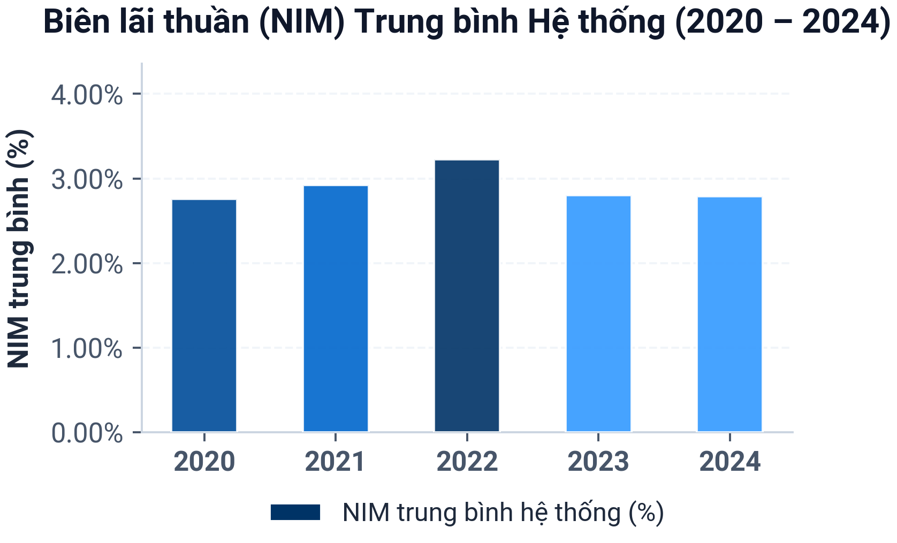
    

  

  <!-- CỘT PHẢI: NIM Compression chart (col-span-7) -->
  

    

      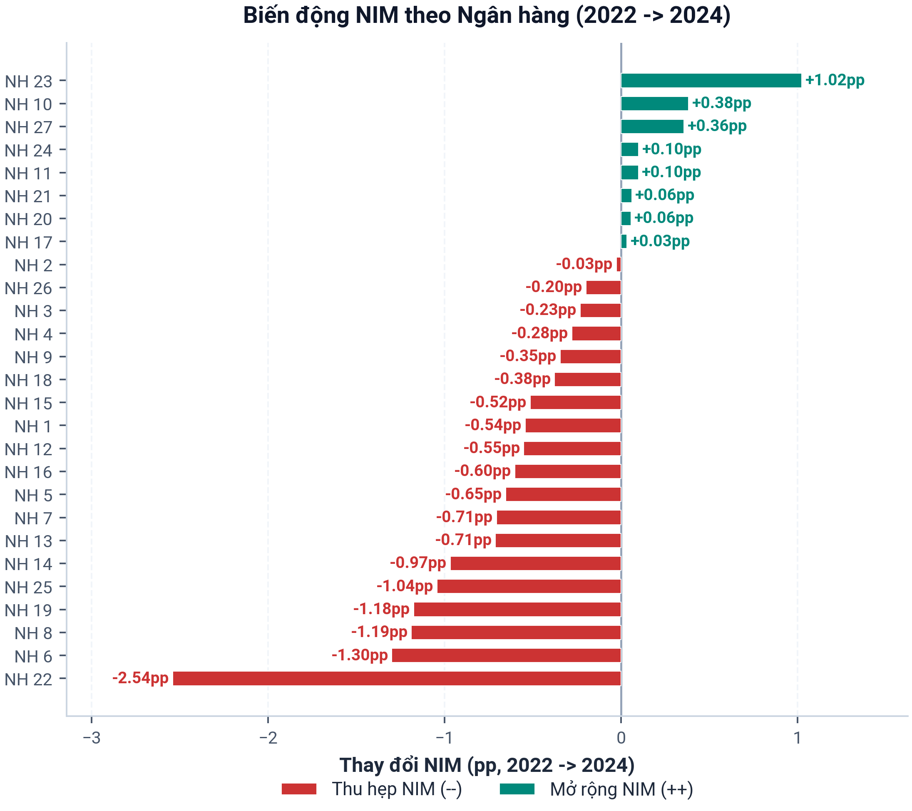
    

  

<template #footer-left>Phần II: Hiệu quả Sinh lời | Slide 2.2 – Áp lực Biên lãi thuần (NIM)</template>
</ImpressiveHeader>

---
transition: slide-left
---

<!-- SLIDE 3.1: Cơ cấu thu nhập hoạt động -->
<ImpressiveHeader>
<template #title>Chương 3: Cơ cấu Thu nhập & Chi phí</template>
<template #subtitle>Phân rã nguồn thu nhập hoạt động (TOI) toàn hệ thống (2020 – 2024)</template>

  <!-- CỘT TRÁI (col-span-5) -->
  

    

      

        ♦
        <strong class="text-[#003366] text-[11px]">Thu nhập lãi thuần vẫn chiếm vị thế áp đảo:</strong> 
        Tỷ trọng thu nhập lãi thuần trên TOI tăng từ 75.30% (2020) lên 78.33% (2024), cho thấy hệ thống ngân hàng Việt Nam vẫn phụ thuộc nặng nề vào hoạt động tín dụng truyền thống. Ngược lại, tỷ trọng thu ngoài lãi giảm từ 24.70% xuống 21.67%.
      

      

        ♦
        <strong class="text-[#00897B] text-[11px]">Thu dịch vụ thuần co hẹp:</strong> 
        Đáng chú ý, tỷ trọng thu nhập dịch vụ thuần (Fee Income Ratio) giảm từ 10.86% xuống 9.00%, cho thấy nỗ lực đa dạng hóa nguồn thu từ phí dịch vụ chưa đạt kỳ vọng, trong khi mảng ngoại hối & vàng tăng nhẹ từ 2.97% lên 4.11% nhờ biến động tỷ giá.
      

      

        *Macro: Dòng vốn FDI giải ngân đạt đỉnh lịch sử 25.35 tỷ USD (2024) và tiêu dùng bán lẻ phục hồi mạnh mẽ là động lực hỗ trợ mảng thu ngoại hối và dịch vụ thanh toán.*
      

    

  

  <!-- CỘT PHẢI (col-span-7) -->
  

    

      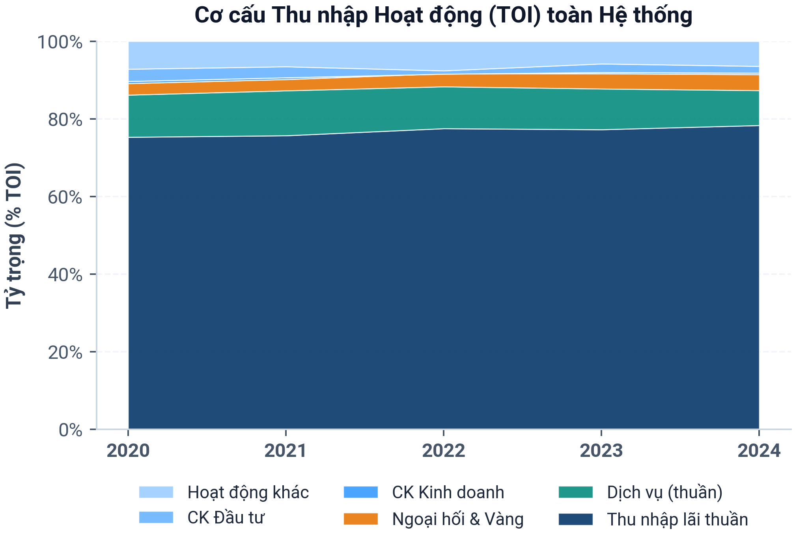
    

  

<template #footer-left>Phần III: Cơ cấu Thu nhập & Chi phí | Slide 3.1 – Đa dạng hóa Nguồn thu</template>
</ImpressiveHeader>

---
transition: slide-left
---

<!-- SLIDE 3.2: Phân hóa CIR -->
<ImpressiveHeader>
<template #title>Chương 3: Phân hóa Chi phí Hoạt động</template>
<template #subtitle>Tỷ lệ Chi phí trên Thu nhập (CIR) toàn hệ thống năm 2024</template>

  <!-- CỘT TRÁI (col-span-5) -->
  

    

      

        ♦
        <strong class="text-[#003366] text-[11px]">Phân hóa khổng lồ về hiệu quả chi phí:</strong> 
        Tỷ lệ CIR (Cost-to-Income Ratio) năm 2024 ghi nhận khoảng cách chênh lệch lên tới 46.94pp giữa ngân hàng tối ưu chi phí tốt nhất (NH 8: 23.0%) và kém nhất (NH 25: 70.0%). Trung bình hệ thống ở mức 40.1%.
      

      

        ♦
        <strong class="text-[#E67300] text-[11px]">Nhóm chi phí cao — rủi ro vận hành:</strong> 
        Có 5 ngân hàng duy trì CIR trên 50% (NH 25, NH 20, NH 21, NH 26, NH 19), phản ánh bộ máy vận hành cồng kềnh hoặc năng lực tạo thu nhập còn hạn chế. Các ngân hàng này đối mặt áp lực lớn khi biên lãi tiếp tục thu hẹp.
      

      

        *Lưu ý: NH 22 (TOI âm) được loại trừ khỏi phân tích CIR do không có ý nghĩa thống kê.*
      

    

  

  <!-- CỘT PHẢI (col-span-7) -->
  

    

      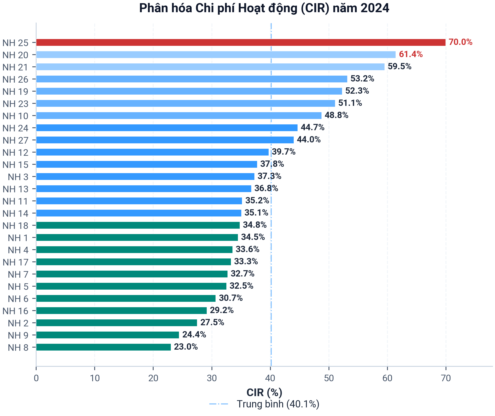
    

  

<template #footer-left>Phần III: Cơ cấu Thu nhập & Chi phí | Slide 3.2 – Phân hóa CIR</template>
</ImpressiveHeader>

---
transition: slide-left
---

<!-- SLIDE 4.1: CASA Ratio -->
<ImpressiveHeader>
<template #title>Chương 4: Huy động & Tín dụng</template>
<template #subtitle>Tỷ lệ tiền gửi không kỳ hạn (CASA) duy trì xu hướng thấp quanh 15.7%</template>

  <!-- CỘT TRÁI (col-span-5) -->
  

    

      

        ♦
        <strong class="text-[#003366] text-[11px]">Dòng tiền rẻ chững lại:</strong> 
        Tỷ lệ tiền gửi không kỳ hạn (CASA Ratio) trung bình toàn ngành biến động trồi sụt, sau khi giảm từ đỉnh 17.70% (2021) hiện đang neo ở mức 15.72%. Điều này phản ánh xu hướng thắt chặt chi tiêu của người dân và sự dịch chuyển của dòng tiền nhàn rỗi sang các kênh đầu tư hoặc tiền gửi có kỳ hạn dài hơn để tìm kiếm lợi suất an toàn.
      

      

        ♦
        <strong class="text-[#E67300] text-[11px]">Phân hóa CASA khổng lồ:</strong> 
        Lợi thế nguồn vốn rẻ không chia đều. Dữ liệu ghi nhận mức chênh lệch CASA khổng lồ lên tới 35.23 điểm phần trăm (pp) giữa nhóm dẫn đầu và nhóm cuối bảng trong năm 2024, tạo ra áp lực huy động vốn (Cost of Funds) rất lớn cho các ngân hàng top dưới.
      

    

  

  <!-- CỘT PHẢI (col-span-7) -->
  

    

      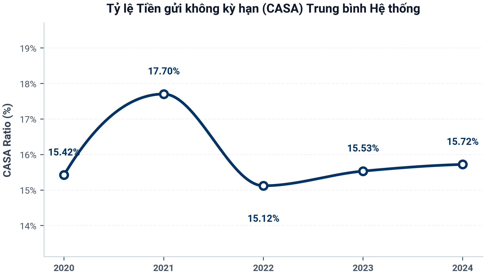
    

  

<template #footer-left>Phần IV: Huy động & Tín dụng | Slide 4.1 – Xu hướng CASA</template>
</ImpressiveHeader>

---
transition: slide-left
---

<!-- SLIDE 4.2: LDR bùng nổ -->
<ImpressiveHeader>
<template #title>Chương 4: Rủi ro Thanh khoản (LDR)</template>
<template #subtitle>Tỷ lệ LDR vượt mức 100%, huy động không theo kịp tín dụng</template>

  <!-- CỘT TRÁI (col-span-5) -->
  

    

      

        ♦
        <strong class="text-[#CC3333] text-[11px]">LDR tăng vọt lên mức báo động:</strong> 
        Tỷ lệ dư nợ trên tổng vốn huy động (LDR) trung bình toàn ngành leo dốc liên tục từ mức an toàn 91.11% (2020) lên 103.25% (2024). Đáng chú ý, có tới 15/27 ngân hàng thương mại đã vượt qua ngưỡng "trần an toàn" 100%.
      

      

        ♦
        <strong class="text-[#003366] text-[11px]">Rủi ro kỳ hạn & Thanh khoản:</strong> 
        Thực trạng này phản ánh tình trạng căng thẳng thanh khoản trầm trọng và rủi ro kỳ hạn (Maturity Gap) ngày càng lớn khi nguồn vốn huy động tiền gửi từ khách hàng không đuổi kịp tốc độ bơm tín dụng ra nền kinh tế.
      

      

        *Macro Context: Áp lực tỷ giá từ sức mạnh đồng USD (DXY) buộc NHNN phải hút tiền trong nhiều giai đoạn, làm cung tiền M2 tăng trưởng chậm lại so với dư nợ, gây khát thanh khoản cục bộ.*
      

    

  

  <!-- CỘT PHẢI (col-span-7) -->
  

    

      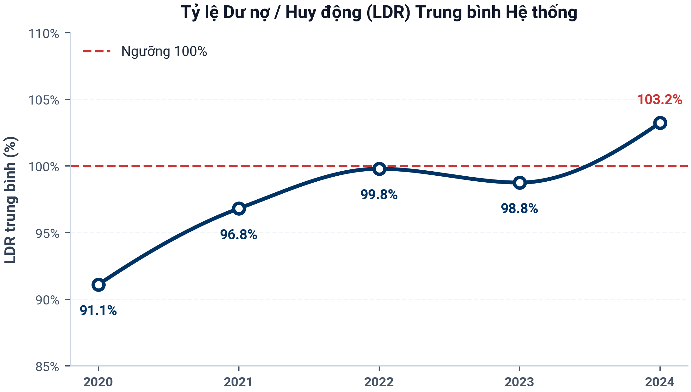
    

  

<template #footer-left>Phần IV: Huy động & Tín dụng | Slide 4.2 – Áp lực LDR</template>
</ImpressiveHeader>

---
transition: slide-left
---

<!-- SLIDE 4.3: Bán lẻ hóa tín dụng -->
<ImpressiveHeader>
<template #title>Chương 4: Cấu trúc Tín dụng</template>
<template #subtitle>Tỷ trọng cho vay cá nhân tăng trưởng mạnh mẽ đạt mức ~48%</template>

  <!-- CỘT TRÁI (col-span-5) -->
  

    

      

        ♦
        <strong class="text-[#00897B] text-[11px]">Chuyển dịch sang mảng bán lẻ:</strong> 
        Cấu trúc tín dụng hệ thống chứng kiến sự dịch chuyển chiến lược. Tỷ trọng cho vay khách hàng cá nhân (theo quy mô dư nợ tổng hợp) đã tăng từ 47.18% (2020) lên mức 48.49% (2024), phản ánh định hướng phân tán rủi ro và cải thiện biên lợi nhuận (NIM) của các ngân hàng.
      

      

        ♦
        <strong class="text-[#003366] text-[11px]">Động lực từ vĩ mô:</strong> 
        Sau "vực thẳm" đại dịch (tháng 8/2021), tổng mức bán lẻ hàng hóa lấy lại quỹ đạo tăng trưởng ổn định 8-9% YoY. Điểm tựa tiêu dùng mạnh mẽ này đã kích thích trực tiếp đến mảng cho vay tiêu dùng, thẻ tín dụng và vay mua nhà cá nhân.
      

    

  

  <!-- CỘT PHẢI (col-span-7) -->
  

    

      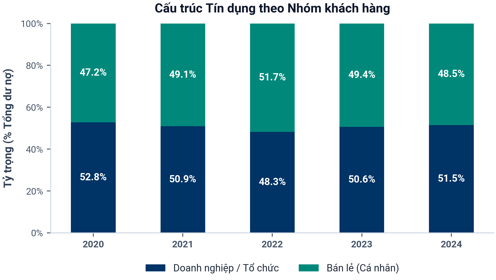
    

  

<template #footer-left>Phần IV: Huy động & Tín dụng | Slide 4.3 – Cấu trúc Tín dụng</template>
</ImpressiveHeader>

---
transition: slide-left
---

<!-- SLIDE 5.1: NPL Trend -->
<ImpressiveHeader>
<template #title>Chương 5: Sức khỏe Tài sản</template>
<template #subtitle>Bão nợ xấu: Vết sẹo có độ trễ từ thời kỳ COVID-19</template>

  <!-- CỘT TRÁI (col-span-5) -->
  

    

      

        ♦
        <strong class="text-[#CC3333] text-[11px]">Tỷ lệ nợ xấu (NPL) vọt tăng:</strong> 
        Tỷ lệ nợ xấu trung bình toàn ngành ghi nhận đà tăng mạnh từ mức an toàn 1.74% (năm 2020) lên mức 2.87% (năm 2024), tương đương mức tăng hơn 1.6 lần. Đây là hồi chuông cảnh báo về rủi ro mất vốn tiềm ẩn trên bảng cân đối kế toán.
      

      

        ♦
        <strong class="text-[#003366] text-[11px]">Hết thời gian ân hạn:</strong> 
        Các khoản nợ được gia hạn, giãn hoãn theo Thông tư 01 và 02 từ thời kỳ đại dịch Covid-19 đã dần hết thời gian ân hạn, buộc các ngân hàng phải chuyển nhóm nợ. Điều này khiến nợ xấu tích tụ bấy lâu nay chính thức bùng phát.
      

      

        *Macro Context: Mặc dù hoạt động sản xuất đã phục hồi (PMI liên tục >51.0 vào năm 2024), dòng tiền thực tế của nhiều doanh nghiệp vẫn ở trạng thái kiệt quệ sau chuỗi cú sốc liên tiếp, không đủ khả năng trả nợ cũ.*
      

    

  

  <!-- CỘT PHẢI (col-span-7) -->
  

    

      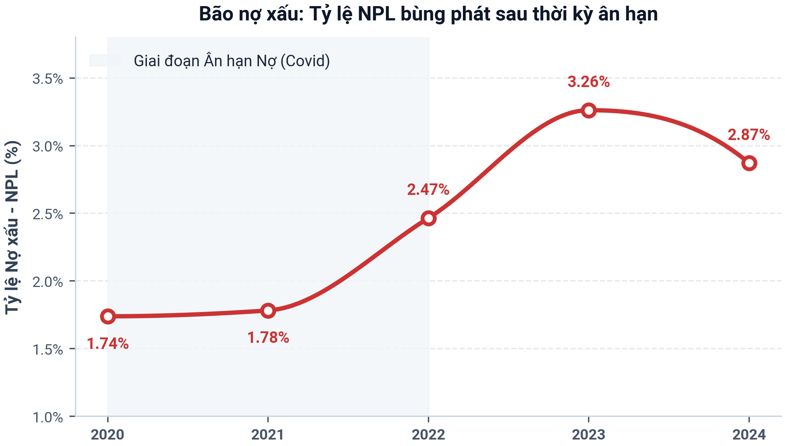
    

  

<template #footer-left>Phần V: Sức khỏe Tài sản | Slide 5.1 – Nợ xấu (NPL)</template>
</ImpressiveHeader>

---
transition: slide-left
---

<!-- SLIDE 5.2: LLR -->
<ImpressiveHeader>
<template #title>Chương 5: Phân hóa Rủi ro</template>
<template #subtitle>Đệm dự phòng (LLR) mỏng đi đáng lo ngại trên diện rộng</template>

  <!-- CỘT TRÁI (col-span-5) -->
  

    

      

        ♦
        <strong class="text-[#CC3333] text-[11px]">Đệm dự phòng suy yếu:</strong> 
        Tỷ lệ bao phủ nợ xấu (Coverage Ratio - LLR) đánh giá khả năng chống chịu của ngân hàng trước các cú sốc tín dụng. Hệ thống ghi nhận mức LLR suy giảm nghiêm trọng khi có tới 22 trên tổng số 27 ngân hàng (chiếm hơn 80% hệ thống) có tỷ lệ bao phủ dưới mức 100%.
      

      

        ♦
        <strong class="text-[#00897B] text-[11px]">Nhóm phòng thủ vững chắc:</strong> 
        Sự phân hóa diễn ra cực đoan khi chỉ có đúng 2 ngân hàng duy trì được tỷ lệ bao phủ nợ xấu ở mức an toàn cao (trên 150%). Các ngân hàng top dưới không chỉ đối mặt với nợ xấu tăng cao (NPL > 3.0%) mà còn không có đủ nguồn lực trích lập dự phòng (LLR < 50%), đe dọa trực tiếp đến lợi nhuận cốt lõi trong tương lai.
      

    

  

  <!-- CỘT PHẢI (col-span-7) -->
  

    

      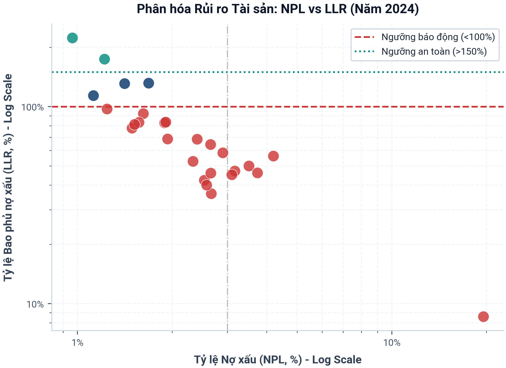
    

  

<template #footer-left>Phần V: Sức khỏe Tài sản | Slide 5.2 – Tỷ lệ Bao phủ Nợ xấu</template>
</ImpressiveHeader>

---
transition: fade
layout: center
---

<!-- SLIDE SUMMARY -->

  <!-- Decorative top bar -->
  

  
  

    <h2 class="text-2xl font-bold text-[#003366] mb-2 font-serif">TỔNG HỢP: SCORECARD (2024)</h2>
    
Bức tranh toàn cảnh: Duy trì tăng trưởng quy mô đi kèm với sự phân hóa sâu sắc và rủi ro tiềm ẩn gia tăng

  

  
  

    <!-- Sinh lời -->
    

      Sinh lời (ROA)
      1.04%
      Trạng thái đi ngang
    

    

      Sinh lời (ROE)
      11.23%
      Đà tăng trưởng chững lại
    

    

      Biên lãi (NIM)
      2.79%
      Thu hẹp đáng kể
    

    

      Chi phí (CIR)
      40.1%
      Phân hóa mạnh mẽ (46.9pp)
    

    <!-- Huy động & Tín dụng & Nợ -->
    

      

        Nguồn vốn (CASA)
        15.72%
        Nguồn vốn thắt chặt, chi phí huy động tăng
      

      

        Thanh khoản (LDR)
        103.25%
        Áp lực thanh khoản (15 NH vượt mốc 100%)
      

      

        Nợ xấu (NPL)
        2.87%
        Rủi ro gia tăng, đệm dự phòng suy yếu
      

    

  

  
  

    

      Phần II: Đào sâu nguyên nhân tạo nên sự phân hóa 
      Nhìn chung, hệ thống ngân hàng về mặt tổng thể vẫn ghi nhận sự mở rộng về quy mô tín dụng. Tuy nhiên, hiệu quả vận hành và chất lượng tài sản lại bộc lộ mức độ phân hóa sâu sắc. <strong class="text-[#E67300]">Phần tiếp theo sẽ đi sâu phân tích cấu trúc nhân quả, nhằm bóc tách các yếu tố cốt lõi đang trực tiếp chi phối sự khác biệt về năng lực sinh lời bền vững trong chu kỳ hiện tại.</strong>
    

  

---
transition: slide-left
---

<!-- SLIDE 6.1: Giai đoạn 1 - Bối cảnh Vĩ mô -->
<ImpressiveHeader>
<template #title>Chương 6: Giai đoạn 1 (2020-2021) — "Ai có vốn rẻ, người đó sống"</template>
<template #subtitle>1. Bối cảnh vĩ mô: Cú sốc hệ thống & Áp lực ép giảm lợi suất đầu ra</template>

  <!-- CỘT TRÁI (col-span-4) -->
  

    

      

        <strong class="text-[#003366] text-[10.5px] uppercase border-b border-slate-300 pb-0.5 mb-1 block">1. Đứt gãy chuỗi sản xuất</strong>
        Do COVID-19, kinh tế vĩ mô rơi vào suy thoái kỹ thuật. GDP chạm đáy lịch sử, lần lượt đạt 2.91% (2020) và 2.56% (2021). Chỉ số PMI sụt xuống 32.7 điểm (T4/2020), phản ánh chuỗi sản xuất ngưng trệ.
      

      

        <strong class="text-[#E67300] text-[10.5px] uppercase border-b border-slate-300 pb-0.5 mb-1 block">2. Áp lực chính sách lên Yield</strong>
        NHNN buộc phải ban hành Thông tư 01 và 03, yêu cầu các TCTD cơ lại cấu nợ, miễn giảm lãi và phí để hỗ trợ doanh nghiệp. Chi phí huy động chưa giảm kịp nhưng lãi suất cho vay buộc phải hạ ngay lập tức.
      

      

        <strong class="text-[#003366]">Hệ quả then chốt:</strong> 
        Lợi suất tài sản sinh lời (Yield đầu ra) bị ép giảm đồng loạt trên toàn hệ thống. <strong class="text-[#E67300]">Do đó, Yield không tạo ra sự phân hóa NIM trong giai đoạn này vì toàn ngành chịu chung áp lực pháp lý.</strong>
      

    

  

  <!-- CỘT PHẢI (col-span-8) -->
  

    

      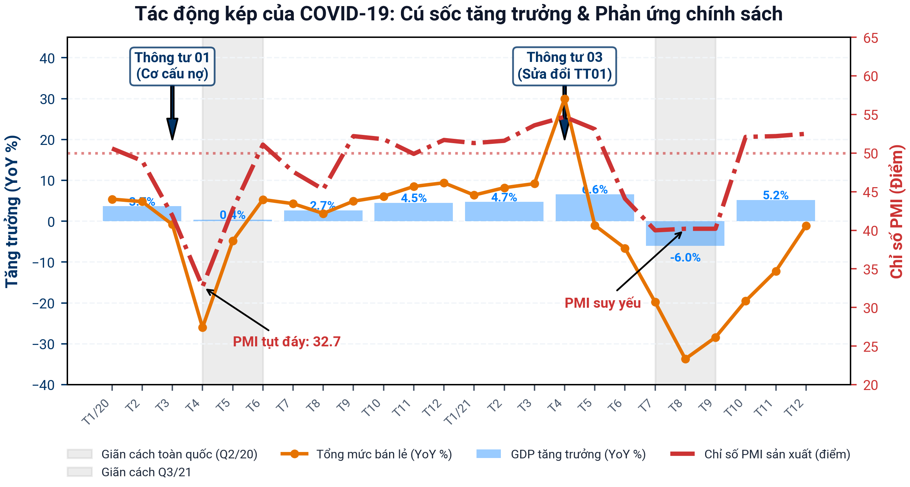
    

  

<template #footer-left>Phần VI: Giai đoạn 1 (2020-2021) | Slide 6.1 – Cú sốc Vĩ mô</template>
</ImpressiveHeader>

---
transition: slide-left
---

<!-- SLIDE 6.2: Giai đoạn 1 - CASA vs CoF -->
<ImpressiveHeader>
<template #title>Chương 6: Giai đoạn 1 (2020-2021) — "Ai có vốn rẻ, người đó sống"</template>
<template #subtitle>2. Nhánh nhân quả chính: Lá chắn CASA quyết định CoF và NIM</template>

  <!-- CỘT TRÁI (col-span-5) -->
  

    

      

        <strong class="text-[#003366] text-[10.5px] uppercase border-b border-slate-300 pb-0.5 mb-1 block">1. Kiểm định thực nghiệm (Mô hình hồi quy)</strong>
        Thực chứng cho thấy sự phân hóa NIM khổng lồ (1.22% - 8.34%) được quyết định từ chi phí đầu vào. Tỷ lệ CASA giải thích tới 75% biến động chi phí vốn (R² ≈ 0.75). Tương quan nghịch cực mạnh (r = -0.864) khẳng định CASA là lá chắn tối ưu giúp neo giữ giá vốn.
      

      

        <strong class="text-[#00897B] text-[10.5px] uppercase border-b border-slate-300 pb-0.5 mb-1 block">2. Phân hóa thực tế khốc liệt</strong>
        ■ Nhóm dẫn đầu (Vùng dưới cùng bên phải):
        Hệ sinh thái số vượt trội (NH7: CASA 45.6%, NH6: 40.8%) giúp tối ưu CoF dưới 3%, thúc đẩy NIM đạt 5.5%, ROA dẫn đầu toàn ngành 3.4%.
      

      

        ■ Nhóm tụt hậu (Vùng trên cùng bên trái):
        Do thiếu hụt CASA (NH20: 2.4%, NH24: 4.2%), việc phụ thuộc dòng vốn bán buôn khiến CoF vượt 7%, làm NIM thu hẹp còn 1.2% - 2.0% và ROA tiệm cận 0%.
      

    

  

  <!-- CỘT PHẢI (col-span-7) -->
  

    

      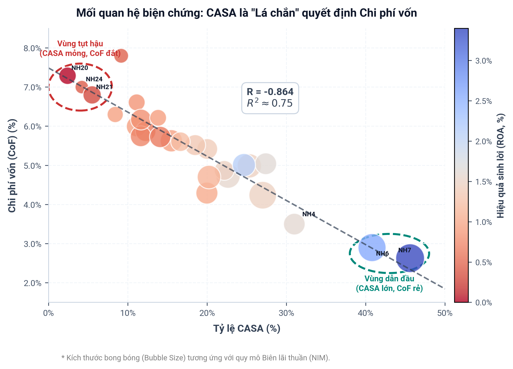
    

  

<template #footer-left>Phần VI: Giai đoạn 1 (2020-2021) | Slide 6.2 – Phân tích Nhân quả CASA & CoF</template>
</ImpressiveHeader>

---
transition: slide-left
---

<!-- SLIDE 6.3: Giai đoạn 1 - Nghịch lý Đòn bẩy -->
<ImpressiveHeader>
<template #title>Chương 6: Giai đoạn 1 (2020-2021) — "Ai có vốn rẻ, người đó sống"</template>
<template #subtitle>3. Nhánh phụ 1: Nghịch lý đòn bẩy tài chính trong khủng hoảng</template>

  <!-- CỘT TRÁI (col-span-5) -->
  

    

      

        <strong class="text-[#003366] text-[10.5px] uppercase border-b border-slate-300 pb-0.5 mb-1 block">1. Sự phá vỡ lý thuyết truyền thống</strong>
        Lý thuyết tài chính doanh nghiệp truyền thống cho rằng trong điều kiện bình thường, việc tăng cường sử dụng đòn bẩy tài chính (hệ số nhân vốn chủ sở hữu cao) sẽ giúp khuếch đại tỷ suất sinh lời trên vốn chủ sở hữu (ROE). Tuy nhiên, dữ liệu thực tế của hệ thống ngân hàng Việt Nam trong khủng hoảng 2020-2021 lại chứng minh một nghịch lý hoàn toàn trái ngược.
      

      

        <strong class="text-[#00897B] text-[10.5px] uppercase border-b border-slate-300 pb-0.5 mb-1 block">2. Cơ chế tác động của khủng hoảng</strong>
        Khi nền kinh tế đối mặt với cú sốc hệ thống và chất lượng tài sản đi xuống, đòn bẩy tài chính cao không đóng vai trò khuếch đại lợi nhuận mà ngược lại, phóng đại tổn thất thực tế. 
      

      

        <strong class="text-[#CC3333]">Hệ lụy của việc thiếu đệm vốn:</strong> 
        Các ngân hàng có đệm vốn mỏng (Equity Ratio thấp) thường bị thị trường đánh giá rủi ro cao hơn, dẫn đến việc bị "phạt" bằng mức chi phí huy động vốn đắt đỏ trên thị trường liên ngân hàng và dân cư, trực tiếp làm xói mòn hiệu quả sinh lời tổng thể.
      

    

  

  <!-- CỘT PHẢI (col-span-7) -->
  

    

      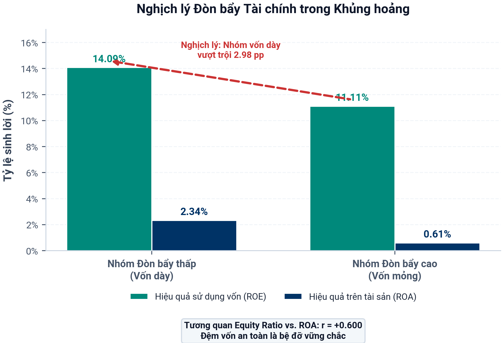
    

  

<template #footer-left>Phần VI: Giai đoạn 1 (2020-2021) | Slide 6.3 – Nghịch lý Đòn bẩy</template>
</ImpressiveHeader>

---
transition: slide-left
---

<!-- SLIDE 6.4: Giai đoạn 1 - Nợ ẩn & VAMC -->
<ImpressiveHeader>
<template #title>Chương 6: Giai đoạn 1 (2020-2021) — "Ai có vốn rẻ, người đó sống"</template>
<template #subtitle>4. Nhánh phụ 2: Nợ ẩn — "Bình yên giả tạo" và Quả bom hẹn giờ VAMC</template>

  <!-- CỘT TRÁI -->
  

    

      

        <strong class="text-[#003366] text-[10.5px] uppercase border-b border-slate-300 pb-0.5 mb-1 block">1. Màn sương "Bình yên giả tạo"</strong>
        Bên cạnh sự phân hóa về chi phí vốn và đòn bẩy, sức khỏe tài sản toàn ngành tạo cảm giác bình yên giả tạo. Tỷ lệ NPL báo cáo chỉ tăng nhẹ từ 1.74% lên 1.78% (trung bình 1.76%), cho thấy chất lượng tín dụng dường như vẫn trong tầm kiểm soát.
      

      

        <strong class="text-[#E67300] text-[10.5px] uppercase border-b border-slate-300 pb-0.5 mb-1 block">2. Hai kênh nợ ẩn nguy hiểm</strong>
        Rủi ro thực tế đang âm thầm tích lũy dưới bề nổi của bảng cân đối kế toán:
      

      

        

          <strong class="text-slate-800">■ Nợ nhóm 2 tăng mạnh:</strong> Tỷ lệ nợ cần chú ý tăng từ 1.25% lên 1.67% (+0.42 pp), gấp 10 lần mức tăng nợ xấu báo cáo. Cơ chế giữ nguyên nhóm nợ của Thông tư 01 và 02 biến Nhóm 2 thành nơi trú ẩn của các khoản nợ suy giảm chất lượng.
        

        

          <strong class="text-slate-800">■ Trái phiếu VAMC chưa xử lý:</strong> Còn 10/27 ngân hàng gánh lượng trái phiếu VAMC đáng kể. Đây là nguồn nợ ẩn có độ trễ lớn, gây áp lực trích lập dự phòng trực tiếp lên lợi nhuận khi chính sách hỗ trợ hết hạn.
        

      

    

  

  <!-- CỘT PHẢI -->
  

    

      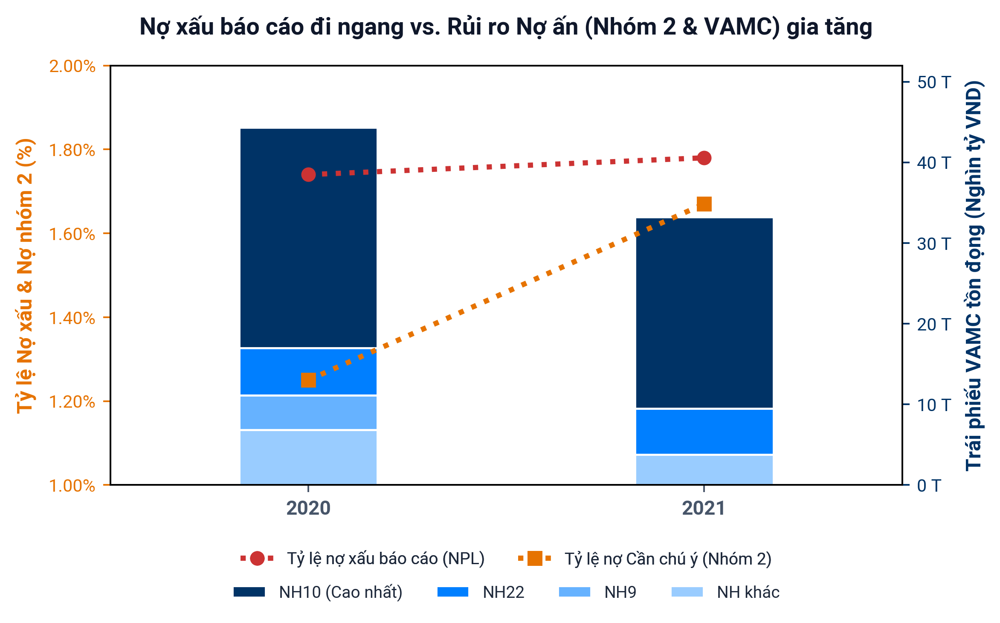
    

  

<template #footer-left>Phần VI: Giai đoạn 1 (2020-2021) | Slide 6.4 – Rủi ro Nợ ẩn & VAMC</template>
</ImpressiveHeader>

---
transition: slide-left
---

<!-- SLIDE 7.1: Giai đoạn 2 - Bối cảnh vĩ mô -->
<ImpressiveHeader>
<template #title>Chương 7: Giai đoạn 2 (2022-2023) — "Phục hồi ảo & Quả bom phát nổ"</template>
<template #subtitle>1. Bối cảnh vĩ mô: Cú đảo chiều chính sách & Áp lực tỷ giá</template>

  <!-- CỘT TRÁI (col-span-5) -->
  

    

      

        <strong class="text-[#003366] text-[10px] uppercase border-b border-slate-300 pb-0.5 mb-1 block">1. Nhu cầu tín dụng bùng nổ nóng</strong>
        Tăng trưởng GDP đạt 8.02% (2022), FDI thực hiện đạt đỉnh 22.4 tỷ USD thúc đẩy mạnh nhu cầu tín dụng. NIM toàn ngành đạt đỉnh lịch sử 3.56% nhờ lợi suất đầu ra tăng nhanh hơn chi phí vốn.
      

      

        <strong class="text-[#E67300] text-[10px] uppercase border-b border-slate-300 pb-0.5 mb-1 block">2. Cú đảo chiều chính sách khẩn cấp</strong>
        DXY neo cao buộc NHNN hút tiền và tăng mạnh lãi suất điều hành (+200 bps) cuối năm 2022 để bảo vệ tỷ giá. Động thái này đẩy lãi suất liên ngân hàng và huy động dân cư vọt tăng nhanh.
      

      

        <strong class="text-[#007FFF] text-[10px] uppercase border-b border-slate-300 pb-0.5 mb-1 block">3. Căng thẳng thanh khoản hệ thống</strong>
        Tăng trưởng M2 sụt giảm mạnh so với tín dụng do NHNN hút VND để can thiệp tỷ giá. Điều này gây "khát thanh khoản" cục bộ và đẩy tỷ giá USD/VND liên ngân hàng tăng mạnh.
      

    

  

  <!-- CỘT PHẢI (col-span-7) -->
  

    

      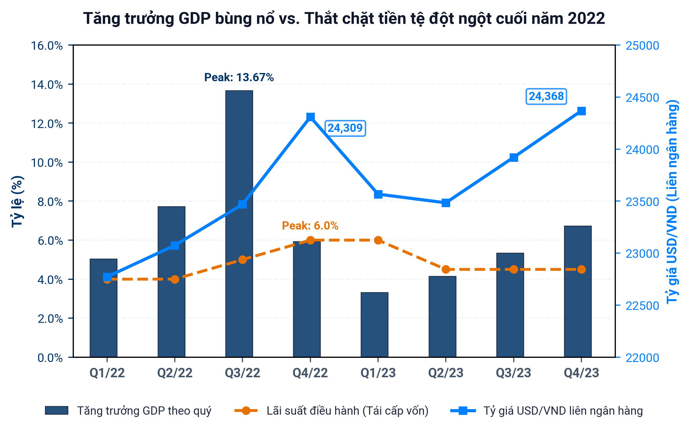
    

  

<template #footer-left>Phần VII: Giai đoạn 2 (2022-2023) | Slide 7.1 – Bối cảnh vĩ mô & Tỷ giá</template>
</ImpressiveHeader>

---
transition: slide-left
---

<!-- SLIDE 7.2: Giai đoạn 2 - Khủng hoảng thanh khoản -->
<ImpressiveHeader>
<template #title>Chương 7: Giai đoạn 2 (2022-2023) — "Phục hồi ảo & Quả bom phát nổ"</template>
<template #subtitle>2. Nhánh nhân quả 1: Khủng hoảng thanh khoản cục bộ đẩy CoF & sụp NIM</template>

  <!-- CỘT TRÁI (col-span-5) -->
  

    

      

        <strong class="text-[#C0392B] text-[10px] uppercase border-b border-slate-300 pb-0.5 mb-1 block">1. Khát thanh khoản hệ thống (LDR > 100%)</strong>
        Tín dụng tăng nóng vượt xa huy động, đi kèm cung tiền M2 giảm mạnh. Hệ quả: tỷ lệ LDR trung bình ngành vọt lên đỉnh 100.88% (vượt ngưỡng an toàn), với 14/27 ngân hàng vượt trần LDR 100%.
      

      

        <strong class="text-[#E67E22] text-[10px] uppercase border-b border-slate-300 pb-0.5 mb-1 block">2. Buộc phải phát hành vốn đắt đỏ (GTCG)</strong>
        Để bù đắp thanh khoản thiếu hụt, 20/27 ngân hàng buộc phải phát hành Giấy tờ có giá (GTCG) dài hạn lãi suất cao (GTCG/Tiền gửi > 5%), làm tăng mạnh chi phí huy động.
      

      

        <strong class="text-[#003366] text-[10px] uppercase border-b border-slate-300 pb-0.5 mb-1 block">3. Lá chắn CASA yếu đi & NIM sụp đổ</strong>
        Tỷ lệ CASA toàn ngành sụt giảm từ 16.56% về 15.33% do tiền gửi dịch chuyển sang tiết kiệm lãi suất cao. CoF tăng vọt khiến NIM trung bình giảm từ 3.23% (2022) về 2.80% (2023), khiến 19/27 ngân hàng bị hẹp biên lãi.
      

    

  

  <!-- CỘT PHẢI (col-span-7) -->
  

    

      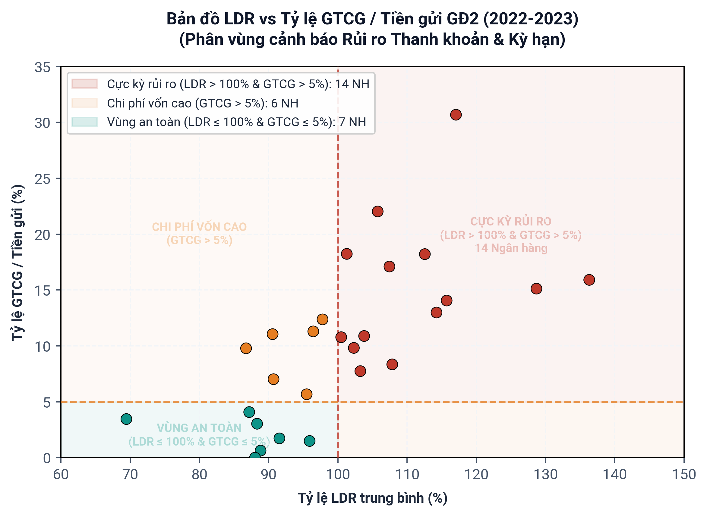
    

  

<template #footer-left>Phần VII: Giai đoạn 2 (2022-2023) | Slide 7.2 – Khủng hoảng thanh khoản & NIM</template>
</ImpressiveHeader>

---
transition: slide-left
---

<!-- SLIDE 7.3: Giai đoạn 2 - Quả bom nợ xấu phát nổ -->
<ImpressiveHeader>
<template #title>Chương 7: Giai đoạn 2 (2022-2023) — "Phục hồi ảo & Quả bom phát nổ"</template>
<template #subtitle>3. Nhánh nhân quả 2: Quả bom nợ xấu GĐ1 phát nổ hậu ân hạn</template>

  <!-- CỘT TRÁI (col-span-5) -->
  

    

      

        <strong class="text-[#C0392B] text-[10px] uppercase border-b border-slate-300 pb-0.5 mb-1 block">1. Quả bom nợ xấu phát nổ (Hết ân hạn COVID)</strong>
        Khi Thông tư 01 và 02 hết hiệu lực cùng thị trường BĐS đóng băng, nợ ẩn từ GĐ1 nhảy nhóm khốc liệt. Tỷ lệ NPL trung bình toàn ngành vọt tăng 63% (từ 1.76% lên 2.86%). Tỷ lệ nợ cần chú ý (Watch-list) cũng tăng 47% (từ 1.46% lên 2.15%).
      

      

        <strong class="text-[#E67E22] text-[10px] uppercase border-b border-slate-300 pb-0.5 mb-1 block">2. Án phạt trích lập & Bào mòn lợi nhuận thực</strong>
        Nợ xấu bùng phát chấm dứt thời kỳ lợi nhuận ảo. Tương quan nghịch giữa chất lượng tài sản và hiệu quả sinh lời thể hiện rõ nét qua hệ số NPL ↔ ROA r = -0.460 (p = 0.015). Áp lực trích lập dự phòng ồ ạt trực tiếp bào mòn lợi nhuận ròng toàn hệ thống.
      

      

        <strong class="text-[#0D9488] text-[10px] uppercase border-b border-slate-300 pb-0.5 mb-1 block">3. Phân hóa chất lượng tài sản khốc liệt</strong>
        ■ Bị tàn phá nặng nề nhất: Nhóm phơi nhiễm BĐS lớn, đệm vốn mỏng tăng nợ xấu mạnh: tiêu biểu là NH22 (NPL 23.84%), NH8 (5.4%), và NH15 (3.5%). 
        ■ Giữ vững vùng an toàn tuyệt đối: Nhóm kỷ luật tín dụng cao duy trì chất lượng tài sản xuất sắc: NH20 (NPL 0.7%), NH4 (0.8%), và NH7 (0.9%).
      

    

  

  <!-- CỘT PHẢI (col-span-7) -->
  

    

      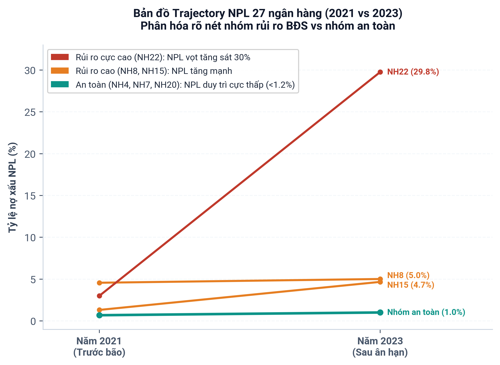
    

  

<template #footer-left>Phần VII: Giai đoạn 2 (2022-2023) | Slide 7.3 – Quả bom nợ xấu phát nổ hậu ân hạn</template>
</ImpressiveHeader>

---
transition: slide-left
---

<!-- SLIDE 7.4: Giai đoạn 2 - Lợi nhuận Phục hồi ảo & Hình phạt Đòn bẩy -->
<ImpressiveHeader>
<template #title>Chương 7: Giai đoạn 2 (2022-2023) — "Phục hồi ảo & Quả bom phát nổ"</template>
<template #subtitle>4. Nhánh phụ: Sự lung lay của lợi nhuận "Phục hồi ảo" và Đòn bẩy tiếp tục trừng phạt ROE</template>

  <!-- CỘT TRÁI (col-span-5) -->
  

    

      

        <strong class="text-[#003366] text-[9.5px] uppercase border-b border-slate-300 pb-0.5 mb-1 block">1. Lợi nhuận phục hồi kém bền vững</strong>
        Mặc dù ROA trung bình toàn ngành tăng nhẹ lên 1.36% nhờ tín dụng tăng nóng đầu giai đoạn, chất lượng lợi nhuận lại vô cùng kém bền vững. Có tới 23/27 ngân hàng phải dựa vào nguồn thu hồi nợ ngoại bảng bất thường (đóng góp > 1% TOI) để làm đẹp sổ sách trong bối cảnh biên lãi thuần bị bóp nghẹt do CoF tăng vọt.
      

      

        <strong class="text-[#C0392B] text-[9.5px] uppercase border-b border-slate-300 pb-0.5 mb-1 block">2. Chi phí dự phòng ăn mòn lợi nhuận</strong>
        Sự lung lay thể hiện rõ nét khi có tới 4 ngân hàng bị chi phí dự phòng rủi ro tín dụng ăn mòn quá bán (> 50%) lợi nhuận hoạt động cốt lõi (PPOP) trong năm 2023: điển hình là NH21 (79.4%), NH19 (72.0%), NH8 (69.8%), và NH2 (50.1%).
      

      

        <strong class="text-[#0D9488] text-[9.5px] uppercase border-b border-slate-300 pb-0.5 mb-1 block">3. Dịch vụ là phao cứu sinh & Hình phạt đòn bẩy</strong>
        Cơ cấu thu nhập ngoài lãi trở thành phao cứu sinh giúp đa dạng hóa nguồn thu với tương quan thuận rõ rệt Fee Ratio ↔ ROA (r = +0.538). Đồng thời, nghịch lý đòn bẩy tài chính tiếp tục trừng phạt các ngân hàng vốn mỏng: nhóm đòn bẩy thấp duy trì ROE vượt trội ở mức 13.56% so với mức chỉ 10.93% của nhóm đòn bẩy cao (chênh lệch 2.63pp).
      

      

        <strong class="text-[#003366] text-[9.5px] uppercase border-b border-slate-300 pb-0.5 mb-1 block">4. Giải phẫu DuPont: NH4 (Thật) vs NH3 (Ảo)</strong>
        ■ NH4 (Kỷ luật & Biên lãi dày): NII/Assets cao (2.9%), dự phòng cực thấp (-0.2% nhờ tài sản an toàn), giúp ROA đạt 1.8% và ROE đạt 20.0% với đòn bẩy an toàn 11.1x.
        ■ NH3 (Đòn bẩy gánh): Biên lãi mỏng hơn và bị dự phòng ăn mòn (-1.0%), khiến ROA chỉ đạt 1.0%. NH3 phải gánh đòn bẩy khổng lồ (20.3x) để nâng ROE lên 20.6%.
      

    

  

  <!-- CỘT PHẢI (col-span-7) -->
  

    

      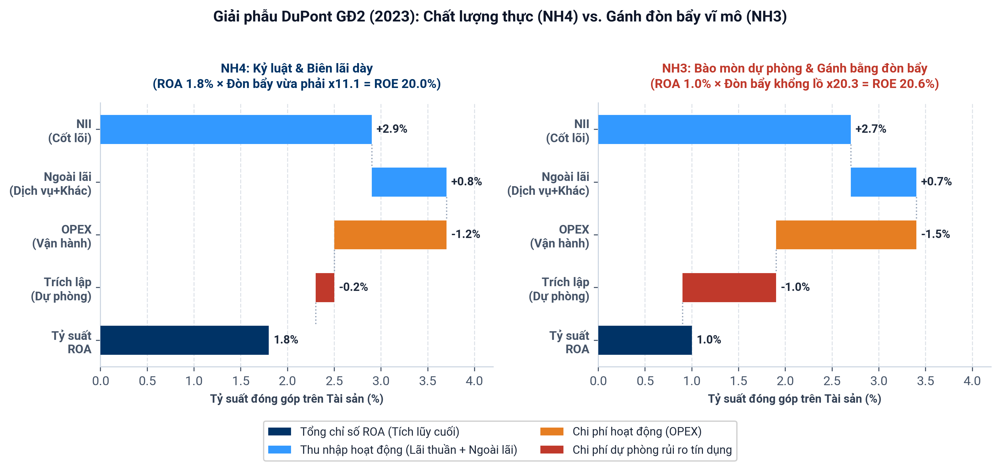
    

  

<template #footer-left>Phần VII: Giai đoạn 2 (2022-2023) | Slide 7.4 – Chất lượng lợi nhuận & Giải phẫu DuPont</template>
</ImpressiveHeader>

---
transition: slide-left
---

<!-- SLIDE 8.1: Giai đoạn 3 - Bối cảnh vĩ mô và Vết thương ngành ngân hàng -->
<ImpressiveHeader>
<template #title>Chương 8: Giai đoạn 3 (2024) — "Nợ xấu thống trị mọi thứ"</template>
<template #subtitle>1. Bối cảnh vĩ mô GĐ3: Kinh tế phục hồi nhưng vết thương ngành ngân hàng bắt đầu "ngấm"</template>

  <!-- CỘT TRÁI (col-span-5) -->
  

    

      

        <strong class="text-[#003366] text-[10px] uppercase border-b border-slate-300 pb-0.5 mb-1 block">1. Vĩ mô tươi sáng & Sản xuất mở rộng</strong>
        Bước sang năm 2024, nền kinh tế vĩ mô Việt Nam chứng kiến sự phục hồi vững chắc. Tốc độ tăng trưởng GDP thực tế đạt mức ấn tượng 7.09%, chỉ số nhà quản trị mua hàng PMI sản xuất lấy lại đà mở rộng và duy trì ổn định ở mức > 51.0 (bình quan cả năm đạt 51.8).
      

      

        <strong class="text-[#0D9488] text-[10px] uppercase border-b border-slate-300 pb-0.5 mb-1 block">2. Dòng vốn FDI lập kỷ lục lịch sử</strong>
        Niềm tin của các nhà đầu tư nước ngoài được củng cố mạnh mẽ khi dòng vốn FDI thực hiện đạt kỷ lục mới với 25.4 tỷ USD. Hoạt động xuất nhập khẩu cũng hồi phục mạnh mẽ, củng cố đà tăng trưởng chung của toàn bộ nền kinh tế thực.
      

      

        <strong class="text-[#C0392B] text-[10px] uppercase border-b border-slate-300 pb-0.5 mb-1 block">3. Vết thương ngân hàng ngấm đòn nợ xấu</strong>
        Trái ngược hoàn toàn với gam màu tươi sáng của vĩ mô, hệ thống ngân hàng lại bước vào thời kỳ suy giảm lợi nhuận nghiêm trọng với tỷ suất ROA toàn ngành sụt giảm mạnh về mức đáy 1.12% (hoặc bình quan số học giảm về 1.04%). Nguyên nhân không đến từ các biến động tức thời của năm 2024, mà là hệ quả của chu kỳ nợ xấu dồn nén từ 4 năm trước (2020-2023) bắt đầu "ngấm" và phản ánh đầy đủ lên bảng cân đối kế toán thông qua gánh nặng chi phí trích lập dự phòng.
      

    

  

  <!-- CỘT PHẢI (col-span-7) -->
  

    

      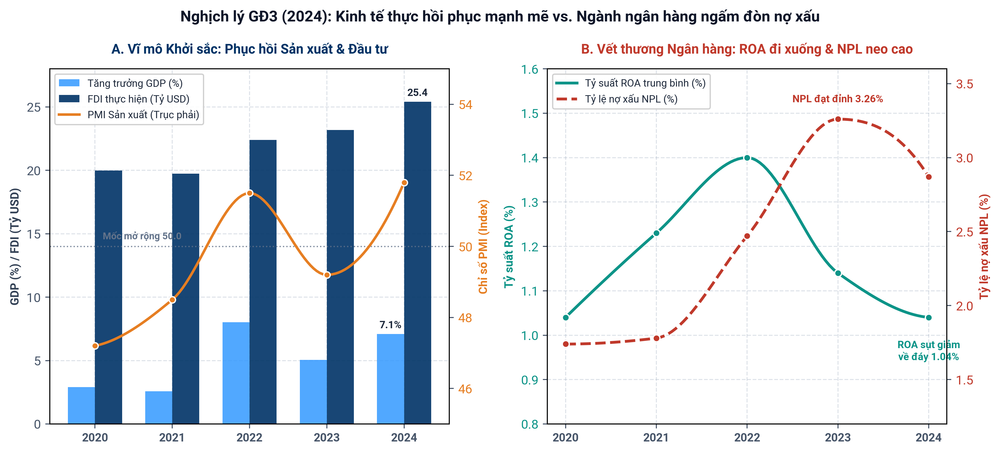
    

  

<template #footer-left>Phần VIII: Giai đoạn 3 (2024) | Slide 8.1 – Bối cảnh vĩ mô và Sức khỏe ngành ngân hàng</template>
</ImpressiveHeader>

---
transition: slide-left
---

<!-- SLIDE 8.2: Giai đoạn 3 - Sự dịch chuyển tương quan và NPL thống trị -->
<ImpressiveHeader>
<template #title>Chương 8: Giai đoạn 3 (2024) — "Nợ xấu thống trị mọi thứ"</template>
<template #subtitle>2. Nhánh nhân quả chính: Sự chuyển giao quyền lực tuyệt đối — NPL thống trị hệ thống</template>

  <!-- CỘT TRÁI (col-span-5) -->
  

    

      

        Dữ liệu thực chứng năm 2024 chỉ ra một sự dịch chuyển cấu trúc quyền lực cực kỳ rõ nét giữa các biến số chi phối hiệu quả hoạt động ngân hàng.
      

      

        <strong class="text-[#C0392B] text-[9.5px] uppercase border-b border-slate-300 pb-0.5 mb-1 block">1. NPL trở thành biến số thống trị tuyệt đối</strong>
        Tương quan NPL ↔ ROA vọt lên mức âm lịch sử: r = -0.894 (so với GĐ1 chỉ là -0.263, GĐ2 là -0.460). Rủi ro nợ xấu lúc này giải thích tới gần 80% phương sai lợi nhuận của các ngân hàng.
      

      

        <strong class="text-[#003366] text-[9.5px] uppercase border-b border-slate-300 pb-0.5 mb-1 block">2. CASA mất đi ngôi vương chi phối</strong>
        Tương quan CASA ↔ ROA sụt giảm mạnh từ mức +0.659 (GĐ1) xuống chỉ còn +0.391 (GĐ3). Khi nợ xấu bùng phát quá lớn (NPL trung bình 2.87%, tối đa tới 19.54% ở NH22), chi phí dự phòng khổng lồ ăn mòn toàn bộ lợi ích từ biên lãi thuần rộng do vốn rẻ CASA mang lại. Điểm cốt lõi chuyển từ "ai huy động được vốn rẻ nhất" sang "ai quản trị và thu hồi nợ tốt nhất".
      

      

        <strong class="text-[#E67E22] text-[9.5px] uppercase border-b border-slate-300 pb-0.5 mb-1 block">3. Hệ quả phân hóa cực đại</strong>
        ■ NH22 (Suy kiệt): NPL vọt lên 19.54% khiến ROA sụt về -4.78%, ROE sụt -91.69% do đòn bẩy khuếch đại thảm họa.
        ■ Nhóm quản trị rủi ro tốt vẫn đứng vững: NH7 (NPL 1.1%, ROA 2.4% - dẫn đầu ngành), NH4 (NPL 1.0%) và NH2 (NPL 1.2%).
      

    

  

  <!-- CỘT PHẢI (col-span-7) -->
  

    

      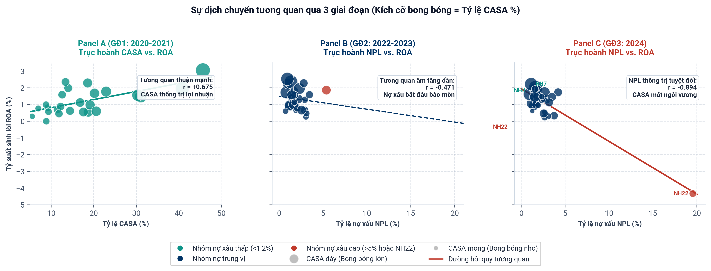
    

  

<template #footer-left>Phần VIII: Giai đoạn 3 (2024) | Slide 8.2 – Sự dịch chuyển tương quan và NPL thống trị</template>
</ImpressiveHeader>

---
transition: slide-left
---

<!-- SLIDE 8.3: Giai đoạn 3 - Đa dạng hóa nguồn thu phi tín dụng -->
<ImpressiveHeader>
<template #title>Chương 8: Giai đoạn 3 (2024) — "Nợ xấu thống trị mọi thứ"</template>
<template #subtitle>3. Nhánh phụ 1: Đa dạng hóa nguồn thu phi tín dụng (Fee Income) là phao cứu sinh</template>

  <!-- CỘT TRÁI (col-span-5) -->
  

    

      

        <strong class="text-[#003366] text-[9.5px] uppercase border-b border-slate-300 pb-0.5 mb-1 block">1. Động cơ tăng trưởng phi tín dụng</strong>
        Trong bối cảnh biên lãi thuần (NIM) truyền thống bị nén chặt và dư nợ tín dụng chịu rủi ro trích lập dự phòng cao, hoạt động đa dạng hóa thu nhập ngoài lãi trở thành động cơ tăng trưởng thứ hai cực kỳ quan trọng cho các ngân hàng.
      

      

        <strong class="text-[#0D9488] text-[9.5px] uppercase border-b border-slate-300 pb-0.5 mb-1 block">2. Tương quan dương mạnh mẽ với ROA</strong>
        Hệ số tương quan Fee Ratio ↔ ROA đạt r = +0.551 trên toàn hệ thống (và đạt tới r = +0.672 đối với tỷ lệ Fee/TOI khi loại trừ ngân hàng yếu kém NH22). Đây là tương quan dương mạnh nhất toàn ngành bên cạnh yếu tố nợ xấu NPL.
      

      

        <strong class="text-[#003366] text-[9.5px] uppercase border-b border-slate-300 pb-0.5 mb-1 block">3. Phao cứu sinh từ chuyển đổi số & bảo hiểm</strong>
        Các ngân hàng có tỷ trọng ngoài lãi cao nhờ thành công trong mảng Bancassurance chuyên sâu (15 NH) và Chuyển đổi số thanh toán bán lẻ (13 NH) đã duy trì được mức ROA vượt trội bất chấp giông bão tín dụng. Điển hình là NH7 và NH4 duy trì ROA đứng đầu hệ thống.
      

    

  

  <!-- CỘT PHẢI (col-span-7) -->
  

    

      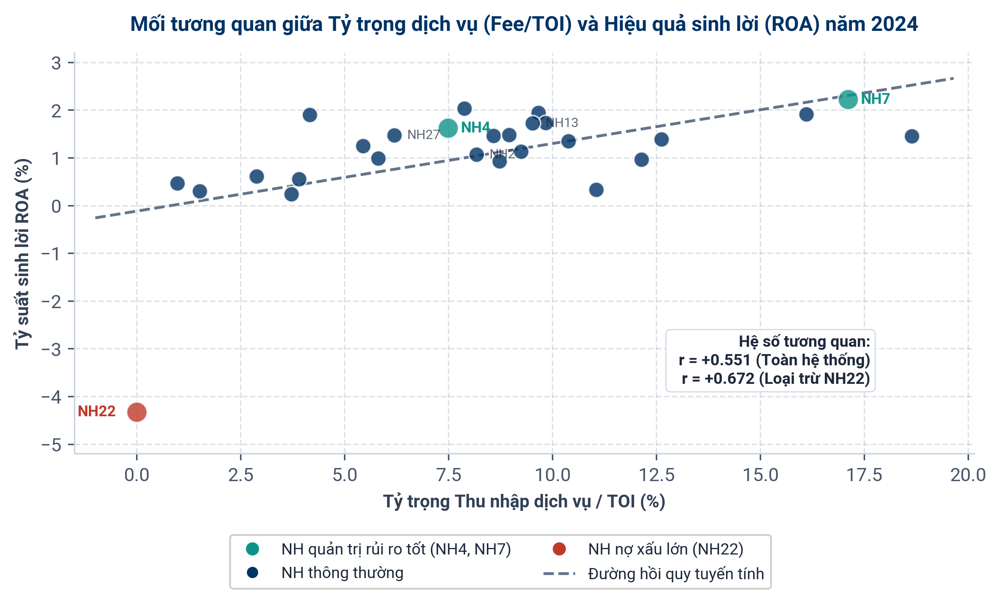
    

  

<template #footer-left>Phần VIII: Giai đoạn 3 (2024) | Slide 8.3 – Thu nhập phi tín dụng và Phao cứu sinh dịch vụ</template>
</ImpressiveHeader>

---
transition: slide-left
---

<!-- SLIDE 8.4: Giai đoạn 3 - Nghịch lý đòn bẩy đạt cực đại -->
<ImpressiveHeader>
<template #title>Chương 8: Giai đoạn 3 (2024) — "Nợ xấu thống trị mọi thứ"</template>
<template #subtitle>4. Nhánh phụ 2: Nghịch lý đòn bẩy đạt cực đại (Leverage LOW vs. HIGH ROE)</template>

  <!-- CỘT TRÁI (col-span-5) -->
  

    

      

        <strong class="text-[#E67E22] text-[9.5px] uppercase border-b border-slate-300 pb-0.5 mb-1 block">1. Phân hóa ROE cực đại do di chứng nợ xấu</strong>
        Nghịch lý đòn bẩy trong khủng hoảng tín dụng bộc lộ rõ nét nhất ở giai đoạn này:
        Nhóm đòn bẩy thấp (Leverage LOW) đạt ROE trung bình dương 12.02%, trong khi nhóm đòn bẩy cao (Leverage HIGH) sụt xuống mức âm -1.55% (khoảng cách chênh lệch kỷ lục lên tới 13.57pp).
      

      

        <strong class="text-[#003366] text-[9.5px] uppercase border-b border-slate-300 pb-0.5 mb-1 block">2. Bản chất kiểm định DuPont</strong>
        Tương quan Profit Margin ↔ ROE đạt r = +0.904 (tương quan thuận tuyệt đối, hoặc tương quan âm cực mạnh NPL ↔ ROE đạt r = -0.965), vượt trội hoàn toàn so với Leverage ↔ ROE (r = -0.353). Chênh lệch ROE khổng lồ được quyết định bởi biên lợi nhuận thực tế (được bảo vệ nhờ quản trị nợ xấu) chứ không phải do việc dùng đòn bẩy cao để cố đấm ăn xôi tăng quy mô rủi ro.
      

      

        <strong class="text-[#C0392B] text-[9.5px] uppercase border-b border-slate-300 pb-0.5 mb-1 block">3. Giải phẫu NH4 (Top) vs NH22 (Bottom)</strong>
        ■ NH4 (Hiệu quả thực): Biên lãi dày, dự phòng thấp giúp ROA đạt 1.8%, đòn bẩy an toàn 11.1x đem lại ROE vững chãi 20.0%.
        ■ NH22 (Thảm họa nợ xấu): Biên lãi mỏng, dự phòng cực lớn (-3.8% tài sản) kéo sập ROA về -4.3%, đòn bẩy 15.0x khuếch đại mức lỗ khiến ROE rơi về -65.1% (kịch bản ghi nhận -91.69%).
      

      

        Transition: "Qua 3 giai đoạn căng thẳng, bức màn che đậy sức khỏe tài sản thực sự đã được gỡ bỏ hoàn toàn. Hãy cùng nhìn lại bản đồ dịch chuyển tổng thể để nhận diện chân dung những người hùng bền vững..."
      

    

  

  <!-- CỘT PHẢI (col-span-7) -->
  

    

      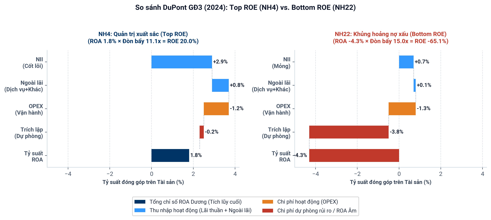
    

  

<template #footer-left>Phần VIII: Giai đoạn 3 (2024) | Slide 8.4 – Nghịch lý đòn bẩy tài chính & Phân rã ROE</template>
</ImpressiveHeader>

---
transition: slide-left
---

<!-- SLIDE 9.1: Chương 9 - Bản đồ dịch chuyển 3 giai đoạn -->
<ImpressiveHeader>
<template #title>Chương 9: Tổng Hợp — Bản Đồ Dịch Chuyển Trajectory Map & 3 "Gene" Bền Vững</template>
<template #subtitle>1. Bản đồ dịch chuyển 3 giai đoạn (Trajectory PCA Space Map)</template>

  

    

      Áp dụng K-Means Clustering trên 6 biến chuẩn hóa (ROA, NPL, CASA, CIR, NIM, LDR) phân loại 27 ngân hàng thành 4 cụm rõ rệt để phác họa bản đồ dịch chuyển vị thế qua 3 giai đoạn (GĐ1 → GĐ2 → GĐ3).
    

  

  
  

    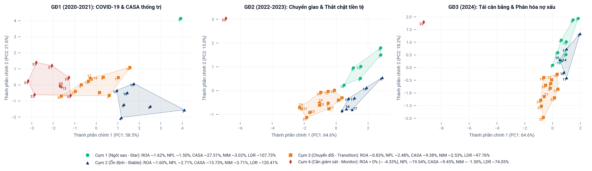
  

<template #footer-left>Phần IX: Tổng Hợp | Slide 9.1 – Bản đồ dịch chuyển 3 giai đoạn (Trajectory PCA Space Map)</template>
</ImpressiveHeader>

---
transition: slide-left
---

<!-- SLIDE 9.2: Giải thích sự dịch chuyển qua 3 giai đoạn theo nhóm -->
<ImpressiveHeader>
<template #title>Chương 9: Tổng Hợp — Bản Đồ Dịch Chuyển Trajectory Map & 3 "Gene" Bền Vững</template>
<template #subtitle>2. Phân tích chi tiết nguyên nhân dịch chuyển theo nhóm vị thế</template>

  

    <table class="w-full border-collapse text-[10px] leading-[1.3] text-slate-600">
      <thead>
        <tr class="bg-[#003366] text-white font-bold text-left text-[10.5px]">
          <th class="py-2 px-3 w-[18%] border-r border-slate-200/20">Nhóm Vị Thế</th>
          <th class="py-2 px-3 w-[82%]">Đặc Điểm Vận Hành & Minh Chứng Số Liệu Thực Tế</th>
        </tr>
      </thead>
      <tbody class="divide-y divide-slate-100 font-medium bg-white">
        <!-- Row 1: Consistent Leaders -->
        <tr class="hover:bg-slate-50/50">
          <td class="py-2 px-3 border-r border-slate-100 align-top">
            

              🏆 Bền Vững
            

            
Consistent Leaders

            
Đại diện: NH 4, NH 2

          </td>
          <td class="py-2 px-3 align-top text-justify">
            Vững vàng tại cụm 🟢 (Ngôi sao) hoặc 🔵 (Ổn định) qua 3 giai đoạn nhờ sở hữu <strong class="text-slate-800">3 "gene" bền vững</strong>:
            <ul class="list-disc pl-4 mt-0.5 space-y-0 text-slate-600">
              <li><strong class="text-slate-700">Giá vốn rẻ:</strong> Đệm CASA dày giúp tối ưu chi phí huy động (CoF của NH 4 chỉ ~0.87%, danh nghĩa ~2.8%).</li>
              <li><strong class="text-slate-700">Đệm vốn vững chắc:</strong> Tỷ lệ an toàn vốn (Equity Ratio) duy trì ở mức cao vượt trội (>10%).</li>
              <li><strong class="text-slate-700">Phòng vệ rủi ro cao:</strong> Trích lập nghiêm ngặt, tỷ lệ bao phủ nợ xấu 2024 của NH 4 đạt 223.31%, NH 2 đạt 174.68%.</li>
            </ul>
          </td>
        </tr>
        <!-- Row 2: Turnaround Success -->
        <tr class="hover:bg-slate-50/50">
          <td class="py-2 px-3 border-r border-slate-100 align-top">
            

              📈 Phục Hồi
            

            
Turnaround Success

            
Đại diện: NH 1, NH 2

          </td>
          <td class="py-2 px-3 align-top text-justify">
            Bứt phá từ cụm 🔴 (Cần giám sát) / 🟡 (Chuyển đổi) ở GĐ1 lên cụm 🔵/🟢 (Ổn định/Ngôi sao) ở GĐ3 nhờ xoay trục chiến lược quyết liệt:
            <ul class="list-disc pl-4 mt-0.5 space-y-0 text-slate-600">
              <li><strong class="text-slate-700">Cơ cấu nguồn vốn:</strong> Siết tín dụng rủi ro cao (BĐS, trái phiếu doanh nghiệp) và tập trung kéo mạnh CASA cá nhân.</li>
              <li><strong class="text-slate-700">Tối ưu chi phí:</strong> Cắt giảm chi phí hoạt động, hạ nhanh tỷ lệ CIR từ >45% xuống vùng tối ưu ~30%.</li>
              <li><strong class="text-slate-700">Làm sạch bảng cân đối:</strong> Quyết liệt xử lý và tất toán toàn bộ nợ xấu tại trái phiếu VAMC.</li>
            </ul>
          </td>
        </tr>
        <!-- Row 3: Declining Performers -->
        <tr class="hover:bg-slate-50/50">
          <td class="py-2 px-3 border-r border-slate-100 align-top">
            

              📉 Suy Giảm
            

            
Declining Performers

            
Đại diện: NH 22, NH 8

          </td>
          <td class="py-2 px-3 align-top text-justify">
            Trượt xuống cụm rủi ro 🔴 (Cần giám sát) do vi phạm kỷ luật vốn và khẩu vị rủi ro quá lớn:
            <ul class="list-disc pl-4 mt-0.5 space-y-0 text-slate-600">
              <li><strong class="text-slate-700">Tín dụng tăng trưởng nóng:</strong> Tập trung cho cho vay các dự án BĐS lớn, đẩy LDR vượt trần an toàn >100% (tiêu biểu như NH 8 đạt 142.66%).</li>
              <li><strong class="text-slate-700">Đệm phòng vệ yếu:</strong> Đệm vốn tự có bị bào mòn (&lt;6% ở NH 22) và tỷ lệ bao phủ nợ xấu quá thấp (&lt;50%, NH 22 chỉ đạt 8.60%).</li>
              <li><strong class="text-slate-700">Hệ quả:</strong> Khi thị trường biến động, nợ xấu gia tăng làm xói mòn trực tiếp vốn chủ sở hữu và lợi nhuận.</li>
            </ul>
          </td>
        </tr>
      </tbody>
    </table>
  

<template #footer-left>Phần IX: Tổng Hợp | Slide 9.2 – Phân nhóm dịch chuyển qua các giai đoạn</template>
</ImpressiveHeader>

---
transition: slide-left
---

<!-- SLIDE 10.1: Đề xuất giải pháp Vĩ mô & Toàn hệ thống (Góc độ Nhà nước & NHNN) -->
<ImpressiveHeader>
<template #title>Chương 10: Khuyến Nghị & Giải Pháp Chiến Lược</template>
<template #subtitle>1. Định hướng vĩ mô & Chính sách điều hành hệ thống (Nhà nước & NHNN)</template>

  

    <strong class="text-rose-900 font-bold">Vấn đề cốt lõi từ dữ liệu:</strong> Tỷ lệ thanh khoản LDR toàn hệ thống căng thẳng ở mức 104.87%; có 22/27 ngân hàng thiếu hụt đệm dự phòng (Coverage &lt; 100%) và 5/27 ngân hàng có đệm vốn mỏng (&lt; 6%). Nợ xấu (NPL) trở thành biến số thống trị kéo lùi lợi nhuận (r = -0.894).
  

  

    

      

        

          🎯
          <strong class="text-[9px] text-[#003366] uppercase font-bold tracking-wider">Room Tín Dụng</strong>
        

        NHNN & Cơ chế cấp
      

      

        <strong class="text-slate-800">Kiểm soát rủi ro hệ thống & room tín dụng:</strong> Phân hóa cấp room tín dụng chặt chẽ dựa trên sức khỏe tài chính thực tế. Ưu tiên cấp room cao cho cụm <strong class="text-emerald-700">Ngôi Sao / Ổn định</strong> có tỷ lệ CASA dồi dào và Coverage &gt; 100%. Yêu cầu trình phương án tái cơ cấu khẩn cấp và siết room tín dụng với cụm <strong class="text-rose-700">Cần giám sát</strong> (đặc biệt là nhóm có NPL &gt; 3% và lạm dụng đòn bẩy).
      

    

    

      

        

          💧
          <strong class="text-[9px] text-[#003366] uppercase font-bold tracking-wider">Luật Nợ Xấu & OMO</strong>
        

        Khơi thông thanh khoản
      

      

        <strong class="text-slate-800">Thanh khoản & Xử lý nợ xấu:</strong> Điều hành linh hoạt thị trường mở (OMO) để cung cấp thanh khoản ngắn hạn, hạn chế việc các ngân hàng nhỏ (CASA &lt; 15%) phải đua lãi suất phát hành Giấy tờ có giá đắt đỏ gây hiệu ứng domino. Đẩy nhanh hoàn thiện hành lang pháp lý (kế thừa Nghị quyết 42) để các ngân hàng nhanh chóng phát mại tài sản bảo đảm, xử lý triệt độ nợ đọng của <strong class="text-slate-700">VAMC</strong>.
      

    

    

      

        

          💻
          <strong class="text-[9px] text-[#003366] uppercase font-bold tracking-wider">Hạ Tầng Số</strong>
        

        Open Banking & API
      

      

        <strong class="text-slate-800">Thúc đẩy hạ tầng số Open Banking:</strong> Đẩy nhanh tiến độ hoàn thiện khung pháp lý về Open API và chia sẻ dữ liệu quốc gia (Đề án 06), tạo bệ phóng giúp toàn ngành giảm chi phí vận hành (CIR) và gia tăng thu nhập dịch vụ phi tín dụng, qua đó giảm phụ thuộc rủi ro vào hoạt động tín dụng truyền thống.
      

    

  

<template #footer-left>Phần III: Đề Xuất Giải Pháp | Slide 10.1 – Giải pháp Vĩ mô & Điều hành hệ thống</template>
</ImpressiveHeader>

---
transition: slide-left
---

<!-- SLIDE 10.2: Đề xuất chiến lược chung cho các Doanh nghiệp Ngân hàng -->
<ImpressiveHeader>
<template #title>Chương 10: Khuyến Nghị & Giải Pháp Chiến Lược</template>
<template #subtitle>2. Chiến lược định hình 3 "Gene" bền vững cho các Doanh nghiệp Ngân hàng</template>

  

    <strong class="text-[#003366] font-bold">Vấn đề cốt lõi từ dữ liệu:</strong> Biên lợi nhuận (Profit Margin) quyết định khả năng sinh lời bền vững (r = -0.904 với ROE) trong khi chi phí nhân sự chiếm tới ~55.4% Opex. Việc lạm dụng đòn bẩy khi nợ xấu bùng phát chỉ khuếch đại khoản lỗ (ROE nhóm đòn bẩy cao chạm đáy -1.55%).
  

  

    

      

        

          🏆
          <strong class="text-[9px] text-[#003366] uppercase font-bold tracking-wider">Gene 1: CASA</strong>
        

        Thanh khoản & Giá vốn
      

      

        <strong class="text-slate-800">Bảo vệ Gene 1 (CASA & thanh khoản):</strong> Từ bỏ tư duy cạnh tranh huy động vốn bằng lãi suất cao. Chuyển sang thu hút CASA cá nhân thông qua trải nghiệm hệ sinh thái số (Zero-fee, tiện ích đa dạng). Giảm tỷ trọng nguồn vốn Wholesale ngắn hạn để tài trợ tín dụng trung-dài hạn nhằm hạ nhiệt LDR.
      

    

    

      

        

          📉
          <strong class="text-[9px] text-[#003366] uppercase font-bold tracking-wider">Gene 2: Nợ Xấu</strong>
        

        Kỷ luật Quản trị nợ
      

      

        <strong class="text-slate-800">Kỷ luật Gene 2 (Quản trị Nợ xấu):</strong> Chấm dứt chiến lược "tăng trưởng bằng mọi giá" qua đòn bẩy cao. Các ngân hàng có tỷ lệ bao phủ (Coverage) &lt; 80% bắt buộc phải tạm dừng chia cổ tức bằng tiền mặt, dồn 100% lợi nhuận giữ lại để lập đệm dự phòng rủi ro và củng cố vốn tự có (Equity Ratio).
      

    

    

      

        

          ⚡
          <strong class="text-[9px] text-[#003366] uppercase font-bold tracking-wider">Gene 3: Thu Ngoài</strong>
        

        Thu thuần dịch vụ & CIR
      

      

        <strong class="text-slate-800">Đa dạng hóa Gene 3 (Thu nhập ngoài lãi & Opex):</strong> Dịch chuyển trọng tâm doanh thu sang Fee Income (mục tiêu &gt;15% TOI) thông qua thanh toán số và Bancassurance thực chất. Quyết liệt ứng dụng eKYC và RPA để tối ưu chi phí nhân sự, ép tỷ lệ CIR xuống dưới mức chuẩn 35%.
      

    

  

<template #footer-left>Phần III: Đề Xuất Giải Pháp | Slide 10.2 – Chiến lược phục hồi bền vững cho các Ngân hàng</template>
</ImpressiveHeader>

---
transition: slide-left
---

<!-- SLIDE 10.3: Giải pháp chiến lược ưu tiên riêng biệt theo phân cụm ngân hàng -->
<ImpressiveHeader>
<template #title>Chương 10: Khuyến Nghị & Giải Pháp Chiến Lược</template>
<template #subtitle>3. Phác đồ điều trị riêng biệt cho 4 cụm vị thế chiến lược (PCA Map)</template>

  

    <strong class="text-slate-800">Vấn đề cốt lõi:</strong> Sự phân hóa cực độ trên bản đồ PCA giữa 4 cụm chiến lược yêu cầu các phác đồ điều trị riêng biệt, giải quyết chính xác "gene thiếu hụt" của từng nhóm ngân hàng cụ thể.
  

  

    

      

        🟢 Ngôi Sao
        Điển hình: NH 4, NH 7
      

      

        <strong class="text-slate-700">Vấn đề:</strong> Đối mặt giới hạn tăng trưởng của tín dụng truyền thống.
        |
        <strong class="text-slate-700">Giải pháp khắc phục:</strong> Khai thác đệm vốn dày (Equity &gt; 10%) và CASA &gt; 30% để nhân bản mô hình thu phí thanh toán và Wealth Management. Đẩy mạnh chuyển dịch sang xuất khẩu nền tảng công nghệ số nội bộ.
      

    

    

      

        🔵 Ổn Định
        Điển hình: NH 11, NH 14
      

      

        <strong class="text-slate-700">Vấn đề:</strong> Tỷ lệ CASA chưa tối ưu (nhiều NH hiện đang dưới 15%), dễ tổn thương khi lãi suất huy động biến động.
        |
        <strong class="text-slate-700">Giải pháp khắc phục:</strong> Áp dụng ngay chiến lược "Digital Payroll" (trả lương qua tài khoản B2B2C) để kéo CASA tự nhiên. Tự động hóa quy trình phê duyệt tín dụng (Auto-Approval) để tiết giảm CIR, bảo vệ Profit Margin.
      

    

    

      

        🟡 Chuyển Đổi
        Điển hình: NH 15, NH 19
      

      

        <strong class="text-slate-700">Vấn đề:</strong> LDR căng thẳng (&gt;100%), NIM bị nén và CIR kém hiệu quả.
        |
        <strong class="text-slate-700">Giải pháp khắc phục:</strong> Cắt giảm quyết liệt mạng lưới chi nhánh vật lý truyền thống dư thừa. Tái cấu trúc danh mục, dịch chuyển chi phí đầu tư sang IT để thúc đẩy tỷ trọng Fee/TOI lên mức 15-20%, bù đắp đà suy giảm của lãi.
      

    

    

      

        🔴 Giám Sát
        Điển hình: NH 22, NH 8
      

      

        <strong class="text-slate-700">Vấn đề:</strong> Nợ xấu bùng nổ, Coverage bốc hơi (&lt;55%), vốn chủ cạn kiệt, đe dọa an toàn hệ thống (Equity &lt; 6%).
        |
        <strong class="text-slate-700">Giải pháp khắc phục:</strong> Đóng băng ngay việc mở rộng tín dụng vào lĩnh vực rủi ro (BĐS). Ưu tiên sinh tử là gọi vốn cấp 1 từ cổ đông chiến lược để vá đệm vốn, tích cực thu hồi tài sản và dọn sạch trái phiếu VAMC bằng mọi giá thay vì tìm kiếm lợi nhuận.
      

    

  

<template #footer-left>Phần III: Đề Xuất Giải Pháp | Slide 10.3 – Giải pháp chiến lược ưu tiên theo phân cụm</template>
</ImpressiveHeader>
