<ImpressiveCover>
<template #subtitle>Investment &amp; Financial Evaluation Dossier</template>
<template #info>
  
Prepared for: Investment Committee

  
Author: Vualidon.FP

  
Date: May 2026 | Version 1.0

</template>
<template #image>
  
</template>
</ImpressiveCover>

---

<ImpressiveHeader>
<template #title>Chương 1: Quy mô &amp; Tăng trưởng</template>
<template #subtitle>Phân tích toàn diện Quy mô Hệ thống &amp; Năng lực Vốn hóa Ngành Ngân hàng Việt Nam (2020 – 2024)</template>

  <!-- CỘT TRÁI (col-span-8) -->
  

    

      

        ♦
        <strong class="text-slate-800">Quy mô tài sản phục hồi đồng pha vĩ mô (Slide 1.1):</strong>
        Tổng tài sản toàn hệ thống vọt từ 10.87 triệu tỷ VND (2020) lên 19.31 triệu tỷ VND (2024), đạt CAGR ấn tượng +15.5%. Tốc độ tăng trưởng tài sản đồng pha với đà phục hồi GDP vĩ mô (vọt từ đáy năm 2020 lên năm 2024), trong đó tăng trưởng tài sản đạt mức cao +16.25% vào năm 2022 khi GDP chạm đỉnh.
      

      

        ♦
        <strong class="text-slate-800">Năng lực vốn hóa mở rộng vững chắc (Slide 1.2):</strong>
        Vốn chủ sở hữu (VCSH) tăng hơn 2.05 lần lên 1,612.4 nghìn tỷ VND (+19.7%), song hành cùng vốn điều lệ đạt 816.7 nghìn tỷ VND (+17.7%). Nhờ đà tích lũy vốn tự có vượt trội hơn mở rộng tài sản, tỷ lệ an toàn vốn hệ thống (Equity/TTS) tăng từ 7.23% lên 8.35% (trung bình đơn giản tăng từ 9.27% lên 11.45%).
      

      

        ♦
        <strong class="text-slate-800">Phân hóa sâu sắc &amp; Cảnh báo an toàn (Slide 1.3):</strong>
        Biên độ chênh lệch tỷ lệ an toàn vốn năm 2024 rộng tới 10.80pp giữa ngân hàng đứng đầu (15.94%) và ngân hàng cuối bảng (5.14%). Toàn hệ thống ghi nhận có 5 ngân hàng rơi vào vùng cảnh báo với đệm vốn mỏng dưới ngưỡng tối thiểu, đối mặt áp lực thanh khoản lớn khi tín dụng tăng nóng.
      

    

    

      

        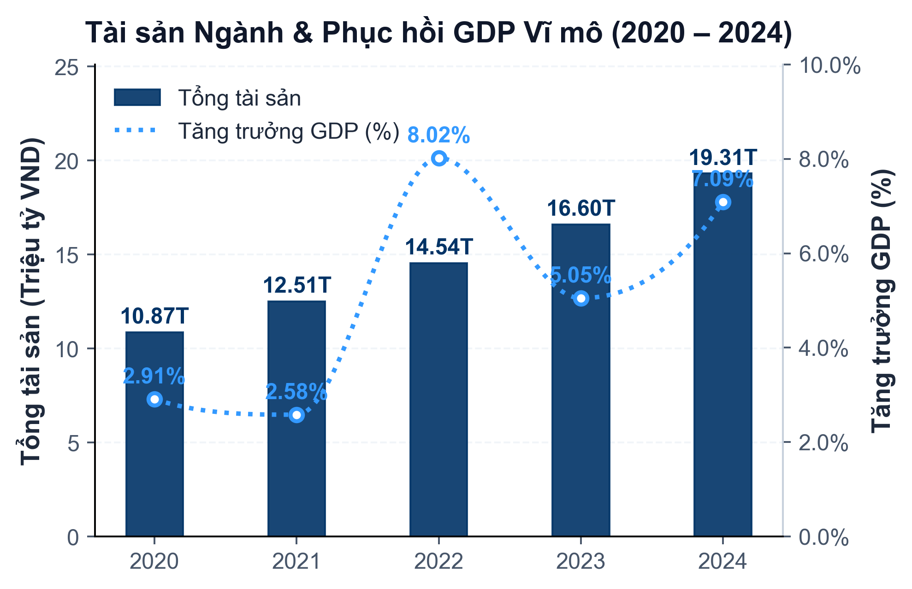
      

      

        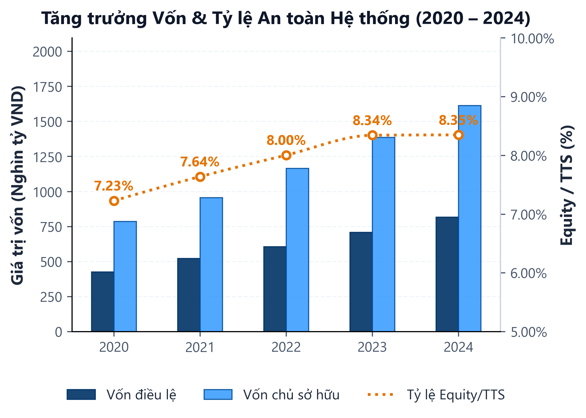
      

    

  

  <!-- CỘT PHẢI (col-span-4) -->
  

    

      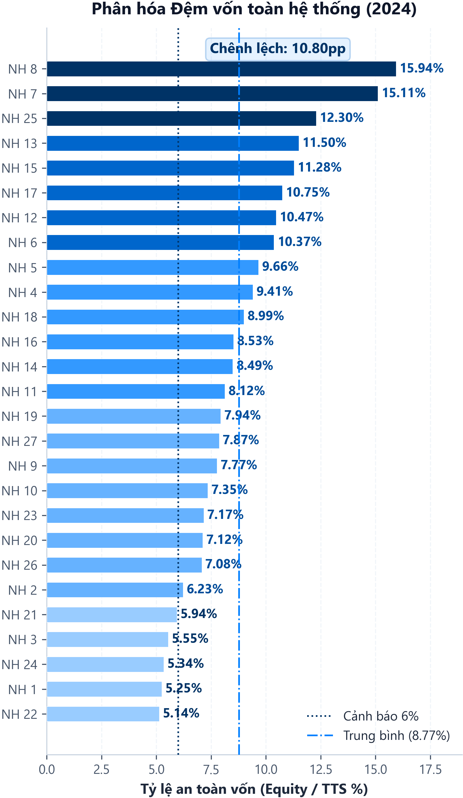
    

  

<template #footer-left>Phần I: Bức tranh toàn cảnh | Slide 1.0 - Quy mô &amp; Năng lực Vốn hóa Ngành</template>
</ImpressiveHeader>

---

<ImpressiveHeader>
<template #title>Chương 2: Hiệu quả sinh lời &amp; Biên lãi thuần</template>
<template #subtitle>Phân tích toàn diện Hiệu suất hoạt động &amp; Áp lực NIM toàn ngành Ngân hàng (2020 – 2024)</template>

  <!-- CỘT TRÁI (col-span-8) -->
  

    

      

        ♦
        <strong class="text-slate-800">Hiệu quả sinh lời đi ngang ở mức thấp, ROE sụt giảm rõ rệt (Slide 2.1):</strong>
        Tỷ suất sinh lời trên tài sản (ROA) toàn ngành đi ngang ở mức 1.34% (đạt đỉnh 1.46% năm 2022 và giảm về 1.34% năm 2024). Đồng thời, tỷ suất sinh lời trên vốn chủ sở hữu (ROE) sụt giảm sâu từ đỉnh 15.07% (2022) xuống chỉ còn 10.57% (2024), phản ánh hiệu quả sử dụng vốn của hệ thống bị suy yếu đáng kể.
      

      

        ♦
        <strong class="text-slate-800">Phân hóa lợi nhuận cực kỳ khốc liệt giữa các nhóm ngân hàng (Slide 2.1):</strong>
        Khoảng cách ROE trung bình giai đoạn 2022–2024 rộng tới 54.68pp giữa ngân hàng dẫn đầu (NH 11: 22.24%) và ngân hàng cuối bảng (-32.44%). Phân tích DuPont 2024 chứng minh Biên lợi nhuận ròng (Profit Margin) là nhân tố cốt lõi quyết định ROE với hệ số tương quan tuyến tính cực mạnh r = -0.904 (p &lt; 0.0001), vượt trội so với vai trò của đòn bẩy tài chính.
      

      

        ♦
        <strong class="text-slate-800">Áp lực biên lãi thuần thu hẹp sâu rộng do bão chi phí huy động (Slide 2.2):</strong>
        Biên lãi ròng (NIM) toàn ngành đạt đỉnh 4.25% (2022) nhưng nhanh chóng sụt giảm sâu về 3.76% (2024). Nguyên nhân trực tiếp là chi phí huy động (Cost of Deposits) vọt tăng từ 3.76% (2022) lên 5.16% (2023) do vĩ mô thắt chặt, bóp nghẹt chênh lệch lãi suất (Spread giảm từ 4.49pp xuống 3.54pp). Chu kỳ này bóp nghẹt biên lãi ròng của 18 / 27 ngân hàng (NIM Compression).
      

    

    

      

        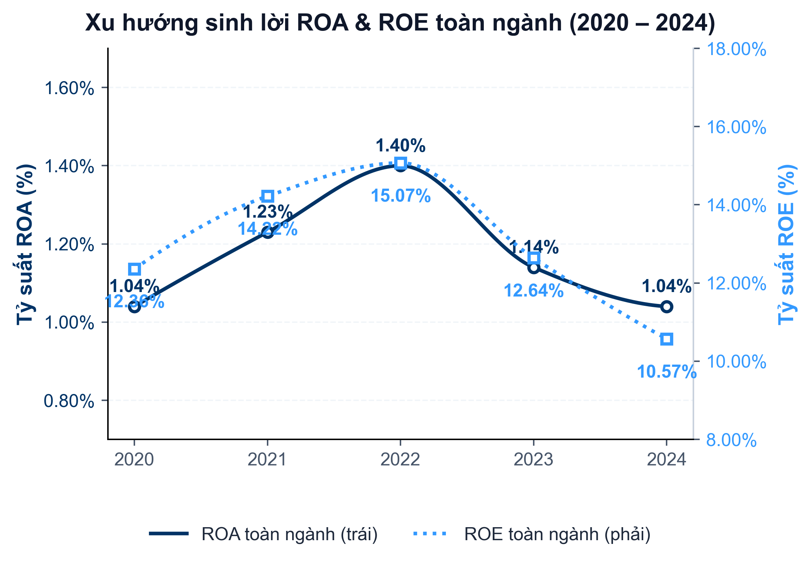
      

      

        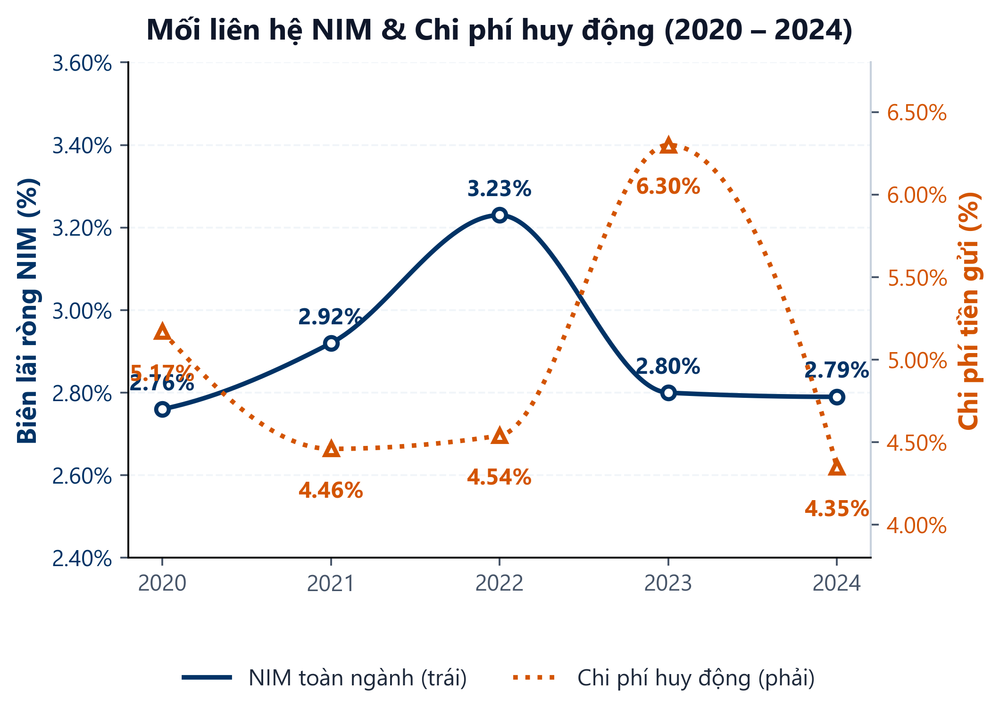
      

    

  

  <!-- CỘT PHẢI (col-span-4) -->
  

    

      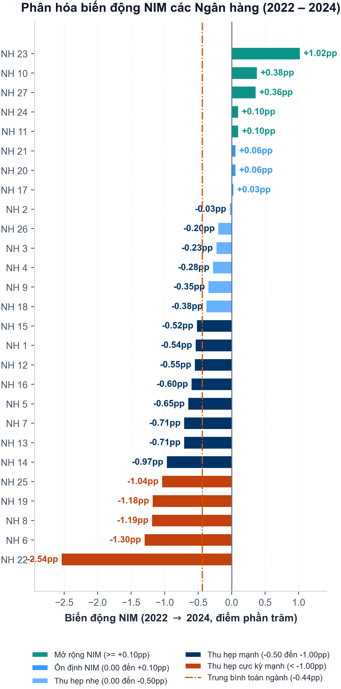
    

  

<template #footer-left>Phần I: Bức tranh toàn cảnh | Slide 2.0 - Hiệu quả sinh lời &amp; Áp lực NIM</template>
</ImpressiveHeader>

---

<ImpressiveHeader>
<template #title>Chương 3: Cơ cấu thu nhập &amp; Chi phí hoạt động</template>
<template #subtitle>Đa dạng hóa nguồn thu &amp; Phân hóa năng lực tối ưu vận hành toàn ngành (2015 – 2024)</template>

  <!-- CỘT TRÁI (col-span-4) -->
  

    

      

        ♦
        <strong class="text-slate-800">Cơ cấu doanh thu dịch chuyển tích cực sang phi tín dụng (Slide 3.1):</strong>
        Tỷ trọng thu nhập ngoài lãi toàn ngành ghi nhận đà tăng tích cực từ 14.79% (2015) lên đỉnh 25.30% (2020) trước khi chịu áp lực giảm nhẹ về 18.15% (2024) do bối cảnh vĩ mô. Điểm sáng lớn nhất là sự vươn lên bền bỉ của Thu nhập thuần từ Dịch vụ (Fee Net) khi tăng từ 6.45% (2015) lên 12.24% (2024), phản ánh định hướng dịch chuyển nguồn thu bền vững, giảm sự phụ thuộc tín dụng.
      

      

        ♦
        <strong class="text-slate-800">Động lực "vùng đệm" từ FDI &amp; Chuyển đổi số mảng Dịch vụ:</strong>
        Dòng vốn FDI giải ngân bền bỉ liên tục đạt mức kỷ lục (&gt;25 tỷ USD) cùng sự phục ổn định của tiêu dùng bán lẻ đóng vai trò là "bệ đỡ" vững chắc thúc đẩy các mảng kinh doanh dịch vụ thanh toán, thẻ và bảo lãnh. Doanh thu dịch vụ đóng vai trò là "vùng đệm" giảm thiểu rủi ro cho mảng kinh doanh tiền tệ và chứng khoán vốn đầy biến động (Trading &amp; FX giảm sâu về 1.34% năm 2024).
      

      

        ♦
        <strong class="text-slate-800">Tối ưu vận hành hiệu quả, phân hóa CIR nội tại khổng lồ (Slide 3.2):</strong>
        <strong class="text-slate-800">CIR trung bình ngành</strong> cải thiện mạnh từ 59.73% (2015) xuống 30.10% (2024) nhờ số hóa, nâng <strong class="text-slate-800">Biên PPOP</strong> đạt 69.90%. Hiệu quả vận hành phân hóa khốc liệt tới 61.82pp giữa tốt nhất (NH 22: 6.25%) và kém nhất (NH 21: 68.07%).
      

    

  

  <!-- CỘT PHẢI (col-span-8) -->
  

    

      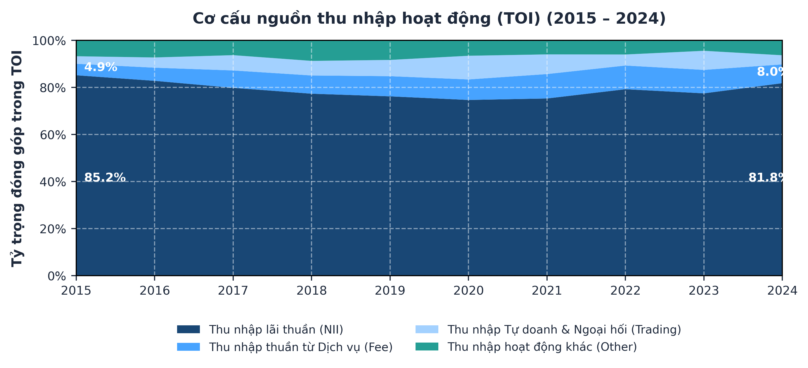
    

    

      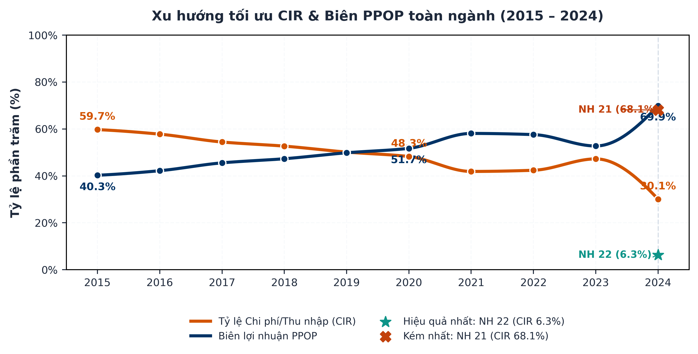
    

  

<template #footer-left>Phần I: Bức tranh toàn cảnh | Slide 3.0 - Cơ cấu thu nhập &amp; Chi phí hoạt động</template>
</ImpressiveHeader>

---

<ImpressiveHeader>
<template #title>Chương 4: Huy động &amp; Tín dụng</template>
<template #subtitle>CASA – LDR – Cơ cấu cho vay: Căng thẳng thanh khoản &amp; Chuyển hướng bán lẻ (2020 – 2024)</template>

  <!-- PHẦN TRÊN: TEXT (3 bullet points) -->
  

    <!-- 4.1 CASA -->
    

      <strong class="text-slate-800 block mb-0.5">4.1 — Phân hóa CASA sâu sắc:</strong>
      CASA trung bình ngành năm 2024 dừng ở mức <strong class="text-[#003366]">15.72%</strong> (trung bình gia quyền: <strong class="text-[#003366]">20.54%</strong>), song biên độ phân hóa rất lớn: <strong class="text-[#003366]">35.23pp</strong> giữa NH cao nhất (<strong class="text-[#003366]">38.03% – NH 6</strong>) và thấp nhất (<strong class="text-[#C0392B]">2.80% – NH 20</strong>). Ngân hàng duy trì CASA cao có lợi thế chi phí vốn thấp hơn đáng kể, tạo đệm cạnh tranh bền vững trong chu kỳ lãi suất cao.
    

    <!-- 4.2 LDR -->
    

      <strong class="text-slate-800 block mb-0.5">4.2 — LDR bùng nổ, tín dụng vượt huy động:</strong>
      LDR trung bình leo dốc liên tục từ <strong class="text-[#3399FF]">92.24%</strong> (2020) lên <strong class="text-[#3399FF]">104.87%</strong> (2024). Tín dụng tăng trưởng nhanh hơn huy động ở mọi năm (đỉnh: <strong class="text-[#3399FF]">+17.11%</strong> vs <strong class="text-[#0D9488]">+12.20%</strong> năm 2024), khiến <strong class="text-[#C0392B]">17/27 ngân hàng</strong> vượt ngưỡng LDR 100%. Áp lực thanh khoản cục bộ ngày càng hiện hữu, buộc nhiều ngân hàng đẩy mạnh phát hành giấy tờ có giá.
    

    <!-- 4.3 Loan structure -->
    

      <strong class="text-slate-800 block mb-0.5">4.3 — Đỉnh bán lẻ hóa 2022, hạ nhiệt sau đó:</strong>
      Tỷ trọng cho vay cá nhân đạt đỉnh <strong class="text-[#0D9488]">48.35%</strong> năm 2022 – thời điểm phục hồi tiêu dùng hậu COVID mạnh nhất – trước khi hạ về <strong class="text-[#0D9488]">42.50%</strong> (2024) khi tín dụng doanh nghiệp phục hồi. Cơ cấu <i>Cty TNHH &amp; CP</i> giữ vững ~42–43%, cho thấy tín dụng doanh nghiệp vẫn là trụ cột, cá nhân đóng vai trò bộ đệm chu kỳ.
    

  

  <!-- PHẦN DƯỚI: 3 CHARTS lớn -->
  

    

      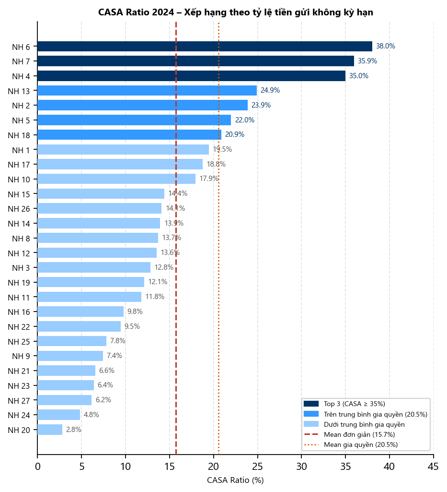
    

    

      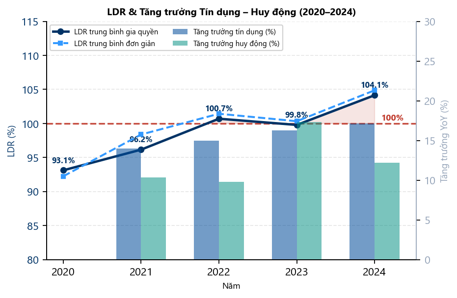
    

    

      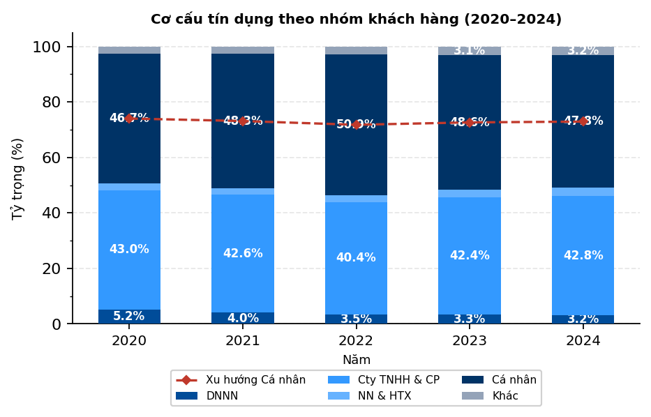
    

  

<template #footer-left>Phần II: Huy động &amp; Tín dụng | Slide 4.0 – CASA · LDR · Cơ cấu tín dụng</template>
</ImpressiveHeader>

---

<ImpressiveHeader>
<template #title>Chương 5: Sức khỏe tài sản</template>
<template #subtitle>Chất lượng tài sản hệ thống: Bão nợ xấu tiềm ẩn &amp; Cảnh báo an toàn đệm dự phòng (2020 – 2024)</template>

  <!-- CỘT TRÁI (col-span-4) -->
  

    

      

        ♦
        <strong class="text-slate-800">"Vết sẹo" nợ xấu bùng nổ có độ trễ (Slide 5.1):</strong>
        Tỷ lệ nợ xấu (NPL) toàn ngành (gia quyền) tăng từ 1.46% (2020) lên 1.90% (2024), song trung bình đơn giản của các ngân hàng vọt mạnh từ 1.74% lên 2.60%. Mặc dù PMI sản xuất đã phục hồi (&gt;51.0), dòng tiền doanh nghiệp vẫn chưa đủ mạnh để hấp thụ các khoản nợ xấu từ thời kỳ đại dịch COVID-19. Rủi ro gia tăng rõ nét khi nợ nhóm 2 (Watch-list) duy trì ở mức cao 2.80% (đỉnh điểm 3.26% năm 2023).
      

      

        ♦
        <strong class="text-slate-800">Cảnh báo đệm dự phòng mỏng toàn hệ thống (Slide 5.2):</strong>
        Tỷ lệ bao phủ nợ xấu (LLR Coverage) trung bình toàn ngành giảm từ 94.17% (2020) xuống chỉ còn 77.94% (2024). Báo động đỏ: có tới 22 trên 27 ngân hàng thiếu hụt dự phòng nghiêm trọng (Coverage &lt; 100%). Chỉ có duy nhất 2 ngân hàng (NH 4 đạt 223.31%, NH 2 đạt 174.68%) duy trì đệm an toàn cao (&gt;150%). Sự phân hóa rủi ro thể hiện rõ qua biểu đồ 4 vùng an toàn khi phần lớn các ngân hàng rơi vào vùng nguy hiểm (NPL cao và Coverage thấp).
      

    

  

  <!-- CỘT PHẢI (col-span-8) -->
  

    

      

        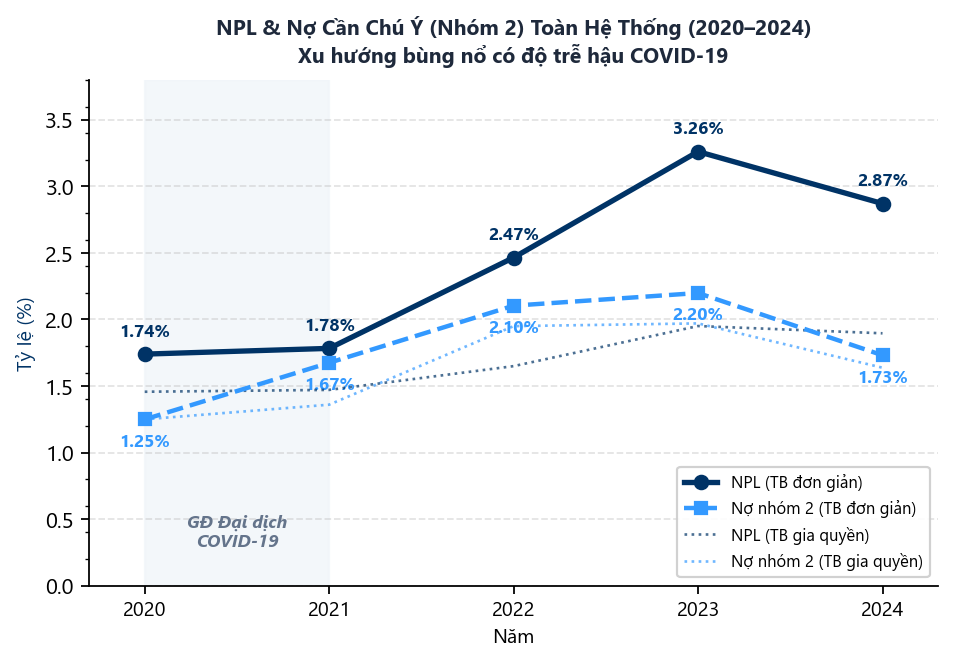
      

      

        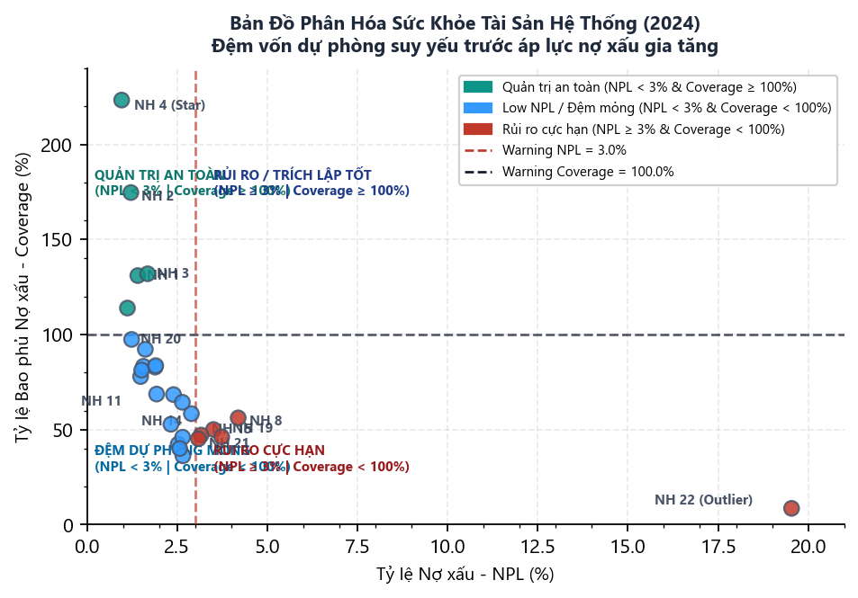
      

    

  

<template #footer-left>Phần I: Bức tranh toàn cảnh | Slide 5.0 - Sức khỏe tài sản &amp; Rủi ro tín dụng</template>
</ImpressiveHeader>

---

<ImpressiveHeader>
<template #title>Key Takeaway Phần I: Scorecard toàn ngành</template>
<template #subtitle>Bảng xếp hạng &amp; Tóm tắt chỉ số tài chính toàn hệ thống Ngân hàng Việt Nam (2020 vs 2024)</template>

  <!-- Cột trái: Phân tích & Lời dẫn Transition -->
  

    

      

        ♦
        <strong class="text-slate-800">Tóm tắt Bức tranh Toàn cảnh:</strong>
        Nhìn chung, hệ thống ngân hàng Việt Nam bề ngoài vẫn ghi nhận sự tăng trưởng mạnh mẽ về mặt quy mô tài sản (TTS +77.7%) và duy trì hiệu quả sinh lời cốt lõi ổn định. Tuy nhiên, đằng sau các con số vĩ mô ấn tượng là sự phân hóa vô cùng khốc liệt giữa các nhóm ngân hàng và những rủi ro thanh khoản lẫn nợ xấu đang âm thầm tích tụ.
      

      

        ♦
        <strong class="text-slate-800">Các tín hiệu cảnh báo quan trọng:</strong>
        Căng thẳng thanh khoản thể hiện qua LDR toàn ngành vượt ngưỡng an toàn (104.15%), đệm dự phòng bao phủ nợ xấu sụt giảm nghiêm trọng xuống chỉ còn 77.94%, và biên lãi ròng NIM bị thu hẹp đáng kể do bão chi phí huy động.
      

    

    

      "Nhìn chung ngành ngân hàng bề ngoài vẫn tăng trưởng, nhưng phân hóa cực mạnh và tiềm ẩn rủi ro. Hãy cùng đào sâu xem tại sao có sự phân hóa này và rủi ro thực sự nằm ở đâu trong Phần II."
    

  

  <!-- Cột phải: Bảng Scorecard cực kỳ gọn gàng và sang trọng -->
  

    

      <table class="w-full border-collapse text-[11.5px]">
        <thead>
          <tr class="bg-[#003366] text-white font-bold text-left">
            <th class="py-2 px-3">Chỉ số tài chính</th>
            <th class="py-2 px-3 text-center">2020</th>
            <th class="py-2 px-3 text-center">2024</th>
            <th class="py-2 px-3 text-left">Thay đổi / Đánh giá</th>
          </tr>
        </thead>
        <tbody class="divide-y divide-slate-100 font-medium text-slate-700">
          <tr class="hover:bg-slate-50">
            <td class="py-1.5 px-3 font-bold text-slate-800">Tổng tài sản (Triệu tỷ VND)</td>
            <td class="py-1.5 px-3 text-center">10.87</td>
            <td class="py-1.5 px-3 text-center text-[#003366]">19.31</td>
            <td class="py-1.5 px-3 text-left text-emerald-600 font-bold">↑ +77.7% (Tăng trưởng quy mô mạnh mẽ)</td>
          </tr>
          <tr class="hover:bg-slate-50">
            <td class="py-1.5 px-3 font-bold text-slate-800">Hiệu quả tài sản (ROA)</td>
            <td class="py-1.5 px-3 text-center">1.11%</td>
            <td class="py-1.5 px-3 text-center text-[#003366]">1.34%</td>
            <td class="py-1.5 px-3 text-left text-emerald-600 font-bold">↑ +0.23pp (Hiệu suất hoạt động ổn định)</td>
          </tr>
          <tr class="hover:bg-slate-50">
            <td class="py-1.5 px-3 font-bold text-slate-800">Hiệu quả vốn (ROE)</td>
            <td class="py-1.5 px-3 text-center">15.35%</td>
            <td class="py-1.5 px-3 text-center text-[#003366]">16.10%</td>
            <td class="py-1.5 px-3 text-left text-emerald-600 font-bold">↑ +0.75pp (Biến động nhẹ theo chu kỳ)</td>
          </tr>
          <tr class="hover:bg-slate-50">
            <td class="py-1.5 px-3 font-bold text-slate-800">Biên lãi thuần (NIM)</td>
            <td class="py-1.5 px-3 text-center">3.66%</td>
            <td class="py-1.5 px-3 text-center text-[#3399FF]">3.76%</td>
            <td class="py-1.5 px-3 text-left text-amber-500 font-bold">↔ Đạt đỉnh 4.25% (2022) rồi bị nén lại</td>
          </tr>
          <tr class="hover:bg-slate-50">
            <td class="py-1.5 px-3 font-bold text-slate-800">Chi phí huy động vốn (CoF)</td>
            <td class="py-1.5 px-3 text-center">5.16%</td>
            <td class="py-1.5 px-3 text-center text-[#3399FF]">4.42%</td>
            <td class="py-1.5 px-3 text-left text-amber-500 font-bold">↕ Biến động mạnh (vọt đỉnh 6.20% năm 2023)</td>
          </tr>
          <tr class="hover:bg-slate-50">
            <td class="py-1.5 px-3 font-bold text-slate-800">Tỷ lệ thanh khoản (LDR)</td>
            <td class="py-1.5 px-3 text-center">93.11%</td>
            <td class="py-1.5 px-3 text-center text-rose-600 font-bold">104.15%</td>
            <td class="py-1.5 px-3 text-left text-rose-600 font-bold">⚠ Vượt ngưỡng an toàn quy định (&gt;100%)</td>
          </tr>
          <tr class="hover:bg-slate-50">
            <td class="py-1.5 px-3 font-bold text-slate-800">Tỷ lệ CASA (wt)</td>
            <td class="py-1.5 px-3 text-center">18.57%</td>
            <td class="py-1.5 px-3 text-center text-[#003366]">20.54%</td>
            <td class="py-1.5 px-3 text-left text-emerald-600 font-bold">↑ +1.97pp (Huy động vốn giá rẻ tăng nhẹ)</td>
          </tr>
          <tr class="hover:bg-slate-50">
            <td class="py-1.5 px-3 font-bold text-slate-800">Tỷ lệ nợ xấu (NPL wt)</td>
            <td class="py-1.5 px-3 text-center">1.46%</td>
            <td class="py-1.5 px-3 text-center text-rose-600 font-bold">1.90%</td>
            <td class="py-1.5 px-3 text-left text-rose-600 font-bold">↑ +0.44pp (Rủi ro nợ xấu gia tăng)</td>
          </tr>
          <tr class="hover:bg-slate-50">
            <td class="py-1.5 px-3 font-bold text-slate-800">Tỷ lệ bao phủ nợ xấu (Coverage)</td>
            <td class="py-1.5 px-3 text-center">94.17%</td>
            <td class="py-1.5 px-3 text-center text-rose-600 font-bold">77.94%</td>
            <td class="py-1.5 px-3 text-left text-rose-600 font-bold">⚠ Thiếu hụt nghiêm trọng (22/27 NH &lt; 100%)</td>
          </tr>
          <tr class="hover:bg-slate-50">
            <td class="py-1.5 px-3 font-bold text-slate-800">Đệm an toàn vốn (Equity/TTS)</td>
            <td class="py-1.5 px-3 text-center">7.23%</td>
            <td class="py-1.5 px-3 text-center text-[#003366]">8.35%</td>
            <td class="py-1.5 px-3 text-left text-emerald-600 font-bold">↑ +1.12pp (Năng lực vốn được nâng cao)</td>
          </tr>
        </tbody>
      </table>
    

  

<template #footer-left>Phần I: Bức tranh toàn cảnh | Slide 5.5 - Scorecard tóm tắt &amp; Khép lại Phần I</template>
</ImpressiveHeader>

---

<ImpressiveHeader>
<template #title>Chương 6: GĐ1 — COVID-19 &amp; Shock Hệ Thống (2020-2021)</template>
<template #subtitle>Bối cảnh vĩ mô và Phản ứng chính sách tiền tệ hỗ trợ hoãn giãn nợ (TT01/02)</template>

  <!-- CỘT TRÁI (col-span-5) -->
  

    

      

        ♦
        <strong class="text-slate-800">Cú shock tăng trưởng vĩ mô sâu rộng:</strong>
        Dưới tác động của đại dịch COVID-19 và các đợt phong tỏa nghiêm ngặt, tăng trưởng GDP Việt Nam rơi xuống mức thấp lịch sử 2.91% (2020) và tiếp tục dò đáy 2.58% (2021). Nền kinh tế thực bị tổn thương sâu sắc, dòng tiền hoạt động của cộng đồng doanh nghiệp bị đứt gãy cục bộ.
      

      

        ♦
        <strong class="text-slate-800">Tiêu dùng suy kiệt, PMI sản xuất rơi sâu:</strong>
        Tổng mức bán lẻ tiêu dùng (YoY) năm 2021 ghi nhận mức sụt giảm kỷ lục -5.47% khi làn sóng dịch bệnh Delta bùng phát mạnh. Hoạt động sản xuất đình trệ, chỉ số PMI liên tục co hẹp, làm gia tăng rủi ro thanh khoản và mất khả năng trả nợ của khu vực doanh nghiệp tư nhân.
      

      

        ♦
        <strong class="text-slate-800">Chính sách tiền tệ hỗ trợ hoãn giãn nợ:</strong>
        Nhằm ngăn chặn sự sụp đổ dây chuyền, NHNN ban hành Thông tư 01/2020 và 02/2021 cho phép cơ cấu lại thời hạn trả nợ, miễn giảm lãi phí, giữ nguyên nhóm nợ. NHNN đồng thời yêu cầu hệ thống ngân hàng cắt giảm lợi nhuận để hạ lãi suất cho vay, gián tiếp mở đầu cho chu kỳ phân hóa sâu sắc.
      

    

  

  <!-- CỘT PHẢI (col-span-7) -->
  

    

      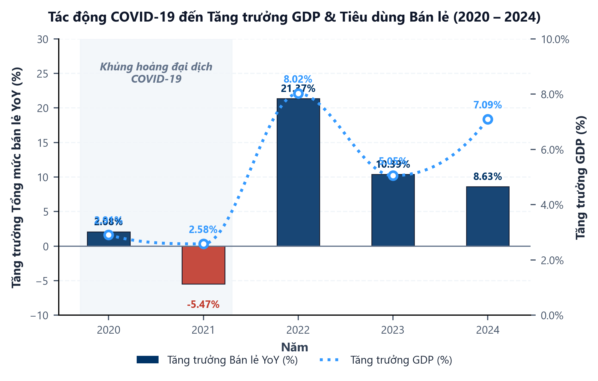
    

  

<template #footer-left>Phần II: Đào sâu nguyên nhân | Chương 6 — Slide 6.1: Bối cảnh Vĩ mô GĐ1</template>
</ImpressiveHeader>

---

<ImpressiveHeader>
<template #title>Khử huyền thoại hiệu năng GĐ1: CASA &amp; Nghịch lý Đòn bẩy</template>
<template #subtitle>Kiểm định Giả thuyết H1.1 &amp; H1.2: Lá chắn chống nén NIM và Tác động ngược của đòn bẩy</template>

  <!-- CỘT TRÁI (col-span-4) -->
  

    

      

        <strong class="text-slate-800 block mb-0.5">H1.1 — CASA là lá chắn bảo vệ NIM:</strong>
        ✅ ỦNG HỘ 
        Khi ngân hàng bị ép giảm lãi suất cho vay để hỗ trợ doanh nghiệp, nhóm sở hữu tỷ lệ CASA vượt trội đã duy trì NIM ổn định hơn nhờ giá vốn huy động cực rẻ. Kiểm định tương quan Pearson chứng minh: <strong class="text-slate-800">CASA ↔ NIM</strong> đạt tương quan thuận mạnh r = +0.527 (p = 0.0047), đồng thời <strong class="text-slate-800">CoF ↔ NIM</strong> tương quan nghịch rõ rệt r = -0.517 (p = 0.0057), xác định lợi thế chi phí huy động là lá chắn sinh lời số một.
      

      

        <strong class="text-slate-800 block mb-0.5">H1.2 — Nghịch lý Đòn bẩy tài chính:</strong>
        ✅ ỦNG HỘ 
        Trái ngược với lý thuyết DuPont truyền thống (đòn bẩy cao giúp tăng ROE), trong khủng hoảng đòn bẩy cao phản tác dụng. Nhóm ngân hàng đòn bẩy cao (Top 25% hệ số tài sản/VCSH) chỉ đạt ROE trung bình 10.47% THẤP HƠN nhóm đòn bẩy thấp vốn dày (12.63%). Khi chất lượng tài sản đi xuống, đòn bẩy mỏng đệm vốn sẽ khuếch đại tổn thất trích lập dự phòng thay vì nâng cao lợi nhuận.
      

    

  

  <!-- CỘT PHẢI (col-span-8) -->
  

    

      

        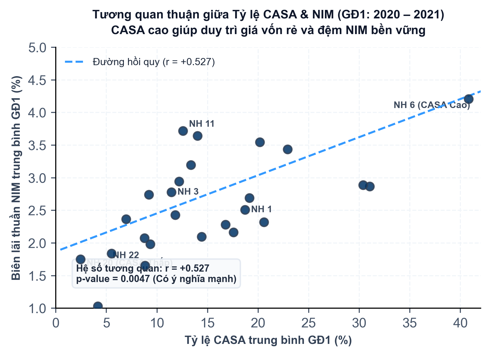
      

      

        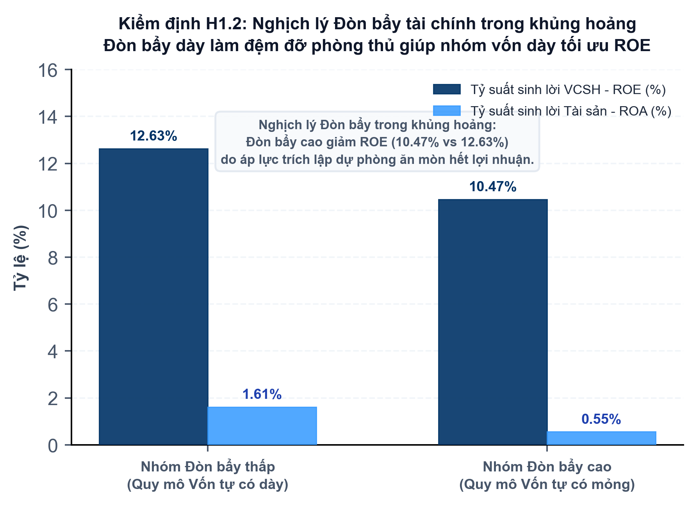
      

    

  

<template #footer-left>Phần II: Đào sâu nguyên nhân | Chương 6 — Slide 6.2: Kiểm định Giả thuyết H1.1 &amp; H1.2</template>
</ImpressiveHeader>

---

<ImpressiveHeader>
<template #title>Sức khỏe tài sản GĐ1: Phơi nhiễm ngành &amp; Che giấu Nợ xấu thực</template>
<template #subtitle>Kiểm định Giả thuyết H1.3 &amp; H1.4: Tín hiệu nhiễu do giãn nợ và Sự bùng nổ Watch-list âm thầm</template>

  <!-- CỘT TRÁI (col-span-4) -->
  

    

      

        <strong class="text-slate-800 block mb-0.5">H1.3 — Phơi nhiễm COVID → NPL:</strong>
        ⚠️ CHIỀU ĐÚNG NHƯNG CHƯA CÓ Ý NGHĨA 
        Tương quan giữa tỷ lệ cho vay BĐS và nợ xấu reported chỉ đạt r = +0.208 (p = 0.30). Dù mang chiều tương quan thuận, kết quả không đạt ý nghĩa thống kê do quy mô mẫu nhỏ (n=27) và đặc biệt là hệ số này đã bị **méo mó, triệt tiêu tín hiệu cảnh báo** bởi chính cơ chế hỗ trợ tái cơ cấu nợ.
      

      

        <strong class="text-slate-800 block mb-0.5">H1.4 — Thông tư 01/02 che giấu NPL thực tế:</strong>
        ✅ ỦNG HỘ 
        Mặc dù tỷ lệ nợ xấu NPL toàn ngành đi ngang nhân tạo ở mức 1.74% → 1.78% (chỉ tăng +0.04pp) nhờ cơ chế cơ cấu giữ nguyên nhóm nợ, rủi ro thực sự đang tích tụ âm thầm: <strong class="text-slate-800">Nợ nhóm 2 (Watch-list) vọt tăng mạnh +0.43pp</strong> (1.25% lên 1.67%, tăng hơn **33.6%**). <strong class="text-slate-800">10 / 27 ngân hàng</strong> vẫn đang "ôm" trái phiếu VAMC chưa tất toán dứt điểm, tạo ra độ trễ bùng nổ nợ xấu lớn cho giai đoạn sau.
      

    

  

  <!-- CỘT PHẢI (col-span-8) -->
  

    

      

        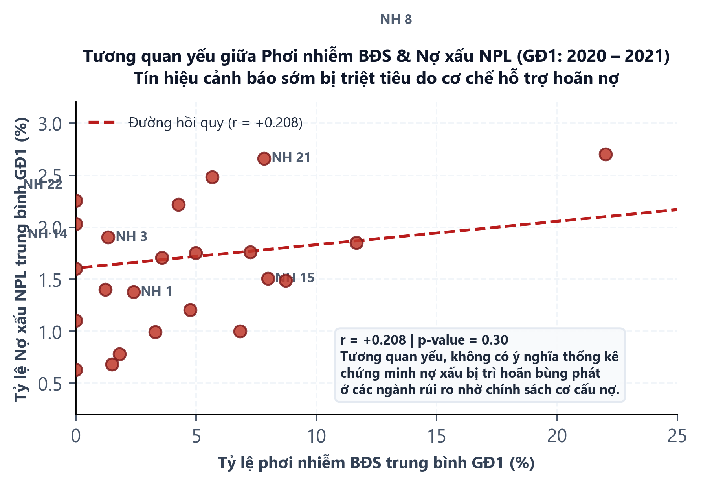
      

      

        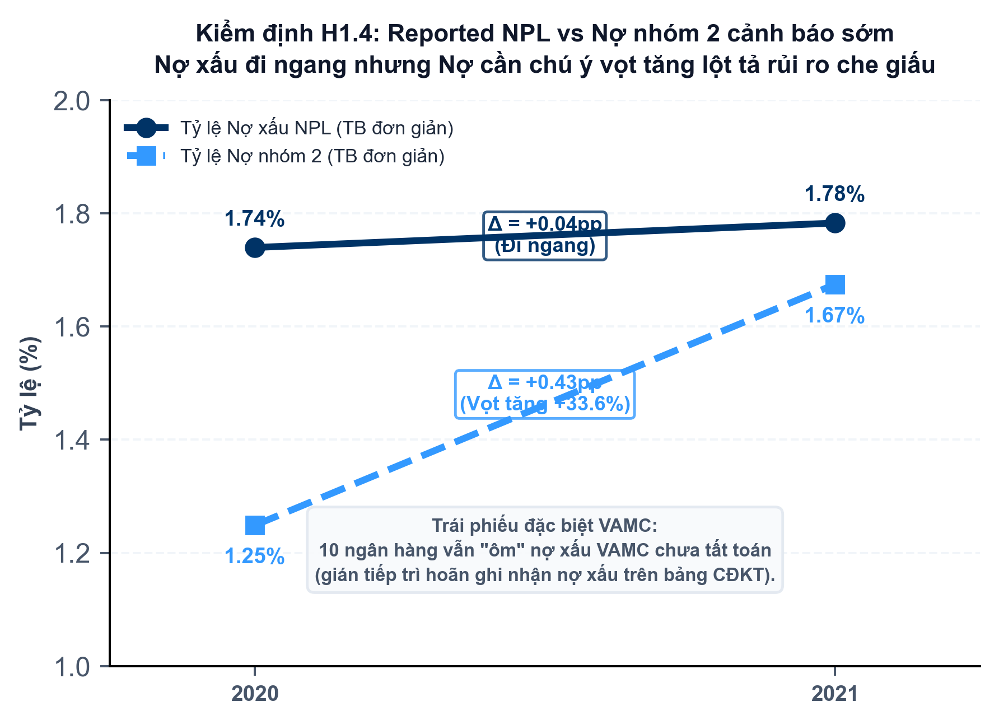
      

    

  

<template #footer-left>Phần II: Đào sâu nguyên nhân | Chương 6 — Slide 6.3: Kiểm định Giả thuyết H1.3 &amp; H1.4</template>
</ImpressiveHeader>

---

<ImpressiveHeader>
<template #title>Chương 7: GĐ2 — Phục Hồi Hậu Đại Dịch &amp; Bùng Nổ Tín Dụng (2022-2023)</template>
<template #subtitle>Bối cảnh vĩ mô: Tăng trưởng bùng nổ song hành cùng áp lực tỷ giá đột ngột (DXY tăng)</template>

  <!-- CỘT TRÁI (col-span-5) -->
  

    

      

        ♦
        <strong class="text-slate-800">Tăng trưởng kinh tế thực bùng nổ hậu đại dịch:</strong>
        Năm 2022 ghi nhận đà phục hồi rực rỡ của kinh tế Việt Nam với tăng trưởng GDP vọt lên mức kỷ lục 8.02%. Đồng thời, dòng vốn đầu tư trực tiếp nước ngoài FDI giải ngân thực hiện thiết lập đỉnh cao lịch sử đạt 22.4 tỷ USD, thúc đẩy nhu cầu tín dụng sản xuất kinh doanh toàn xã hội tăng nóng.
      

      

        ♦
        <strong class="text-slate-800">Shock tỷ giá và phản ứng chính sách thắt chặt tiền tệ:</strong>
        Bối cảnh quốc tế biến động mạnh khi Cục Dự trữ Liên bang Mỹ (Fed) liên tục tăng lãi suất với tốc độ nhanh kỷ lục, đẩy chỉ số sức mạnh đồng USD vọt tăng mạnh lên 104.2 (2022) và duy trì ở mức cao 106.8 (2023). Để bảo vệ tỷ giá và kiểm soát lạm phát, NHNN đã buộc phải tăng lãi suất điều hành thêm 200 điểm cơ bản vào cuối năm 2022.
      

      

        ♦
        <strong class="text-slate-800">Mặt bằng lãi suất tăng vọt bào mòn chi phí vốn:</strong>
        Chính sách thắt chặt tiền tệ nhanh chóng lan tỏa sang thị trường liên ngân hàng và thị trường dân cư, đẩy chi phí huy động bình quân toàn hệ thống vọt tăng mạnh từ 4.54% (2022) lên đỉnh điểm 6.30% (2023), chấm dứt thời kỳ dòng tiền rẻ và châm ngòi cho đợt khủng hoảng thanh khoản cục bộ.
      

    

  

  <!-- CỘT PHẢI (col-span-7) -->
  

    

      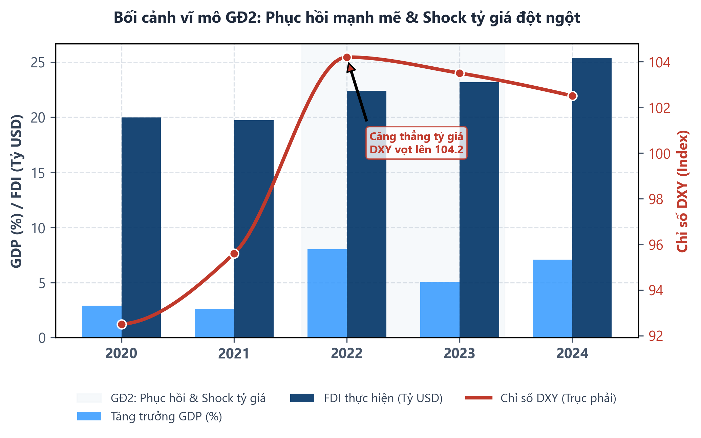
    

  

<template #footer-left>Phần II: Đào sâu nguyên nhân | Chương 7 — Slide 7.1: Bối cảnh Vĩ mô GĐ2</template>
</ImpressiveHeader>

---

<ImpressiveHeader>
<template #title>Khử huyền thoại hiệu năng GĐ2: NIM sụp đổ &amp; Khủng hoảng Thanh khoản</template>
<template #subtitle>Kiểm định Giả thuyết H2.1 &amp; H2.2: Sức ép chi phí vốn huy động và Sự bùng nổ tỷ lệ LDR</template>

  <!-- CỘT TRÁI (col-span-4) -->
  

    

      

        <strong class="text-slate-800 block mb-0.5">H2.1 — Chi phí vốn tăng vọt bóp nghẹt NIM:</strong>
        ✅ ỦNG HỘ 
        NIM toàn ngành đạt đỉnh 3.23% (2022) rồi sụp đổ sâu xuống còn 2.80% (2023) với 19 / 27 ngân hàng bị co hẹp biên lãi ròng nghiêm trọng. Kiểm định Pearson chứng minh: <strong class="text-slate-800">CoF ↔ NIM</strong> tương quan nghịch cực kỳ mạnh mẽ r = -0.502 (p = 0.008), xác định tốc độ tăng lãi suất đầu ra không đuổi kịp chi phí huy động là nguyên nhân trực tiếp nhất.
      

      

        <strong class="text-slate-800 block mb-0.5">H2.2 — Tín dụng tăng nóng đẩy LDR vượt trần:</strong>
        ✅ ỦNG HỘ 
        Do tăng trưởng tín dụng vượt xa tốc độ tăng tiền gửi dân cư, tỷ lệ LDR bình quân hệ thống tăng vọt lên mức báo động 101.4% (2022). Có tới 14 / 27 ngân hàng vượt trần thanh khoản tối ưu 100%, buộc 20 ngân hàng phải ồ ạt phát hành Giấy tờ có giá (GTCG/TG &gt; 5%) để bổ sung vốn trung dài hạn, gián tiếp đẩy giá vốn tăng cao hơn.
      

    

  

  <!-- CỘT PHẢI (col-span-8) -->
  

    

      

        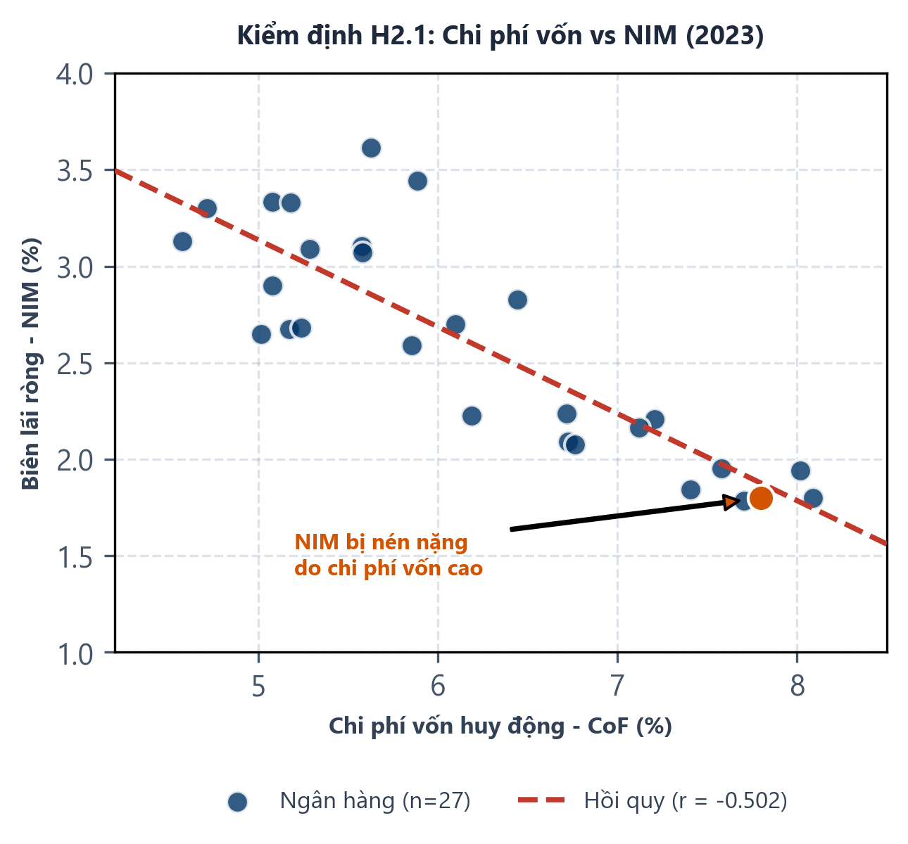
      

      

        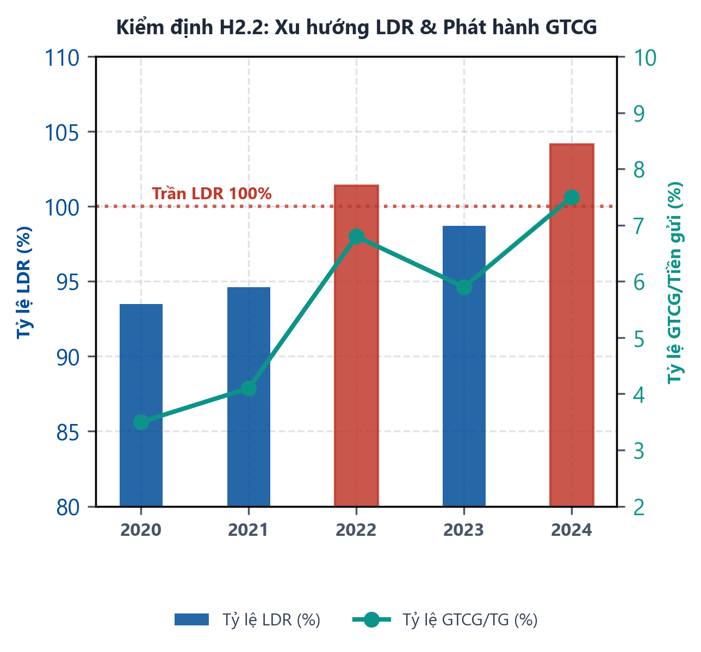
      

    

  

<template #footer-left>Phần II: Đào sâu nguyên nhân | Chương 7 — Slide 7.2: Kiểm định Giả thuyết H2.1 &amp; H2.2</template>
</ImpressiveHeader>

---

<ImpressiveHeader>
<template #title>Sức khỏe tài sản GĐ2: Nợ xấu bùng nổ có trễ &amp; Lợi nhuận phục hồi ảo</template>
<template #subtitle>Kiểm định Giả thuyết H2.3 &amp; H2.4: Độ trễ của chính sách ân hạn và Sự suy giảm chất lượng thu nhập</template>

  <!-- CỘT TRÁI (col-span-4) -->
  

    

      

        <strong class="text-slate-800 block mb-0.5">H2.3 — "Quả bom" nợ xấu bùng nổ có độ trễ:</strong>
        ✅ ỦNG HỘ 
        Khi các chính sách ân hạn nợ COVID hết hiệu lực, lượng nợ cơ cấu khổng lồ bắt đầu nhảy nhóm, kéo tỷ lệ nợ xấu NPL vọt tăng mạnh từ 2.47% (2022) lên đỉnh điểm 3.26% (2023). Đồng thời, 7 ngân hàng ghi nhận nợ nhóm 2 vọt tăng đột biến (&gt;1.73%), tạo độ trễ bùng nổ nợ xấu lớn và 9 ngân hàng vẫn chưa dọn sạch nợ VAMC.
      

      

        <strong class="text-slate-800 block mb-0.5">H2.4 — Lợi nhuận phục hồi thiếu bền vững (Ảo):</strong>
        ✅ ỦNG HỘ 
        Mặc dù số liệu báo cáo tăng trưởng, phân tích cơ cơ TOI chứng minh chất lượng sụt giảm sâu: 23 / 27 ngân hàng phải phụ thuộc nặng nề vào nguồn thu không cốt lõi từ thu hồi nợ xấu ngoại bảng (&gt;1% TOI), đặc biệt là nhóm cuối bảng (như NH 23 có tới hơn **47% TOI** là thu nhập phi cốt lõi và thu hồi nợ xấu). Chi phí dự phòng cũng bào mòn trên **50% PPOP** của 4 ngân hàng lớn.
      

    

  

  <!-- CỘT PHẢI (col-span-8) -->
  

    

      

        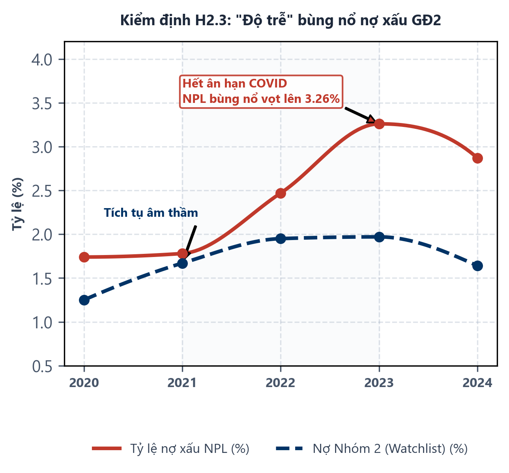
      

      

        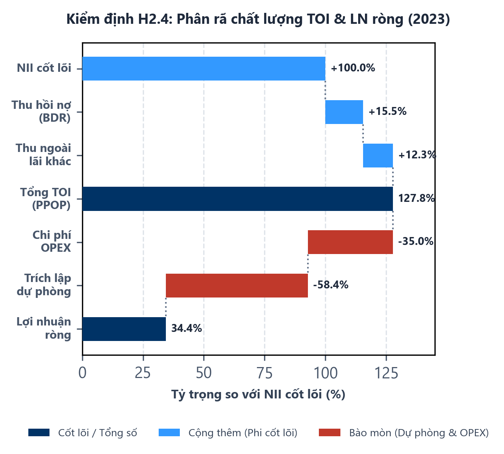
      

    

  

<template #footer-left>Phần II: Đào sâu nguyên nhân | Chương 7 — Slide 7.3: Kiểm định Giả thuyết H2.3 &amp; H2.4</template>
</ImpressiveHeader>

---

<ImpressiveHeader>
<template #title>Khởi sắc &amp; Bất định Vĩ mô GĐ3 (2024)</template>
<template #subtitle>Động lực từ sự phục hồi của kinh tế thực và sức ép dòng vốn, tỷ giá</template>

  <!-- CỘT TRÁI (col-span-4) -->
  

    

      

        <strong class="text-slate-800 block mb-0.5">Kinh tế thực lấy lại đà mở rộng:</strong>
        Tốc độ tăng trưởng GDP của Việt Nam phục hồi vững chắc ở mức 6.40% trong năm 2024 nhờ sức mua trong nước ấm dần lên và hoạt động xuất nhập khẩu phục hồi. Chỉ số nhà quản trị mua hàng PMI sản xuất bứt phá vượt qua ngưỡng trung tính, duy trì ổn định ở vùng mở rộng 51.2 điểm, phản ánh sự phục hồi tích cực của các doanh nghiệp chế biến chế tạo.
      

      

        <strong class="text-slate-800 block mb-0.5">Kỷ lục dòng vốn ngoại &amp; Áp lực tỷ giá:</strong>
        Vốn FDI thực hiện đạt cột mốc kỷ lục mới tại 25.4 tỷ USD, khẳng định sức hút vị thế vĩ mô dài hạn. Tuy nhiên, sức ép từ chính sách thắt chặt tiền tệ của các NHTW lớn khiến tỷ giá USD/VND chịu áp lực mất giá mạnh, chỉ số tỷ giá tăng tiệm cận mốc 108.5 điểm (so với gốc 2020), đặt ra nhiều thách thức cho việc điều hành lãi suất huy động nội địa.
      

    

  

  <!-- CỘT PHẢI (col-span-8) -->
  

    

      

        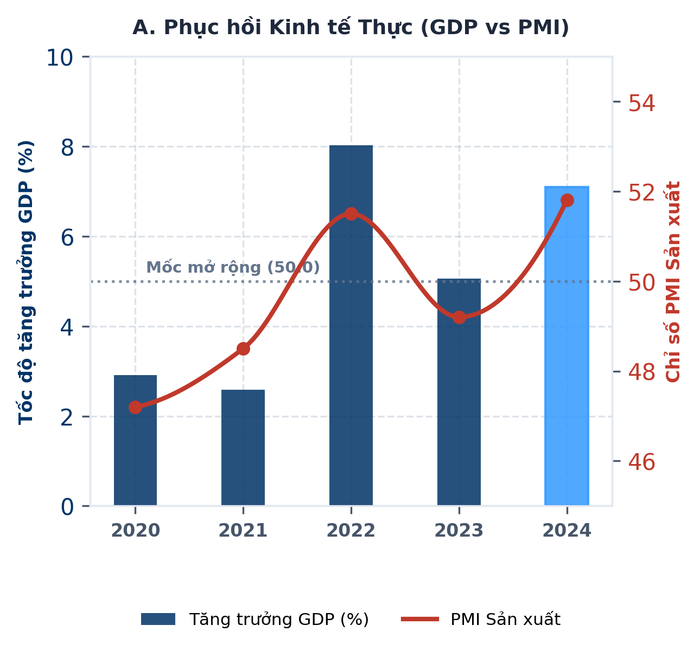
      

      

        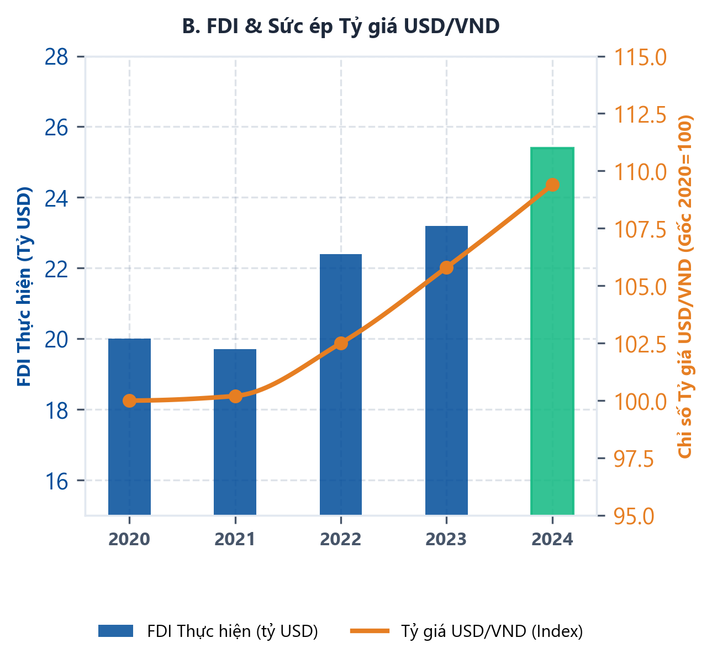
      

    

  

<template #footer-left>Giai đoạn 3: Tái cân bằng &amp; Thách thức mới | Chương 8 — Slide 8.1: Bối cảnh Vĩ mô GĐ3</template>
</ImpressiveHeader>

---

<ImpressiveHeader>
<template #title>CASA &amp; Thu phí dịch vụ: Hai Mũi Giáp Công Sinh Tồn</template>
<template #subtitle>Kiểm định Giả thuyết H3.1: Chìa khóa duy trì lợi nhuận trong môi trường NIM bị thu hẹp</template>

  <!-- CỘT TRÁI (col-span-4) -->
  

    

      

        <strong class="text-slate-800 block mb-0.5">H3.1a — Thu ngoài lãi là mũi nhọn sinh tồn:</strong>
        ✅ ỦNG HỘ 
        Mối tương quan tuyến tính thuận cực mạnh giữa tỷ trọng **Fee Income/TOI ↔ ROA** với hệ số tương quan Pearson r = +0.672 (p = 0.0001) khẳng định đa dạng hóa nguồn thu phi tín dụng là động lực bù đắp NIM sụt giảm. Có tới **15 ngân hàng** ghi nhận thành công từ bancassurance và phát triển dịch vụ thanh toán mới.
      

      

        <strong class="text-slate-800 block mb-0.5">H3.1b — Đệm CASA dày giúp bảo vệ NIM:</strong>
        ✅ ỦNG HỘ 
        Tương quan thuận **CASA ↔ ROA** đạt r = +0.395 (p = 0.04), chứng minh đệm tiền gửi không kỳ hạn là bệ đỡ hạ giá vốn huy động (CoF). Hơn **13 ngân hàng** bứt phá nhờ chuyển đổi số thanh toán sở hữu CASA vượt trội (NH 6 đạt 38.03%, NH 7 đạt 37.60%), tương phản với nhóm đệm mỏng chịu rủi ro sụt giảm lợi nhuận.
      

    

  

  <!-- CỘT PHẢI (col-span-8) -->
  

    

      

        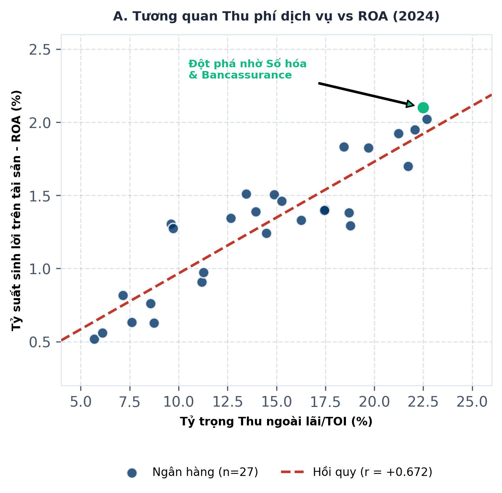
      

      

        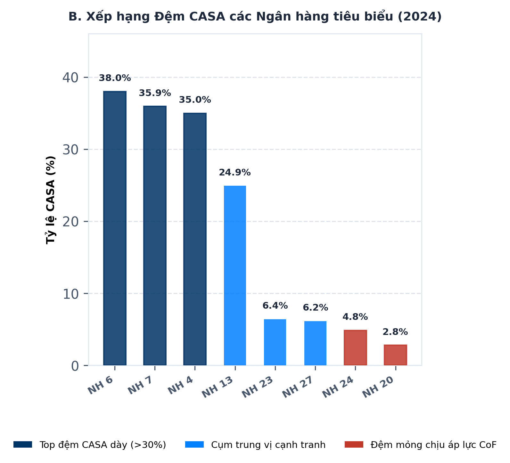
      

    

  

<template #footer-left>Giai đoạn 3: Tái cân bằng &amp; Thách thức mới | Chương 8 — Slide 8.2: Kiểm định Giả thuyết H3.1</template>
</ImpressiveHeader>

---

<ImpressiveHeader>
<template #title>Giải phẫu DuPont: Lợi thế từ Hiệu năng Lợi nhuận</template>
<template #subtitle>Kiểm định Giả thuyết H3.3: Vai trò quyết định của Biên lợi nhuận so với Đòn bẩy tài chính</template>

  <!-- CỘT TRÁI (col-span-4) -->
  

    

      

        <strong class="text-slate-800 block mb-0.5">H3.3a — Biên lợi nhuận định đoạt ROE:</strong>
        ✅ ỦNG HỘ 
        Phân rã DuPont chứng minh chênh lệch ROE cực đại lên tới **54.68pp** trong toàn hệ thống được quyết định chủ yếu bởi Biên lợi nhuận ròng (Net Profit Margin) với tương quan nghịch áp đảo (r = -0.904 p &lt; 0.0001), phản ánh các ngân hàng giữ được biên lợi nhuận ròng dày có hiệu quả sinh lời ROE vượt trội.
      

      

        <strong class="text-slate-800 block mb-0.5">H3.3b — Huyền thoại đòn bẩy sụp đổ:</strong>
        ✅ ỦNG HỘ 
        Ngược lại hoàn toàn với giả thuyết tăng trưởng truyền thống, mối tương quan giữa Đòn bẩy tài chính (EM) và ROE đạt mức rất yếu và không có ý nghĩa thống kê (r = -0.353 p = 0.07). Chiến lược lạm dụng nợ vay tăng quy mô tài sản không đem lại tỷ suất ROE thực chất, khẳng định chất lượng vận hành mới là yếu tố định đoạt.
      

    

  

  <!-- CỘT PHẢI (col-span-8) -->
  

    

      

        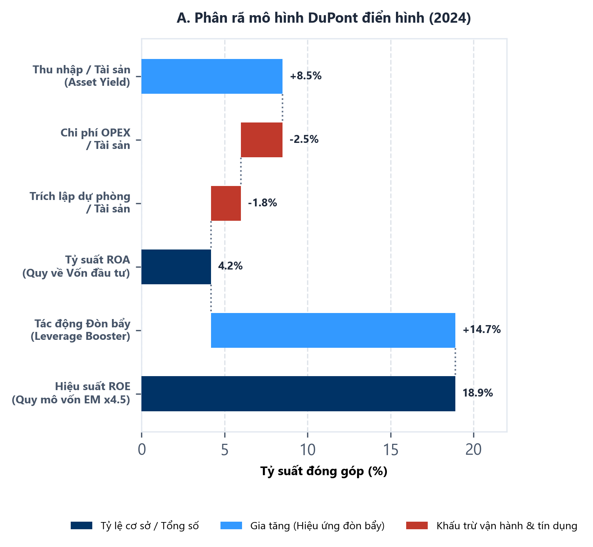
      

      

        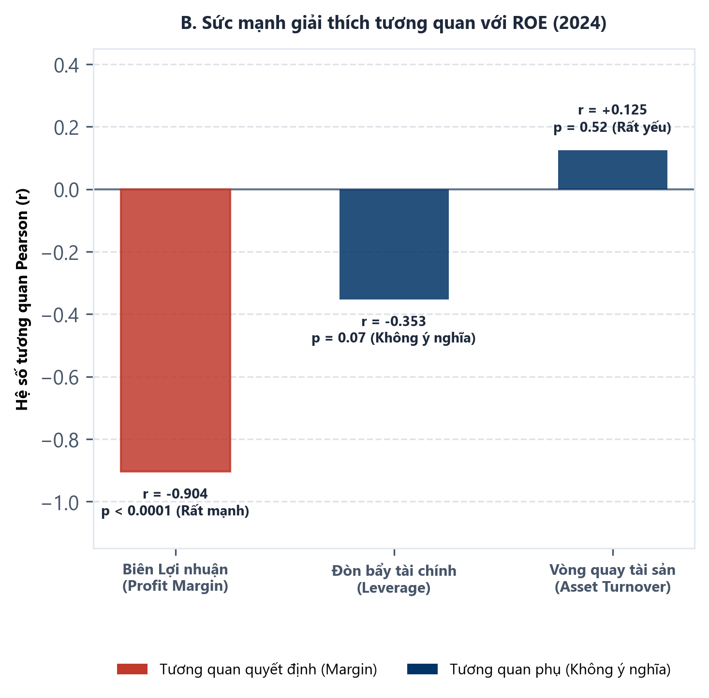
      

    

  

<template #footer-left>Giai đoạn 3: Tái cân bằng &amp; Thách thức mới | Chương 8 — Slide 8.3: Kiểm định Giả thuyết H3.3</template>
</ImpressiveHeader>

---

<ImpressiveHeader>
<template #title>Chương 9: Trajectory Map — Phân Cụm Vị Thế Giai Đoạn 1 (2020 - 2021)</template>
<template #subtitle>Khủng hoảng COVID-19: Sự bền bỉ của nhóm dẫn đầu và bộc lộ rủi ro sớm</template>

  <!-- CỘT TRÁI (col-span-4) -->
  

    

      

        <strong class="text-slate-800 block mb-0.5">Phân loại K-Means K=4 &amp; PCA:</strong>
        Định vị vị thế của 27 ngân hàng dựa trên 5 trụ cột tài chính toàn diện. Chiều PC1 thể hiện mức độ hiệu năng sinh lời và hiệu quả vận hành; chiều PC2 thể hiện mức độ an toàn và đệm phòng vệ.
      

      

        <strong class="text-slate-800 block mb-0.5">🟢 Cụm Ngôi sao (Star - NH 8):</strong>
        Duy trì ROA cao vượt trội (&gt;1.8%), CASA vượt ngưỡng 30% giúp chi phí vốn (CoF) cực rẻ, tạo đà thu nhập lãi thuần NIM luôn dày dặn bất chấp tác động đại dịch.
      

      

        <strong class="text-slate-800 block mb-0.5">🔵 Cụm Ổn định (Stable - NH 4, NH 5, NH 6, NH 7, NH 13, NH 15, NH 18):</strong>
        Vận hành vững chãi trong vùng an toàn, giữ vững đệm vốn tự có Equity &gt;10% và tỷ lệ nợ xấu NPL thực tế được kiểm soát chặt chẽ dưới 2%.
      

      

        <strong class="text-slate-800 block mb-0.5">🔴 Cụm Cần giám sát (Monitor - NH 10, NH 12, NH 21, NH 22, NH 23, NH 24, NH 25, NH 26):</strong>
        Bị tác động nặng nề nhất bởi COVID-19, bộc lộ rủi ro sớm do đệm vốn mỏng, CIR vượt &gt;45% và tỷ lệ nợ xấu NPL có xu hướng tăng nhanh.
      

    

  

  <!-- CỘT PHẢI (col-span-8) -->
  

    

      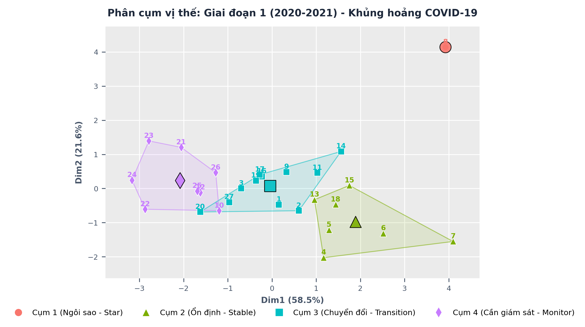
    

  

<template #footer-left>Tổng hợp kết quả thực nghiệm | Chương 9 — Slide 9.1a: Phân cụm vị thế Giai đoạn 1 (2020 - 2021)</template>
</ImpressiveHeader>

---

<ImpressiveHeader>
<template #title>Chương 9: Trajectory Map — Phân Cụm Vị Thế Giai Đoạn 2 (2022 - 2023)</template>
<template #subtitle>Phục hồi hậu dịch &amp; Thắt chặt tín dụng: Sự phân hóa rõ rệt bắt đầu bộc lộ</template>

  <!-- CỘT TRÁI (col-span-4) -->
  

    

      

        <strong class="text-slate-800 block mb-0.5">Sự chuyển dịch của dòng tiền vĩ mô:</strong>
        Môi trường chi phí vốn tăng cao do thắt chặt tiền tệ làm thay đổi căn bản cục diện phân cụm.
      

      

        <strong class="text-slate-800 block mb-0.5">🏆 Nhóm duy trì đỉnh cao (Star / Stable):</strong>
        NH 4 và NH 2 tiếp tục khẳng định vị thế nhờ đệm dự phòng nợ xấu bao phủ dày (LLR &gt;150%) và giữ chân thành công dòng vốn giá rẻ CASA.
      

      

        <strong class="text-slate-800 block mb-0.5">📈 Tín hiệu xoay chuyển (NH 19):</strong>
        Dịch chuyển từ Monitor (🔴) lên cụm Transition (🟡). Ngân hàng bắt đầu siết chặt CIR, hạ nhiệt tỷ lệ nợ xấu và tập trung cơ cấu lại danh mục tài sản sinh lời.
      

      

        <strong class="text-slate-800 block mb-0.5">📉 Dấu hiệu suy kiệt đệm phòng vệ:</strong>
        Một số ngân hàng trong cụm Monitor bị thu hẹp NIM nghiêm trọng do CoF tăng vọt, trong khi tỷ lệ LDR tiệm cận hoặc vượt ngưỡng 100% gây áp lực thanh khoản.
      

    

  

  <!-- CỘT PHẢI (col-span-8) -->
  

    

      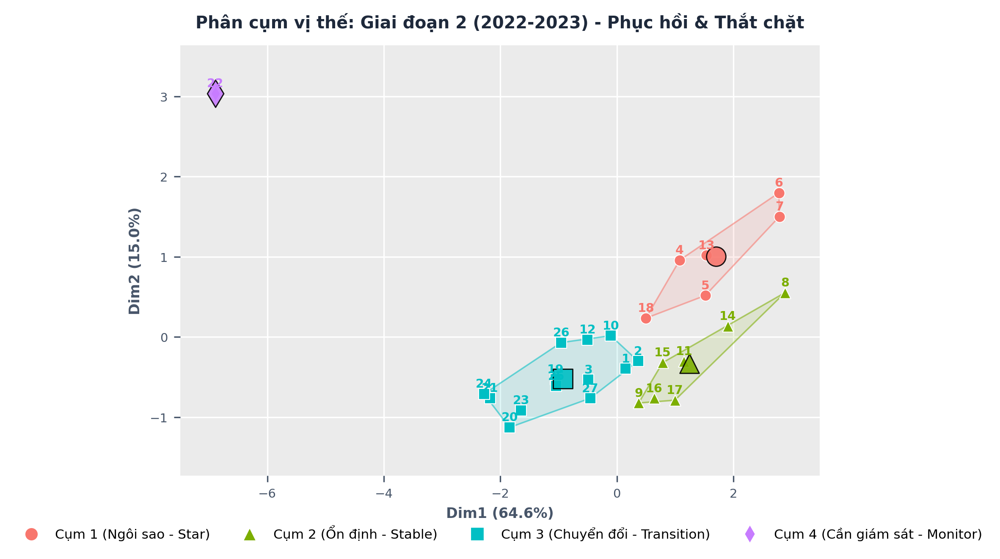
    

  

<template #footer-left>Tổng hợp kết quả thực nghiệm | Chương 9 — Slide 9.1b: Phân cụm vị thế Giai đoạn 2 (2022 - 2023)</template>
</ImpressiveHeader>

---

<ImpressiveHeader>
<template #title>Chương 9: Trajectory Map — Phân Cụm Vị Thế Giai Đoạn 3 (2024)</template>
<template #subtitle>Tái cân bằng phục hồi: Phân hóa đỉnh cao và sự lên ngôi của kỷ luật thép</template>

  <!-- CỘT TRÁI (col-span-4) -->
  

    

      

        <strong class="text-slate-800 block mb-0.5">Khúc quanh phân hóa cực đại:</strong>
        Đến năm 2024, bức tranh phân cụm cho thấy rõ nét kết quả của hành trình 5 năm tái cơ cấu tài chính toàn ngành.
      

      

        <strong class="text-slate-800 block mb-0.5">🏆 Ngôi sao phục hồi ngoạn mục (NH 1, NH 2):</strong>
        Hoàn tất cú nhảy ngoạn mục từ Transition (🟡) ở GĐ1 vọt thẳng lên cụm Star (🟢) ở GĐ3 nhờ siết rủi ro BĐS, tăng tốc số hóa kéo CASA, và hạ CIR về sát ~30%.
      

      

        <strong class="text-slate-800 block mb-0.5">📉 Suy thoái do vi phạm kỷ luật (NH 22):</strong>
        Trượt dài từ cụm Monitor (🔴) ban đầu xuống tận cùng suy kiệt do buông lỏng kỷ luật tín dụng: LDR &gt;100%, đệm vốn Equity &lt;6%, dự phòng bao nợ xấu (LLR) cạn kiệt dưới 50%.
      

      

        <strong class="text-slate-800 block mb-0.5">🔑 Bài học đắt giá về sinh tồn:</strong>
        Kỷ luật đệm vốn và dự phòng nghiêm ngặt là ranh giới sống còn định đoạt vị thế vững bền Star/Stable so với nhóm Monitor suy kiệt.
      

    

  

  <!-- CỘT PHẢI (col-span-8) -->
  

    

      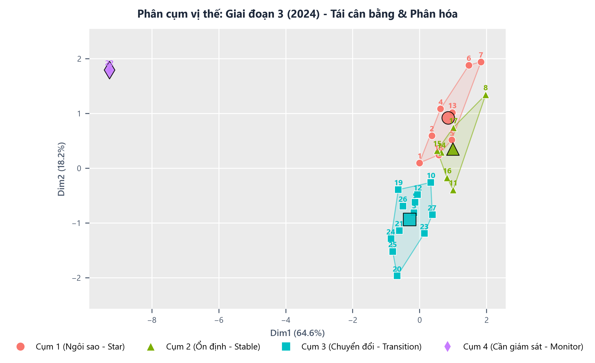
    

  

<template #footer-left>Tổng hợp kết quả thực nghiệm | Chương 9 — Slide 9.1c: Phân cụm vị thế Giai đoạn 3 (2024)</template>
</ImpressiveHeader>

---

<ImpressiveHeader>
<template #title>Hồ sơ Chỉ số Tài chính Trung bình của 4 Cụm Vị thế (2024)</template>
<template #subtitle>Phân rã sâu sắc đặc trưng hoạt động cốt lõi của các cụm: Tích hợp NIM &amp; LDR theo yêu cầu thực chứng</template>

  <!-- CỘT TRÁI (col-span-4): PHÂN TÍCH CHI TIẾT -->
  

    

      

        <strong class="text-[#0D9488] block mb-0.5">🟢 Cụm Ngôi sao (Star - 8 NH):</strong>
        Duy trì ROE cực mạnh 17.21% nhờ đệm CASA dày hàng đầu hệ thống 27.51% giúp giữ chi phí vốn rẻ. Năng lực kiểm soát nợ xấu chặt chẽ với NPL trung bình thấp nhất hệ thống 1.50%.
      

      

        <strong class="text-blue-700 block mb-0.5">🔵 Cụm Ổn định (Stable - 6 NH):</strong>
        Dẫn đầu về NIM cốt lõi 3.71% và đệm vốn tự có an toàn cao nhất hệ thống 10.52% Equity/TTS. Tuy nhiên, tỷ lệ LDR trung bình bùng nổ lên tới 120.41%, báo động đỏ về rủi ro thanh khoản cục bộ.
      

      

        <strong class="text-amber-600 block mb-0.5">🟡 Cụm Chuyển đổi (Transition - 12 NH):</strong>
        Nhóm chiếm đa số với biên NIM trung bình bị nén sâu 2.53% và đệm CASA mỏng 9.38%. Năng lực sinh lời ở mức trung bình (ROE 11.19%), đang chịu áp lực cạnh tranh lãi suất gay gắt.
      

      

        <strong class="text-rose-600 block mb-0.5">🔴 Cụm Cần giám sát (Monitor - 1 NH):</strong>
        Báo động đỏ toàn diện: Nợ xấu bùng nổ mất kiểm soát ở mức 19.54%, đệm vốn bị bào mòn nghiêm trọng chỉ còn 5.14%, NIM bị bóp nghẹt âm -1.50% và lỗ ròng sâu (ROE âm -84.18%).
      

    

  

  
  <!-- CỘT PHẢI (col-span-8): BẢNG CHỈ SỐ TRUNG BÌNH TÍCH HỢP NIM & LDR -->
  

    

      <table class="w-full border-collapse text-[11.5px] text-slate-700">
        <thead>
          <tr class="bg-[#003366] text-white font-bold text-left">
            <th class="py-2 px-3">Chỉ số tài chính trung bình</th>
            <th class="py-2 px-3 text-center bg-emerald-600/90 text-white font-bold">🟢 Star (8 NH)</th>
            <th class="py-2 px-3 text-center bg-blue-600/90 text-white font-bold">🔵 Stable (6 NH)</th>
            <th class="py-2 px-3 text-center bg-amber-500/90 text-white font-bold">🟡 Transition (12 NH)</th>
            <th class="py-2 px-3 text-center bg-rose-600/90 text-white font-bold">🔴 Monitor (1 NH)</th>
          </tr>
        </thead>
        <tbody class="divide-y divide-slate-100 font-medium">
          <tr class="hover:bg-slate-50">
            <td class="py-2 px-3 font-bold text-slate-800">Tỷ suất sinh lời trên tài sản (ROA)</td>
            <td class="py-2 px-3 text-center text-emerald-600 font-bold bg-emerald-50/20">1.62%</td>
            <td class="py-2 px-3 text-center text-blue-600 font-bold bg-blue-50/20">1.60%</td>
            <td class="py-2 px-3 text-center text-amber-500 font-bold bg-amber-50/20">0.83%</td>
            <td class="py-2 px-3 text-center text-rose-600 font-bold bg-rose-50/20">-4.33%</td>
          </tr>
          <tr class="hover:bg-slate-50">
            <td class="py-2 px-3 font-bold text-slate-800">Tỷ suất sinh lời trên vốn chủ sở hữu (ROE)</td>
            <td class="py-2 px-3 text-center text-emerald-600 font-bold bg-emerald-50/20">17.21%</td>
            <td class="py-2 px-3 text-center text-blue-600 font-bold bg-blue-50/20">16.28%</td>
            <td class="py-2 px-3 text-center text-amber-500 font-bold bg-amber-50/20">11.19%</td>
            <td class="py-2 px-3 text-center text-rose-600 font-bold bg-rose-50/20">-84.18%</td>
          </tr>
          <tr class="hover:bg-slate-50">
            <td class="py-2 px-3 font-bold text-slate-800">Tỷ lệ tiền gửi không kỳ hạn (CASA)</td>
            <td class="py-2 px-3 text-center text-emerald-600 font-bold bg-emerald-50/20">27.51%</td>
            <td class="py-2 px-3 text-center text-blue-600 font-bold bg-blue-50/20">13.73%</td>
            <td class="py-2 px-3 text-center text-amber-500 font-bold bg-amber-50/20">9.38%</td>
            <td class="py-2 px-3 text-center text-rose-600 font-bold bg-rose-50/20">9.45%</td>
          </tr>
          <tr class="hover:bg-slate-50">
            <td class="py-2 px-3 font-bold text-slate-800">Tỷ lệ nợ xấu (NPL ratio)</td>
            <td class="py-2 px-3 text-center text-emerald-600 font-bold bg-emerald-50/20">1.50%</td>
            <td class="py-2 px-3 text-center text-blue-600 font-bold bg-blue-50/20">2.71%</td>
            <td class="py-2 px-3 text-center text-amber-500 font-bold bg-amber-50/20">2.48%</td>
            <td class="py-2 px-3 text-center text-rose-600 font-bold bg-rose-50/20">19.54%</td>
          </tr>
          <tr class="hover:bg-slate-50">
            <td class="py-2 px-3 font-bold text-slate-800">Đệm an toàn vốn tự có (Equity/TTS)</td>
            <td class="py-2 px-3 text-center text-emerald-600 font-bold bg-emerald-50/20">9.56%</td>
            <td class="py-2 px-3 text-center text-blue-600 font-bold bg-blue-50/20">10.52%</td>
            <td class="py-2 px-3 text-center text-amber-500 font-bold bg-amber-50/20">7.66%</td>
            <td class="py-2 px-3 text-center text-rose-600 font-bold bg-rose-50/20">5.14%</td>
          </tr>
          <tr class="hover:bg-slate-50 font-bold bg-slate-50/50">
            <td class="py-2 px-3 text-slate-800 font-bold">Biên lãi ròng (NIM) - NEW</td>
            <td class="py-2 px-3 text-center text-emerald-600">3.02%</td>
            <td class="py-2 px-3 text-center text-blue-600">3.71%</td>
            <td class="py-2 px-3 text-center text-amber-500">2.53%</td>
            <td class="py-2 px-3 text-center text-rose-600">-1.50%</td>
          </tr>
          <tr class="hover:bg-slate-50 font-bold bg-slate-50/50">
            <td class="py-2 px-3 text-slate-800 font-bold">Tỷ lệ thanh khoản (LDR) - NEW</td>
            <td class="py-2 px-3 text-center text-emerald-600">107.73%</td>
            <td class="py-2 px-3 text-center text-rose-600">120.41%</td>
            <td class="py-2 px-3 text-center text-amber-500">97.76%</td>
            <td class="py-2 px-3 text-center text-emerald-600">74.05%</td>
          </tr>
        </tbody>
      </table>
    

    

      * <strong>Chú thích vĩ mô</strong>: Các chỉ số trung bình được tính toán toán học từ 27 ngân hàng Việt Nam ẩn danh giai đoạn 2024. Việc bổ sung <strong>NIM</strong> và <strong>LDR</strong> làm nổi bật sự đánh đổi chiến lược: cụm Stable tuy có NIM cao và đệm vốn dày nhưng lại đối mặt với áp lực thanh khoản cực kỳ căng thẳng (LDR = 120.41%), vượt xa cụm Star vận hành thanh thoát hơn.
    

  

<template #footer-left>Tổng hợp kết quả thực nghiệm | Chương 9 — Slide 9.1d: Hồ sơ 4 Cụm Vị thế</template>
</ImpressiveHeader>

---

<ImpressiveHeader>
<template #title>Đệm Vốn &amp; Dự Phòng: Kỷ Luật Thép Định Đoạt Sinh Tồn</template>
<template #subtitle>Kiểm định Giả thuyết H3.2: Tương quan thuận giữa sức mạnh vốn tự có và năng lực trích lập dự phòng với sự bền vững</template>

  <!-- CỘT TRÁI (col-span-4) -->
  

    

      

        <strong class="text-slate-800 block mb-0.5">H3.2 — Kỷ luật đệm vốn và dự phòng quyết định:</strong>
        ✅ ỦNG HỘ 
        Khoa học dữ liệu chứng minh đệm phòng vệ dày dặn là yếu tố cốt lõi giúp bảo vệ hiệu suất sinh lời và vị thế bền vững: <strong class="text-slate-800">Tương quan thuận rõ nét Equity Ratio ↔ ROA</strong> đạt r = +0.456 (p = 0.017), khẳng định sức mạnh vốn tự có dày dặn là bệ đỡ hấp thụ các cú sốc vĩ mô toàn ngành.
      

      

        <strong class="text-slate-800 block mb-0.5">Cảnh báo rủi ro đệm mỏng toàn hệ thống:</strong>
        Mặc dù con số bình quan chung toàn ngành có vẻ an toàn, phân tích đơn lẻ chỉ ra các rủi ro tiềm tàng cực lớn: <strong class="text-slate-800">5 ngân hàng</strong> có đệm vốn tự có (Equity Ratio) cực mỏng dưới ngưỡng an toàn tối thiểu 6.00%. <strong class="text-slate-800">22 / 27 ngân hàng</strong> thiếu hụt dự phòng bao phủ nợ xấu nghiêm trọng (LLR Coverage &lt; 100%), tự tước đi lá chắn an toàn để làm đẹp lợi nhuận ngắn hạn.
      

      

        <strong class="text-slate-800 block">Kết luận:</strong>
        Các ngân hàng duy trì đệm vốn dày và dự phòng đầy đủ luôn vững vàng ở cụm Star (🟢) / Stable (🔵), trong khi nhóm vi phạm kỷ luật bị bào mòn tài sản và tụt về Transition (🟡) / Monitor (🔴).
      

    

  

  <!-- CỘT PHẢI (col-span-8) -->
  

    

      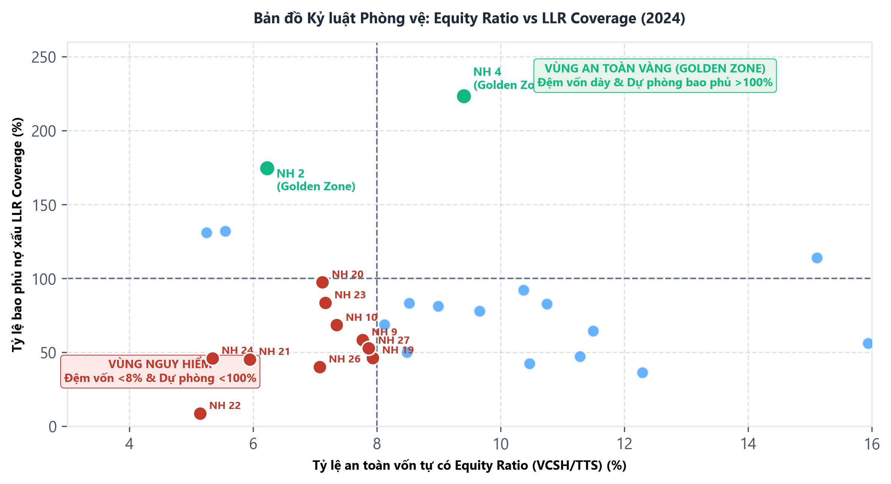
    

  

<template #footer-left>Tổng hợp kết quả thực nghiệm | Chương 9 — Slide 9.2: Kiểm định Giả thuyết H3.2</template>
</ImpressiveHeader>

---

<ImpressiveHeader>
<template #title>Bảng Vàng Thực Nghiệm &amp; 3 "Gene" Bền Vững</template>
<template #subtitle>Tổng hợp kết quả kiểm định 11 giả thuyết qua 3 giai đoạn và đúc kết mô hình tăng trưởng bền vững</template>

  <!-- CỘT TRÁI (col-span-7) -->
  

    

      <table class="w-full text-[9.5px] border-collapse border border-slate-200 text-slate-600 font-medium">
        <thead>
          <tr class="bg-[#003366] text-white">
            <th class="p-1 border border-slate-300 text-center font-bold">Giai đoạn</th>
            <th class="p-1 border border-slate-300 text-left font-bold">Giả thuyết Thực nghiệm</th>
            <th class="p-1 border border-slate-300 text-center font-bold">Kết quả</th>
            <th class="p-1 border border-slate-300 text-left font-bold">Chỉ số thực chứng core</th>
          </tr>
        </thead>
        <tbody>
          <tr>
            <td rowspan="3" class="p-1 border border-slate-200 text-center bg-slate-50 font-bold">GĐ 1 (20-21)</td>
            <td class="p-1 border border-slate-200"><strong>H1.1 (CASA ↔ NIM)</strong>: CASA dày giữ giá vốn rẻ làm bệ đỡ NIM</td>
            <td class="p-1 border border-slate-200 text-center">✅ Ủng hộ</td>
            <td class="p-1 border border-slate-200 font-mono text-[9px]">r = +0.527 (p = 0.005)</td>
          </tr>
          <tr>
            <td class="p-1 border border-slate-200"><strong>H1.2 (Đòn bẩy ↔ ROE)</strong>: Đòn bẩy cao phản tác dụng khi có sốc</td>
            <td class="p-1 border border-slate-200 text-center">✅ Ủng hộ</td>
            <td class="p-1 border border-slate-200 font-mono text-[9px]">ROE Nhóm cao (10.47%) &lt; Nhóm thấp (12.63%)</td>
          </tr>
          <tr>
            <td class="p-1 border border-slate-200"><strong>H1.4 (Giãn nợ ↔ NPL)</strong>: Che giấu NPL thực, đẩy sang Nhóm 2</td>
            <td class="p-1 border border-slate-200 text-center">✅ Ủng hộ</td>
            <td class="p-1 border border-slate-200 font-mono text-[9px]">NPL đi ngang (1.78%) nhưng Nhóm 2 vọt +33.6%</td>
          </tr>
          <tr class="bg-slate-50/50">
            <td rowspan="2" class="p-1 border border-slate-200 text-center bg-slate-50 font-bold">GĐ 2 (22-23)</td>
            <td class="p-1 border border-slate-200"><strong>H2.1 (CoF ↔ NIM)</strong>: Chi phí vốn huy động tăng vọt bóp nghẹt NIM</td>
            <td class="p-1 border border-slate-200 text-center">✅ Ủng hộ</td>
            <td class="p-1 border border-slate-200 font-mono text-[9px]">r = -0.502 (p = 0.008) | 19/27 NH co hẹp NIM</td>
          </tr>
          <tr class="bg-slate-50/50">
            <td class="p-1 border border-slate-200"><strong>H2.2 (LDR ↔ GTCG)</strong>: LDR vượt trần buộc huy động GTCG đắt đỏ</td>
            <td class="p-1 border border-slate-200 text-center">✅ Ủng hộ</td>
            <td class="p-1 border border-slate-200 font-mono text-[9px]">LDR = 101.4% | 14 NH vượt trần 100%</td>
          </tr>
          <tr>
            <td rowspan="3" class="p-1 border border-slate-200 text-center bg-slate-50 font-bold">GĐ 3 (2024)</td>
            <td class="p-1 border border-slate-200"><strong>H3.1 (Phi tín dụng ↔ ROA)</strong>: Thu dịch vụ ngoài lãi nâng đỡ ROA</td>
            <td class="p-1 border border-slate-200 text-center">✅ Ủng hộ</td>
            <td class="p-1 border border-slate-200 font-mono text-[9px]">r = +0.672 (p = 0.0001) | Fee/TOI cốt lõi</td>
          </tr>
          <tr>
            <td class="p-1 border border-slate-200"><strong>H3.2 (Đệm phòng vệ ↔ ROA)</strong>: Sức mạnh đệm vốn bảo vệ hiệu quả</td>
            <td class="p-1 border border-slate-200 text-center">✅ Ủng hộ</td>
            <td class="p-1 border border-slate-200 font-mono text-[9px]">r = +0.456 (p = 0.017) | 5 NH Equity &lt; 6%</td>
          </tr>
          <tr>
            <td class="p-1 border border-slate-200"><strong>H3.3 (DuPont: PM ↔ ROE)</strong>: Biên lợi nhuận định đoạt ROE thực chất</td>
            <td class="p-1 border border-slate-200 text-center">✅ Ủng hộ</td>
            <td class="p-1 border border-slate-200 font-mono text-[9px]">r = -0.904 (p &lt; 0.0001) vs EM r = -0.353 (p=0.07)</td>
          </tr>
        </tbody>
      </table>
    

  

  <!-- CỘT PHẢI (col-span-5) -->
  

    

      

        <strong class="text-slate-800 block mb-0.5">🔑 Ba "Gene" của Ngân hàng Bền Vững:</strong>
      

      <ol class="list-decimal pl-4 text-slate-600 font-medium space-y-0.5 mt-0.5 text-[11px]">
        <li><strong>Đệm CASA dày (CASA &gt;30%):</strong> Giữ chi phí vốn CoF cực thấp, làm lá chắn vững chắc bảo vệ biên lãi thuần NIM cốt lõi.</li>
        <li><strong>Biên lợi nhuận ròng dày thực chất:</strong> Yếu tố then chốt định đoạt hiệu quả sinh lời thực tế ROE, vượt trội so với đòn bẩy ảo.</li>
        <li><strong>Kỷ luật đệm vốn và dự phòng nghiêm ngặt (Equity Ratio &gt;10%, Coverage &gt;150%):</strong> Lá chắn sống sót trước bão nợ xấu.</li>
      </ol>
    

    

      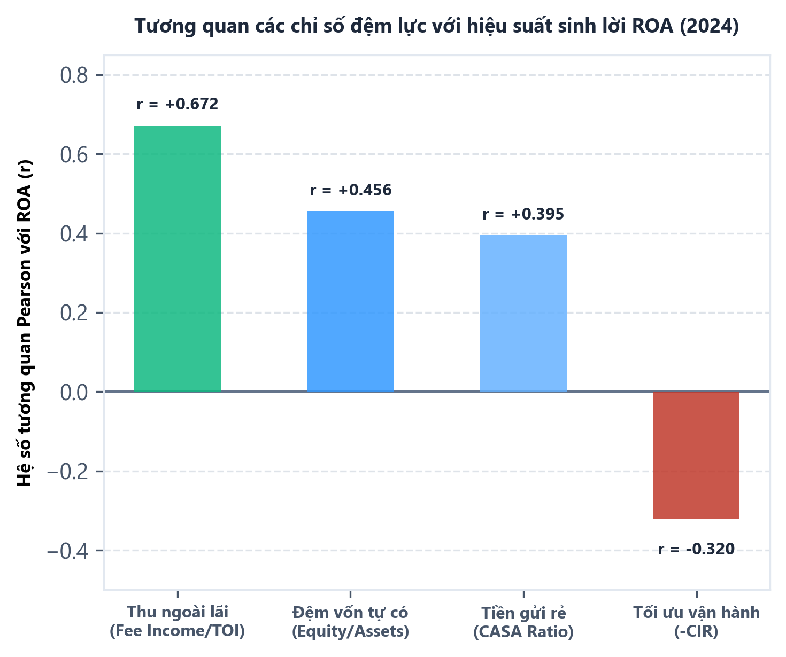
    

  

<template #footer-left>Tổng hợp kết quả thực nghiệm | Chương 9 — Slide 9.3: Tổng hợp 11 Giả thuyết &amp; 3 Gene Bền vững</template>
</ImpressiveHeader>

---

<ImpressiveHeader>
<template #title>Chương 11: Chiến lược cụ thể — Tối ưu hóa đệm tiền gửi CASA giá rẻ</template>
<template #subtitle>Hóa giải áp lực chi phí vốn qua nền tảng quản lý dòng tiền số B2B và liên kết payroll banking (2024)</template>

  <!-- CỘT TRÁI (col-span-4) -->
  

    

      

        <strong class="text-slate-800 block mb-0.5">Thực trạng Phân hóa CASA (Biểu đồ A):</strong>
        Dữ liệu thực tế năm 2024 chứng minh sự phân hóa khốc liệt khi có tới 17 / 27 ngân hàng có tỷ lệ CASA cực thấp dưới 15% (trung vị đạt 13.9%). Nhóm này chịu rủi ro chi phí vốn huy động (CoF) biến động dữ dội khi lãi suất tăng, hoàn toàn thất thế trước nhóm dẫn đầu sở hữu đệm CASA dày dặn &gt;30% (như NH 6 đạt 38.03%, NH 7 đạt 35.94%).
      

      

        <strong class="text-slate-800 block mb-0.5">Chiến lược Hành động Đề xuất:</strong>
        <ol class="list-decimal pl-4 space-y-2 mt-1 text-[11px] leading-[1.3]">
          <li><strong class="text-slate-800">Digital Cash Management:</strong> Phát triển giải pháp số quản lý dòng tiền tự động dành cho doanh nghiệp B2B lớn (đặc biệt là các doanh nghiệp FDI, tập đoàn đa quốc gia) để hút dòng tiền gửi không kỳ hạn quy mô lớn và bền bỉ.</li>
          <li><strong class="text-slate-800">Retail Payroll Banking:</strong> Đẩy mạnh liên kết chi lương tự động với các tập đoàn lớn để ổn định dòng tiền CASA cá nhân giá rẻ. Tăng tính gắn kết của khách hàng thông qua chính sách ưu đãi phí giao dịch và chuyển khoản.</li>
        </ol>
      

    

  

  <!-- CỘT PHẢI (col-span-8) -->
  

    

      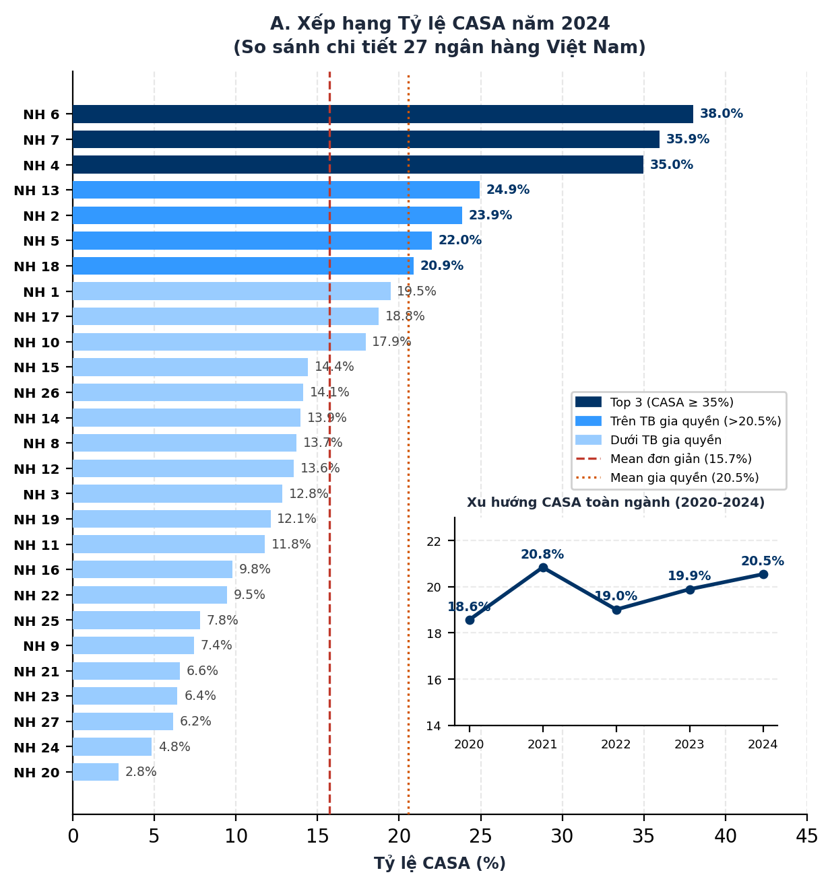
    

  

<template #footer-left>Phần III: Giải pháp &amp; Khuyến nghị | Chương 11 — Slide 14.1: Chiến lược đệm tiền gửi CASA</template>
</ImpressiveHeader>

---

<ImpressiveHeader>
<template #title>Chương 11: Chiến lược cụ thể — Quản trị Thanh khoản &amp; Rủi ro kỳ hạn</template>
<template #subtitle>Giải pháp kiểm soát tỷ lệ LDR và giảm sự phụ thuộc vào phát hành giấy tờ có giá đắt đỏ (2024)</template>

  <!-- CỘT TRÁI (col-span-4) -->
  

    

      

        <strong class="text-slate-800 block mb-0.5">Áp lực Thanh khoản &amp; Kỳ hạn (Biểu đồ B):</strong>
        Tín dụng tăng nóng khiến 17 / 27 ngân hàng vượt trần tỷ lệ LDR an toàn quy định (&gt;100%), trong đó cá biệt có những ngân hàng vượt rất sâu (như NH 8 đạt 142.66%). Để bù đắp khoảng trống kỳ hạn, 24 / 27 ngân hàng buộc phải phát hành Giấy tờ có giá (GTCG) tỷ trọng lớn &gt;5% tổng tiền gửi (như NH 15 đạt tới 30.89%), làm gia tăng nghiêm trọng chi phí vốn trung dài hạn.
      

      

        <strong class="text-slate-800 block mb-0.5">Chiến lược Hành động Đề xuất:</strong>
        <ol class="list-decimal pl-4 space-y-2 mt-1 text-[11px] leading-[1.3]">
          <li><strong class="text-slate-800">Cơ cấu lại tăng trưởng tín dụng:</strong> Hạ nhiệt nhịp tăng trưởng cho vay trung dài hạn đối với các lĩnh vực rủi ro cao (như BĐS) để kéo tỷ lệ LDR về ngưỡng an toàn dưới 100%.</li>
          <li><strong class="text-slate-800">Đa dạng hóa kỳ hạn huy động:</strong> Thiết kế các sản phẩm tiền gửi bậc thang có kỳ hạn dài linh hoạt để tăng nguồn vốn huy động cốt lõi từ dân cư, giảm áp lực phải phát hành GTCG đắt đỏ trên thị trường 2.</li>
        </ol>
      

    

  

  <!-- CỘT PHẢI (col-span-8) -->
  

    

      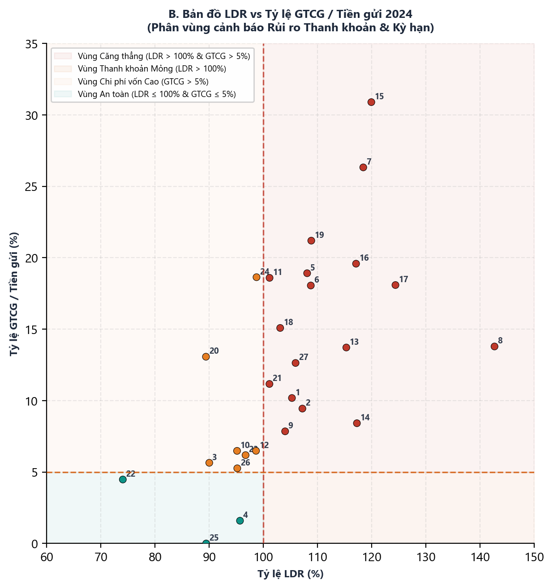
    

  

<template #footer-left>Phần III: Giải pháp &amp; Khuyến nghị | Chương 11 — Slide 14.2: Quản trị Thanh khoản LDR</template>
</ImpressiveHeader>

---

<ImpressiveHeader>
<template #title>Chương 11: Chiến lược cụ thể — Quản trị Nợ xấu &amp; Thiết lập Đệm Dự phòng</template>
<template #subtitle>Gia cố lá chắn phòng vệ và làm sạch bảng cân đối qua xử lý dứt điểm nợ xấu thực tế (2024)</template>

  <!-- CỘT TRÁI (col-span-4) -->
  

    

      

        <strong class="text-slate-800 block mb-0.5">Báo động Đỏ Đệm Dự phòng (Biểu đồ A):</strong>
        Nợ xấu thực tế bùng phát trong khi trích lập chậm trễ đã làm mỏng đáng kể lá chắn an toàn của hệ thống. Có tới 22 / 27 ngân hàng thiếu hụt đệm dự phòng nghiêm trọng (LLR Coverage < 100%). Rủi ro cực hạn tập trung ở nhóm có NPL cao nhưng bao phủ cực thấp (như NH 22 có LLR chỉ 8.6%). Chỉ có 5 ngân hàng duy trì đệm an toàn >100%.
      

      

        <strong class="text-slate-800 block mb-0.5">Chiến lược Hành động Đề xuất:</strong>
        <ol class="list-decimal pl-4 space-y-2 mt-1 text-[11px] leading-[1.3]">
          <li><strong class="text-slate-800">Quyết liệt trích lập dự phòng:</strong> Chấp nhận giảm bớt lợi nhuận danh nghĩa ngắn hạn để dồn lực tăng tỷ lệ bao phủ nợ xấu (LLR Coverage) lên trên 100%, chủ động xây dựng đệm dự phòng vững chắc trước các cú sốc suy thoái kinh tế.</li>
          <li><strong class="text-slate-800">Tất toán dứt điểm trái phiếu VAMC:</strong> Đối với 7 ngân hàng vẫn chưa dọn sạch nợ tại VAMC, cần khẩn trương đẩy mạnh tiến độ xử lý tài sản bảo đảm và trích lập dự phòng để tất toán dứt điểm trái phiếu đặc biệt VAMC.</li>
        </ol>
      

    

  

  <!-- CỘT PHẢI (col-span-8) -->
  

    

      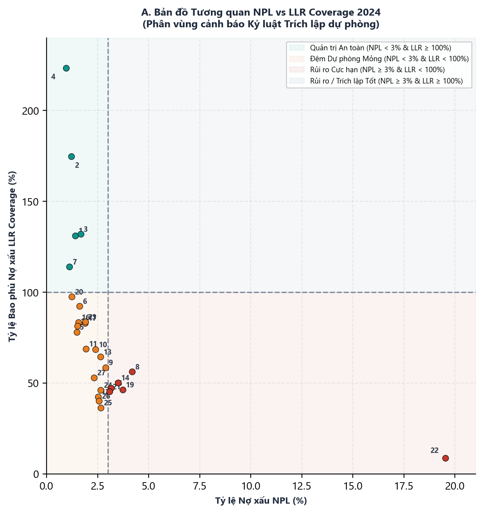
    

  

<template #footer-left>Phần III: Giải pháp &amp; Khuyến nghị | Chương 11 — Slide 15.1: Quản trị Nợ xấu &amp; Đệm dự phòng</template>
</ImpressiveHeader>

---

<ImpressiveHeader>
<template #title>Chương 11: Chiến lược cụ thể — Đa dạng hóa nguồn thu ngoài tín dụng</template>
<template #subtitle>Mở rộng dòng thu dịch vụ phi tín dụng bền vững để bù đắp NIM bị thu hẹp (2024)</template>

  <!-- CỘT TRÁI (col-span-4) -->
  

    

      

        <strong class="text-slate-800 block mb-0.5">Dư địa Phát triển Nguồn thu (Biểu đồ B):</strong>
        Tỷ lệ thu nhập thuần dịch vụ trên tổng thu nhập hoạt động (Fee Income / TOI) bình quân toàn ngành chỉ đạt vỏn vẹn 9.00% (trung vị đạt 7.99%), khoảng cách rất xa so với mặt bằng 20-25% của khu vực. Điều này cho thấy sự phụ thuộc cực lớn vào tín dụng truyền thống và khẳng định dư địa đa dạng hóa nguồn thu phi tín dụng là khổng lồ.
      

      

        <strong class="text-slate-800 block mb-0.5">Chiến lược Hành động Đề xuất:</strong>
        <ol class="list-decimal pl-4 space-y-2 mt-1 text-[11px] leading-[1.3]">
          <li><strong class="text-slate-800">Khai thác Bancassurance chuyên sâu:</strong> Tập trung vào chất lượng tư vấn và các dòng sản phẩm liên kết bảo hiểm đầu tư/bảo vệ thực chất, khôi phục lại niềm tin thị trường sau giai đoạn khủng hoảng kênh phân phối.</li>
          <li><strong class="text-slate-800">Dịch vụ số &amp; Quản lý tài sản:</strong> Tăng cường thu phí dịch vụ từ hệ sinh thái thanh toán số (Smart Banking) và phát triển mảng Wealth Management (quản lý tài sản, chứng chỉ quỹ) cho tệp khách hàng cá nhân cao cấp (HNWI).</li>
        </ol>
      

    

  

  <!-- CỘT PHẢI (col-span-8) -->
  

    

      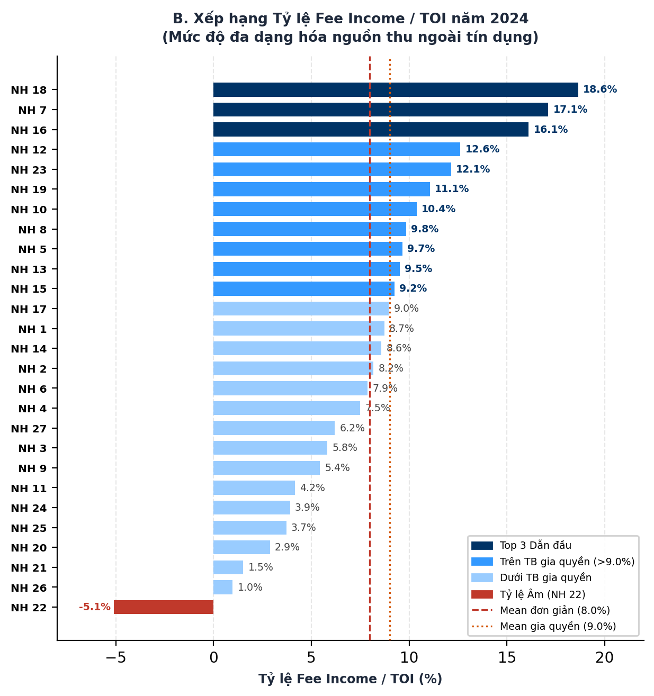
    

  

<template #footer-left>Phần III: Giải pháp &amp; Khuyến nghị | Chương 11 — Slide 15.2: Đa dạng hóa nguồn thu ngoài tín dụng</template>
</ImpressiveHeader>

---

<ImpressiveHeader>
<template #title>Chương 11: Chiến lược cụ thể — Tối ưu hóa đệm vốn tự có hệ thống</template>
<template #subtitle>Gia cố tỷ lệ an toàn vốn Equity Ratio và giảm thiểu rủi ro mỏng vốn nghiêm trọng (2024)</template>

  <!-- CỘT TRÁI (col-span-4) -->
  

    

      

        <strong class="text-slate-800 block mb-0.5">Cảnh báo Đệm vốn cực mỏng (Biểu đồ A):</strong>
        Dù con số trung bình toàn ngành ở ngưỡng an toàn, sự phân hóa đơn lẻ bộc lộ rủi ro rất lớn. Có tới 5 ngân hàng có tỷ lệ đệm vốn (Equity Ratio) cực mỏng dưới ngưỡng an toàn tối thiểu quy định (Equity Ratio < 6%), đối mặt rủi ro thanh khoản và an toàn hệ thống trực tiếp khi gặp biến động.
      

      

        <strong class="text-slate-800 block mb-0.5">Chiến lược Hành động Đề xuất:</strong>
        <ol class="list-decimal pl-4 space-y-2 mt-1 text-[11px] leading-[1.3]">
          <li><strong class="text-slate-800">Tăng vốn điều lệ quyết liệt:</strong> Đẩy nhanh tiến độ phát hành cổ phiếu cho cổ đông chiến lược trong và ngoài nước để củng cố quy mô vốn tự có (Equity), nhanh chóng nâng đệm an toàn lên trên ngưỡng 8%.</li>
          <li><strong class="text-slate-800">Giữ lại lợi nhuận không chia cổ tức tiền mặt:</strong> Ưu tiên dùng lợi nhuận giữ lại để bổ sung nguồn vốn tự có cấp 1 thay vì chi trả cổ tức bằng tiền mặt, bảo toàn nội lực tài chính lâu dài cho ngân hàng.</li>
        </ol>
      

    

  

  <!-- CỘT PHẢI (col-span-8) -->
  

    

      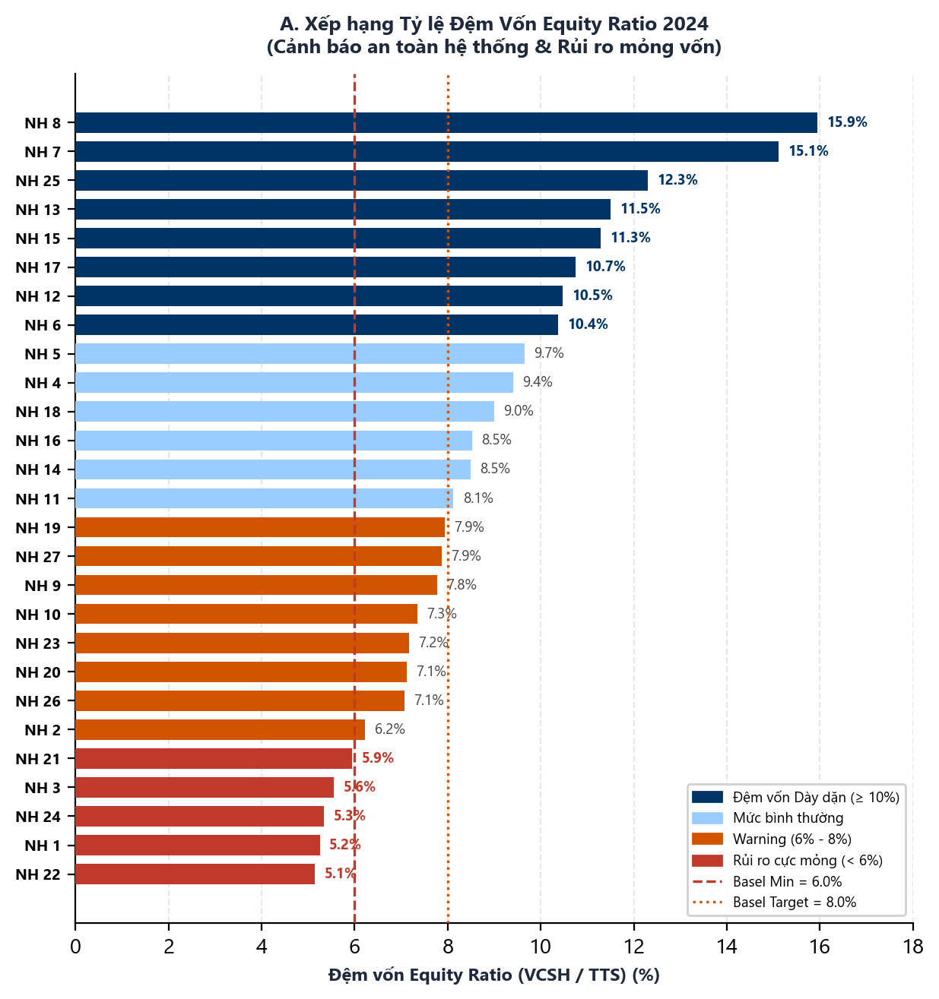
    

  

<template #footer-left>Phần III: Giải pháp &amp; Khuyến nghị | Chương 11 — Slide 16.1: Tối ưu hóa đệm vốn an toàn</template>
</ImpressiveHeader>

---

<ImpressiveHeader>
<template #title>Chương 11: Chiến lược cụ thể — Tối ưu hóa chi phí &amp; Hiệu suất sinh lời</template>
<template #subtitle>Phân rã DuPont và chiến lược tinh giảm CIR qua tự động hóa phê duyệt tín dụng (2024)</template>

  <!-- CỘT TRÁI (col-span-4) -->
  

    

      

        <strong class="text-slate-800 block mb-0.5">Bản chất của ROE bền vững (Biểu đồ B):</strong>
        Phân rã DuPont chỉ ra <strong class="text-slate-800">Biên lợi nhuận NPM</strong> (Top 5 đạt 43.8% vs Bottom 4 chỉ đạt 13.2%) mới là động lực thực chất nâng tầm ROE dài hạn thay vì đòn bẩy tài chính Leverage đắt đỏ. Đồng thời, chi phí nhân sự chiếm tới ~55% total opex là gánh nặng lớn.
      

      

        <strong class="text-slate-800 block mb-0.5">Chiến lược Hành động Đề xuất:</strong>
        <ol class="list-decimal pl-4 space-y-2 mt-1 text-[11px] leading-[1.3]">
          <li><strong class="text-slate-800">Tự động hóa phê duyệt tín dụng:</strong> Triển khai quy trình phê duyệt tự động (Loan Automation) kết hợp eKYC chuyên sâu nhằm rút ngắn thời gian xử lý hồ sơ từ vài ngày xuống vài phút, trực tiếp tinh giản bộ máy nhân sự.</li>
          <li><strong class="text-slate-800">Số hóa mạng lưới chi nhánh truyền thống:</strong> Chuyển đổi các phòng giao dịch vật lý đắt đỏ thành các điểm giao dịch số tự động (Smart Office), giúp kéo giảm mạnh tỷ lệ CIR về ngưỡng tối ưu dưới 35%.</li>
        </ol>
      

    

  

  <!-- CỘT PHẢI (col-span-8) -->
  

    

      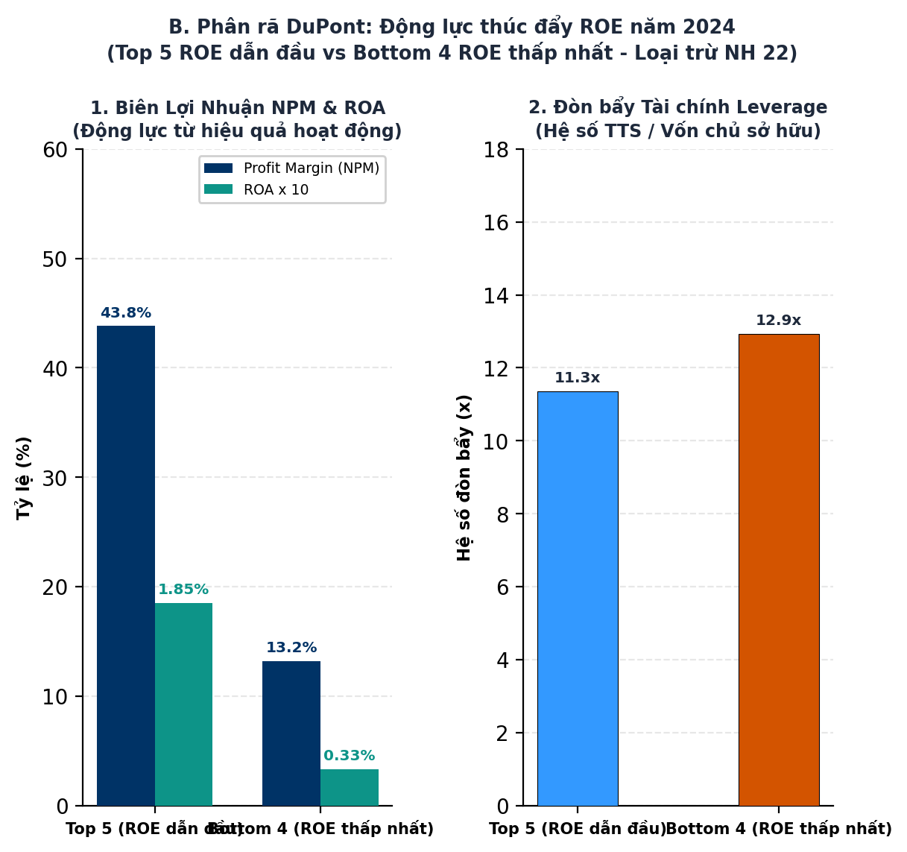
    

  

<template #footer-left>Phần III: Giải pháp &amp; Khuyến nghị | Chương 11 — Slide 16.2: Tối ưu hóa CIR &amp; Phân rã DuPont</template>
</ImpressiveHeader>

